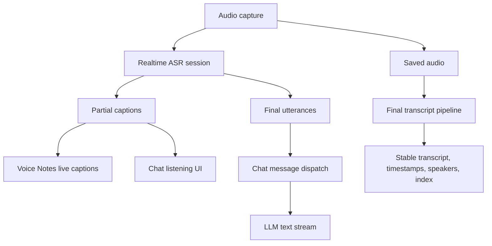

# Realtime Voice Conversation

## Summary

CogniOS should add a local-first realtime voice layer that powers Voice Notes live captions first and Chat voice conversation next. Realtime ASR produces provisional captions and finalized utterances during capture; stable timestamps, speaker labels, indexing, and review remain part of a separate final transcript pipeline.

---

## Problem Frame

The current Voice Notes path is near-realtime, not truly realtime. It records audio into short WAV segments, waits for each segment to complete, then sends the saved segment through the sidecar ASR path. That can produce useful coarse transcript timestamps, but users still experience visible lag and do not get the feeling of live captioning or live conversation.

The next step is not only to improve Voice Notes. The same realtime speech capability should become reusable infrastructure for Chat so a user can speak continuously, have CogniOS detect finished utterances, and automatically send those utterances to the LLM while responses stream back as text.

---

## Key Decisions

- **Local realtime ASR is the baseline.** The first version must run locally and must not depend on a cloud ASR service for the primary experience.
- **Live captions and final transcripts are separate products.** Live captions optimize for immediacy and may change; final transcripts optimize for stability, timestamps, speaker labels, indexing, and review.
- **Chat submits finalized utterances, not partial captions.** Partial text is for visual feedback. Only end-of-utterance text should become a Chat message.
- **Voice Chat v1 is text-response only.** The first Chat version supports realtime voice input with streamed text replies; spoken LLM replies and interruption handling can follow later.
- **Packaging is a launch constraint.** A local realtime ASR runtime is not acceptable unless it can be installed, started, monitored, and upgraded inside the CogniOS desktop distribution.

---

## Actors

- A1. User: Starts Voice Notes, watches live captions, uses voice input in Chat, and reviews completed transcripts.
- A2. Realtime audio layer: Captures microphone or system audio and emits low-latency audio frames to a local realtime ASR session.
- A3. Local realtime ASR runtime: Runs Qwen3-ASR realtime locally, expected to use the vLLM realtime path unless planning validates a better local equivalent.
- A4. Voice Notes: Consumes live captions during recording and later produces stable transcripts from saved audio.
- A5. Chat: Consumes finalized utterances as user messages and streams LLM text responses.
- A6. Finalization pipeline: Produces stable transcript text, coarse or precise timestamps, speaker labels, summaries, and search indexing after recording.

---

## Conceptual Flow

---

## Key Flows

- F1. Voice Note live captions
  - **Trigger:** The user starts a Voice Note while local realtime ASR is available.
  - **Actors:** A1, A2, A3, A4
  - **Steps:** CogniOS captures audio, streams audio frames into the local realtime ASR session, receives partial and final caption events, and displays low-latency captions while recording continues.
  - **Outcome:** The user sees speech appear during the meeting without waiting for post-recording transcription.
  - **Covered by:** R1, R2, R3, R4, R5

- F2. Voice Note finalization
  - **Trigger:** The user stops a Voice Note.
  - **Actors:** A4, A6
  - **Steps:** CogniOS uses the saved audio to produce a stable transcript, preserve or improve timestamps, identify anonymous speaker turns when available, generate summary/action items when configured, and index the completed transcript.
  - **Outcome:** The user has a durable Voice Note artifact that can be reviewed, searched, and replayed near relevant sections.
  - **Covered by:** R6, R7, R8, R9

- F3. Realtime voice Chat
  - **Trigger:** The user enables realtime voice input in Chat.
  - **Actors:** A1, A2, A3, A5
  - **Steps:** CogniOS listens continuously, shows provisional text while the user speaks, detects utterance boundaries, submits finalized utterances to Chat automatically, and streams the LLM response as text.
  - **Outcome:** The user can speak to Chat without pressing send for each message, while avoiding repeated LLM calls for partial speech.
  - **Covered by:** R1, R2, R10, R11, R12, R13

- F4. Runtime unavailable
  - **Trigger:** The local realtime ASR runtime is missing, incompatible, not packaged for the current platform, or fails to start.
  - **Actors:** A1, A3, A4, A5
  - **Steps:** CogniOS reports realtime voice as unavailable or degraded, keeps existing non-realtime Voice Notes behavior available when possible, and does not silently fall back to cloud ASR.
  - **Outcome:** The user gets clear local capability status and does not accidentally send audio off-device.
  - **Covered by:** R14, R15, R16, R17

---

## Requirements

**Shared realtime voice layer**

- R1. CogniOS must expose realtime audio capture as a shared capability that is not owned by Voice Notes or Chat.
- R2. The shared realtime layer must emit provisional caption events and finalized utterance events as distinct outputs.
- R3. Provisional captions must be treated as mutable and low-latency; they must not be presented as the stable transcript.
- R4. Finalized utterances must be stable enough for downstream consumers to store, display, or submit to Chat.
- R5. Voice Notes must consume realtime caption events without blocking audio capture or final transcript generation.

**Voice Notes final transcript**

- R6. Voice Notes must continue saving source audio for finalization, replay, and recovery.
- R7. Voice Notes must generate the durable transcript from saved audio rather than relying only on realtime captions.
- R8. Final transcript timestamps may use coarse segment offsets initially, but the design must leave room for a forced-alignment pass when precise timestamps are added.
- R9. Speaker labels belong to the finalization path by default; realtime speaker labeling is optional and must not be required for v1.

**Realtime Chat**

- R10. Chat must use finalized utterances as automatic user messages rather than sending every partial caption to the LLM.
- R11. Chat must show listening/provisional text while speech is in progress so the user can see what CogniOS is hearing.
- R12. Chat v1 must stream the LLM response as text only.
- R13. Chat must make the automatic-send behavior understandable and reversible enough that users can stop or disable realtime voice input.

**Local runtime and packaging**

- R14. The primary realtime ASR runtime must run locally. Cloud realtime ASR must not be the default or hidden fallback.
- R15. The local realtime runtime must be packageable with CogniOS or installable through a CogniOS-managed setup flow before the feature is considered shippable.
- R16. CogniOS must expose runtime status clearly: unavailable, installing, starting, ready, degraded, failed, and stopped.
- R17. If local realtime ASR cannot be packaged or run on a supported platform, CogniOS must fail closed into an explicit unavailable state rather than pretending realtime voice is supported.

---

## Acceptance Examples

- AE1. **Covers R1-R5.** Given local realtime ASR is ready, when the user starts a Voice Note and speaks, captions appear during recording before the final transcript is generated.
- AE2. **Covers R3, R6-R9.** Given a Voice Note had live captions, when recording stops, CogniOS still runs the final transcript pipeline from saved audio and treats the final transcript as the durable artifact.
- AE3. **Covers R8.** Given the realtime ASR stream does not provide timestamps, when live captions are displayed, the UI does not imply word-level synchronization; later transcript timestamps come from segment offsets or final alignment.
- AE4. **Covers R10-R12.** Given realtime voice Chat is enabled, when the user speaks a sentence and pauses, CogniOS submits one finalized utterance to Chat and streams the LLM response as text.
- AE5. **Covers R10.** Given ASR emits several partial captions for one sentence, when the user is still speaking, CogniOS does not send each partial caption to the LLM.
- AE6. **Covers R13.** Given realtime voice Chat is active, when the user stops listening or disables voice input, CogniOS stops creating automatic Chat messages.
- AE7. **Covers R14-R17.** Given the local realtime ASR runtime is not available on the current machine, when the user opens Voice Notes or Chat voice input, CogniOS shows a local runtime unavailable state and does not route audio to a cloud provider.
- AE8. **Covers R15-R17.** Given a packaged CogniOS build, when realtime voice is enabled, the local ASR runtime can be installed or started through a managed path without asking the user to manually run an external server.

---

## Success Criteria

- Voice Notes captions feel live enough that the user sees speech appear while a meeting is still happening.
- Chat supports hands-free voice input where a completed spoken utterance becomes one Chat message without pressing send.
- The LLM receives stable utterances, not partial ASR churn.
- Final Voice Note transcripts remain higher authority than realtime captions for timestamps, speaker labels, search, and review.
- Local runtime packaging is proven before the feature is considered ready for release.

---

## Scope Boundaries

- No cloud realtime ASR as the first required path.
- No spoken LLM replies in v1.
- No realtime word-level timestamps.
- No required realtime speaker diarization.
- No automatic submission of every partial ASR event to Chat.
- No hidden dependency on a manually launched developer vLLM server in the shippable product.

---

## Dependencies / Assumptions

- Qwen3-ASR streaming is expected to require the vLLM backend for the local open-source model path.
- Qwen3-ASR streaming does not provide timestamps; timestamp precision belongs in finalization through segment offsets or forced alignment.
- The existing Voice Notes saved-audio path remains the recovery source for final transcripts.
- The existing Chat streaming response path can be reused after a finalized utterance is submitted.
- vLLM packaging, startup cost, hardware support, and platform compatibility are high-risk and must be validated before implementation locks in the runtime.

---

## Outstanding Questions

### Deferred to Planning

- [Affects R1-R5, R14-R17][Needs research] What is the exact local realtime ASR runtime shape that CogniOS can package and supervise across supported desktop platforms?
- [Affects R2, R10-R13][Technical] What utterance-boundary rule best balances realtime feel with avoiding accidental early sends?
- [Affects R6-R9][Technical] Which finalization path should produce stable timestamps and speaker labels after recording stops?
- [Affects R15-R17][Technical] How should CogniOS install, update, restart, and observe the realtime ASR runtime in packaged builds?
- [Affects R13][Product] What user control should stop listening quickly enough for realtime Chat to feel safe?

---

## Sources / Research

- Existing near-realtime Voice Notes segmenting and coarse timestamp generation: `src-tauri/src/services/voice_notes/native_audio.rs`
- Existing realtime transcript append format: `src-tauri/src/services/voice_notes/mod.rs`
- Existing sidecar Voice Notes transcription route: `sidecar/search_sidecar/routes/voice_notes.py`
- Existing Qwen ASR ONNX file transcription path: `sidecar/search_sidecar/voice_notes/transcriber.py`
- Qwen3-ASR model card: https://huggingface.co/Qwen/Qwen3-ASR-0.6B
- vLLM supported models: https://docs.vllm.ai/en/latest/models/supported_models/
