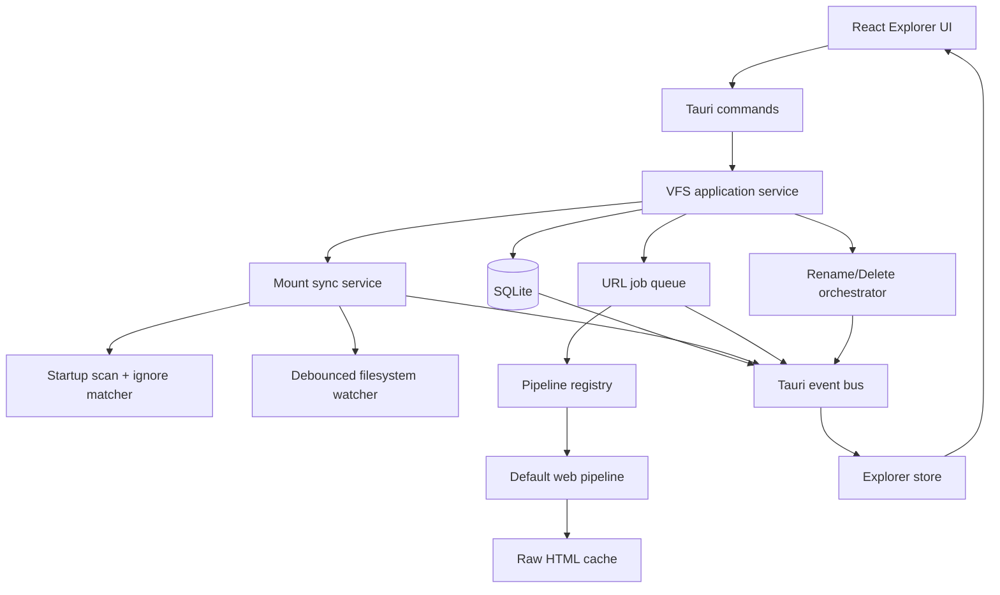
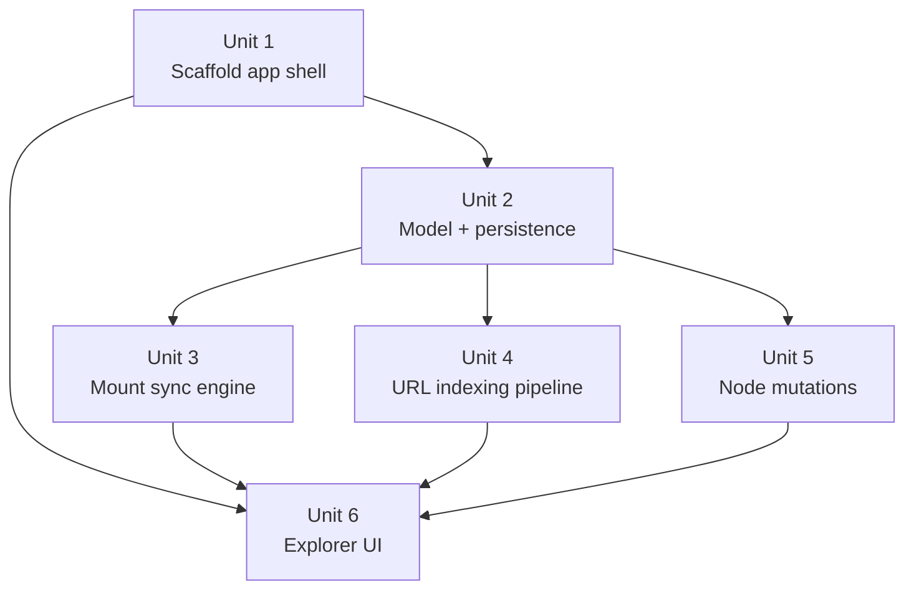
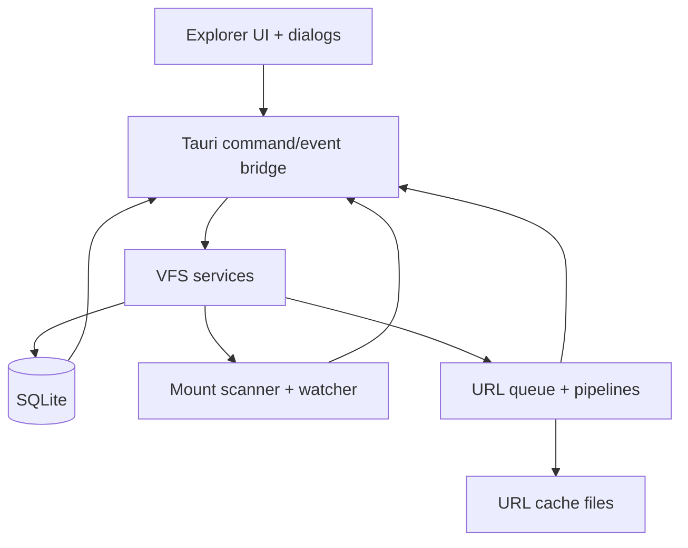

# feat: Build Milestone 1 VFS node management foundation

## Overview

Build the first runnable CogniOS application around a local-first VFS core: Folder, URL, and Mount nodes persisted locally, kept in sync with the filesystem, and exposed through a real-time Explorer tree with breadcrumbs and node-state badges.

This plan treats Milestone 1 as a greenfield desktop app. The repository does not yet contain a Tauri scaffold or prior implementation patterns, so the plan establishes the project structure, backend architecture, UI boundaries, and verification strategy needed to land the feature safely.

| Surface | Milestone 1 behavior | Explicitly not included |
|---|---|---|
| Folder | Virtual-only container, nestable, rename/delete capable | Backing filesystem directory creation |
| URL | Instant bookmark, background indexing, retry/error lifecycle | Additional built-in pipelines beyond default web |
| Mount | Persisted local directory mirror with ignore config, watch sync, unavailable recovery | Cloud/remote storage semantics |
| Explorer | Virtualized tree, breadcrumbs, node badges, destructive confirmations | Search, preview pane, drag-and-drop, bulk actions |

## Problem Frame

CogniOS needs a persistent local substrate before Topics, Chat, or Timeline features can exist. The origin requirements define the Local VFS as that substrate and the Explorer as the primary interface for navigating it. Milestone 1 therefore has two coupled jobs: create a trustworthy local state model, and expose it through a UI that stays responsive while file watchers and URL indexing mutate that state in the background.

The plan keeps the broader product vision in `docs/prd/initial.md` subordinate to the narrower Milestone 1 requirements. In particular, Milestone 1 implements Folder, URL, and Mount node types plus mounted file/directory descendants; it does not reintroduce the PRD's later node taxonomy or `Verified` state (see origin: `docs/brainstorms/vfs-node-management-requirements.md`).

## Requirements Trace

- R1-R2. Support virtual Folder nodes with nesting and cycle rejection.
- R3-R5. Support instant URL bookmark creation, pluggable background indexing, persisted indexing lifecycle, and retry/error visibility.
- R6-R10, R18. Support Mount nodes with app-owned ignore config, live filesystem mirroring, startup reconciliation, and unavailable-path recovery.
- R11-R12, R14. Deliver a real-time Explorer tree with breadcrumb navigation and visible node type/state badges.
- R15. Persist VFS metadata, ignore config, index results, and node availability/indexing state across restarts.
- R16-R17. Support rename/delete mutations for all supported node types, including bidirectional mounted-file mutations and guarded destructive flows.
- SC1-SC6. Meet the stated success criteria from the origin document, especially instant URL visibility, ~1 second watcher updates, restart durability, and 10k-file responsiveness on reference hardware.

## Scope Boundaries

- No Topic clustering, chat, timeline, memory synthesis, or any other AI-facing feature.
- No cloud sync, multi-device sync, remote mounts, or networked storage layer.
- No preview or rendering surface for file or URL content inside the Explorer.
- No search, filtering, drag-and-drop, bulk operations, or multi-select tree behaviors.
- No extra bundled indexing pipelines beyond the default web pipeline required for Milestone 1.

### Deferred to Separate Tasks

- Additional URL-specific pipelines such as YouTube subtitle extraction.
- Later product-vision node types from `docs/prd/initial.md`, including System Logs and Local Chat Threads.
- Rich keyboard shortcut design, search UX, and preview/detail panes once the VFS substrate is stable.

## Context & Research

### Relevant Code and Patterns

- `docs/brainstorms/vfs-node-management-requirements.md` is the source of truth for Milestone 1 scope, node taxonomy, and state transitions.
- `docs/prd/initial.md` provides the broader local-first product framing and confirms the Explorer as a core surface, but its wider node taxonomy is intentionally out of scope for this milestone.
- The repository is currently docs-only: there is no existing Tauri scaffold, frontend framework, persistence layer, or test harness to inherit. The plan therefore follows official upstream structure instead of repo-local patterns.
- Repo guidance in `AGENTS.md` materially affects implementation: keep diffs reviewable, prefer deletion over addition, avoid new dependencies unless justified, and include explicit test file targets for feature-bearing work.

### Institutional Learnings

- No `docs/solutions/` corpus exists yet, so there are no prior institutional learnings to apply.

### External References

- Tauri v2 project structure and frontend integration guidance support a split top-level web app plus `src-tauri/` Rust backend.
- Tauri's frontend-to-Rust command/event model supports a clean boundary where the Rust side owns filesystem and persistence behavior.
- `notify` plus `notify-debouncer-full` provide cross-platform filesystem watching with debounced event delivery, which fits the live-sync and event-storm requirements better than raw per-event handling.
- The Rust `ignore` crate provides gitignore-compatible matching, which aligns with the per-mount raw-text ignore requirement.
- SQLite WAL mode improves local read/write concurrency, and SQLite foreign keys must be enabled explicitly per connection; both facts materially shape the persistence setup.
- TanStack Virtual's headless model is a good fit for a high-density Explorer tree because it virtualizes only visible rows while leaving DOM structure and styling under application control.

## Key Technical Decisions

- Use the standard Tauri v2 split project layout: top-level Vite/React application plus Rust backend under `src-tauri/`.
  Rationale: the official structure keeps Rust-native filesystem access and desktop packaging in the supported place while letting the frontend remain a conventional web app.

- Make Rust the sole owner of authoritative VFS state, persistence, watcher lifecycle, and URL indexing orchestration.
  Rationale: Folder cycle checks, mounted-file mutations, unavailable-path handling, and startup reconciliation are correctness-sensitive and should not be duplicated in frontend state.

- Use React + TypeScript + Vite for the frontend, with a flattened tree model rendered through TanStack Virtual.
  Rationale: the repo is greenfield, React/Vite fits Tauri's documented frontend workflow, and a headless virtualizer preserves control over the editorial tree UI while meeting the 10k-file responsiveness target.

- Persist the VFS graph in SQLite using an adjacency-list `nodes` table plus source-specific side tables for mounts, ignore configs, URL jobs, and URL artifacts.
  Rationale: the model needs durable parent/child relationships across mixed node kinds, restart-safe state recovery, and transactional updates that can cover both node metadata and background job state.

- Enable SQLite WAL mode and explicit foreign-key enforcement at connection startup.
  Rationale: Milestone 1 needs concurrent reads from the Explorer while watcher/indexing writers update state, and SQLite does not enable foreign keys automatically.

- Handle mount startup recovery with a full rescan against the persisted ignore config, then switch to debounced live watching.
  Rationale: correctness on restart matters more than speculative diff reconstruction in a greenfield app, and the success criteria only demand strong performance at the 10k-file baseline.

- Store mounted-file paths relative to the owning mount root, and treat ancestor mount availability as the gate for any filesystem mutation.
  Rationale: relative addressing keeps persisted mirrors stable across app restarts, and availability-aware mutation guards prevent writes against ejected or deleted paths.

- Model URL indexing as a persisted job queue with a matcher-driven pipeline registry and a standard pipeline output contract.
  Rationale: the default web pipeline must land now, but later domain- or scheme-specific pipelines should plug into the same background machinery without rewriting core scheduling logic.

- Reset persisted URL jobs in `indexing` or `error` state back to `pending` during app startup while retaining last-failure metadata for diagnostics.
  Rationale: this matches the origin requirement that failed work survives restarts but re-enters the queue on next launch.

- Put destructive confirmation UX in the frontend, but enforce node-kind-specific validation in the backend before any delete or rename side effect occurs.
  Rationale: the UI owns the human confirmation flow, but safety cannot depend on the frontend alone.

## Alternative Approaches Considered

- Use a diff-based mount restart reconciler instead of a full startup rescan.
  Why not chosen: there is no existing snapshot/delta infrastructure in the repo, and a first-milestone correctness bug here would silently corrupt the mirrored tree. Full rescan is simpler and still compatible with the stated 10k-file performance target.

- Let the frontend own the Explorer tree as the primary source of truth, with Rust acting as a thin filesystem bridge.
  Why not chosen: mounted-file mutations, watcher recovery, and restart durability would then require duplicate business rules across the frontend and backend, increasing split-brain risk.

- Use Tauri's SQL plugin or a frontend-managed persistence layer instead of direct Rust-managed SQLite access.
  Why not chosen: the backend already owns watcher lifecycle and background URL work; keeping persistence in the same Rust boundary avoids cross-layer transaction orchestration.

- Render the entire Explorer tree in the DOM without virtualization and optimize later if performance becomes a problem.
  Why not chosen: the requirements already include a 10k-file responsiveness target, so the UI needs a large-tree strategy from the first implementation pass.

## Open Questions

### Resolved During Planning

- Which frontend stack to use?
  Resolution: React + TypeScript + Vite, with a virtualized flattened tree store.

- Which persistence model to use for mixed node kinds?
  Resolution: SQLite with a shared `nodes` table and source-specific side tables keyed by node id.

- Which watcher strategy to use for mount sync?
  Resolution: `notify` watcher wrapped by `notify-debouncer-full`, with a debounce window in the few-hundred-millisecond range and full-rescan fallback on overflow or watcher errors.

- How should restart reconciliation work for mounts?
  Resolution: startup always runs a full rescan against the current ignore config before live watching resumes.

- How should URL pipelines be selected?
  Resolution: a matcher-based registry keyed by scheme/domain rules, with the default web pipeline as the fallback built-in for Milestone 1.

- How should destructive actions be guarded?
  Resolution: the UI presents confirmations for non-empty virtual folders and mounted-file deletes, while backend mutators perform final validation and return typed failures.

### Deferred to Implementation

- Exact HTML readability/extraction library choice for the default web pipeline, as long as the implementation still produces title/description/Open Graph metadata, a readable preview, and cached raw HTML.
- Final debounce duration tuning and backpressure thresholds after real fixture benchmarking.
- Exact unsupported-URL validation copy when no pipeline can accept the submitted URL.
- Final keyboard and focus behavior for Explorer navigation beyond the core breadcrumb and row interactions required for Milestone 1.

## Output Structure

```text
.
├── index.html
├── package.json
├── tsconfig.json
├── vite.config.ts
├── src/
│   ├── app/
│   │   ├── App.tsx
│   │   └── providers.tsx
│   ├── features/
│   │   └── explorer/
│   │       ├── api/
│   │       ├── components/
│   │       ├── hooks/
│   │       ├── store/
│   │       └── types/
│   ├── lib/
│   │   ├── contracts/
│   │   └── tauri/
│   ├── main.tsx
│   └── styles/
├── src-tauri/
│   ├── Cargo.toml
│   ├── build.rs
│   ├── tauri.conf.json
│   ├── capabilities/
│   ├── migrations/
│   ├── src/
│   │   ├── commands/
│   │   ├── domain/
│   │   ├── infrastructure/
│   │   ├── services/
│   │   ├── events.rs
│   │   ├── lib.rs
│   │   └── main.rs
│   └── tests/
└── docs/
    └── plans/
```

## High-Level Technical Design

> *This illustrates the intended approach and is directional guidance for review, not implementation specification. The implementing agent should treat it as context, not code to reproduce.*



## Implementation Units



- [x] **Unit 1: Scaffold the desktop app shell and IPC boundary**

**Goal:** Create the runnable Tauri/React workspace, the shared frontend/backend contracts, and the minimal Explorer shell that later units can wire into.

**Requirements:** R11, R12, R14, R15 foundation; enables all downstream units.

**Dependencies:** None

**Files:**
- Create: `package.json`
- Create: `tsconfig.json`
- Create: `vite.config.ts`
- Create: `index.html`
- Create: `src/main.tsx`
- Create: `src/app/App.tsx`
- Create: `src/app/providers.tsx`
- Create: `src/styles/tokens.css`
- Create: `src/styles/app.css`
- Create: `src/lib/contracts/vfs.ts`
- Create: `src/lib/tauri/ipc.ts`
- Create: `src/lib/tauri/events.ts`
- Create: `src-tauri/Cargo.toml`
- Create: `src-tauri/build.rs`
- Create: `src-tauri/tauri.conf.json`
- Create: `src-tauri/capabilities/default.json`
- Create: `src-tauri/src/main.rs`
- Create: `src-tauri/src/lib.rs`
- Create: `src-tauri/src/commands/mod.rs`
- Test: `src/app/App.test.tsx`
- Test: `src-tauri/tests/bootstrap_smoke.rs`

**Approach:**
- Follow the documented Tauri v2 project structure so the Rust desktop process and web frontend stay on the supported path.
- Keep `src-tauri/src/main.rs` thin and place app wiring in `src-tauri/src/lib.rs`.
- Define a shared contract layer early for node DTOs, explorer snapshots, and event payloads so later units do not invent incompatible shapes.
- Ship an empty-state Explorer shell now rather than delaying the UI until the end; later units will wire real data into the same shell.

**Execution note:** Start with smoke tests that prove the desktop shell boots and that the shared contracts can flow across the Tauri boundary without ad hoc JSON shapes.

**Patterns to follow:**
- Tauri v2 project layout and command/capability organization from the official docs.
- Editorial UI direction from `docs/prd/initial.md` for typography, density, and restraint.

**Test scenarios:**
- Happy path: a clean checkout starts into an empty Explorer shell with no runtime panic and a stable empty-state view.
- Happy path: frontend bootstrap requests an initial explorer snapshot and receives the typed empty payload.
- Error path: an unregistered or denied backend command is surfaced through the frontend error boundary rather than silently failing.
- Integration: the same node DTO type definitions can describe both the initial snapshot and incremental event payloads without field drift.

**Verification:**
- The app can start with an empty data store, render the shell, and exchange at least one typed command/result pair across the Tauri boundary.

- [x] **Unit 2: Define the VFS domain model and durable persistence layer**

**Goal:** Establish the persisted node graph, state enums, repositories, and startup restore rules that all Folder, URL, and Mount behaviors depend on.

**Requirements:** R1, R2, R3, R5, R6, R15, R18

**Dependencies:** Unit 1

**Files:**
- Create: `src-tauri/migrations/0001_initial.sql`
- Create: `src-tauri/src/domain/mod.rs`
- Create: `src-tauri/src/domain/vfs/mod.rs`
- Create: `src-tauri/src/domain/vfs/node.rs`
- Create: `src-tauri/src/domain/vfs/state.rs`
- Create: `src-tauri/src/infrastructure/db/mod.rs`
- Create: `src-tauri/src/infrastructure/db/connection.rs`
- Create: `src-tauri/src/infrastructure/db/migrations.rs`
- Create: `src-tauri/src/infrastructure/db/node_repository.rs`
- Create: `src-tauri/src/infrastructure/db/url_repository.rs`
- Create: `src-tauri/src/infrastructure/db/mount_repository.rs`
- Modify: `src-tauri/src/lib.rs`
- Modify: `src/lib/contracts/vfs.ts`
- Test: `src-tauri/tests/vfs_persistence.rs`
- Test: `src-tauri/tests/vfs_domain_invariants.rs`

**Approach:**
- Model every persisted entry as a node with a stable id, parent id, node kind, display name, source kind, and lifecycle state.
- Store mount-specific data, URL job metadata, URL artifact metadata, and ignore-config text in side tables keyed by node id rather than overloading the shared node record.
- Enable foreign keys and WAL as part of connection initialization so every repository path inherits the same guarantees.
- Persist enough state to distinguish current availability/indexing state from last error metadata, especially for restart flows.
- Enforce virtual-folder cycle rejection and mixed-node parenting in the application service rather than relying on brittle SQL-only constraints.

**Execution note:** Implement this test-first, beginning with repository/invariant tests for cycle rejection, restart restoration, and mixed parent-child relationships.

**Patterns to follow:**
- The Milestone 1 node taxonomy and state machine from `docs/brainstorms/vfs-node-management-requirements.md`.
- SQLite foreign-key and WAL guidance from the official SQLite docs.

**Test scenarios:**
- Happy path: creating a root Folder, child Folder, URL node, and Mount node persists all nodes with correct parent/child relationships and node kinds.
- Edge case: attempting to move or nest a Folder beneath itself or any descendant is rejected without partial writes.
- Edge case: sibling Folder, URL, and Mount nodes can coexist under the same virtual parent without schema-level collisions.
- Error path: if a transaction fails while creating a node plus source-specific side-table data, no partial node record remains.
- Integration: restarting with persisted URL error metadata and mount availability metadata rehydrates the same graph and lifecycle state needed for downstream services.

**Verification:**
- A fresh database can be created, migrated, populated, closed, and reopened with all node relationships and lifecycle fields intact.

- [x] **Unit 3: Implement mount creation, ignore matching, reconciliation, and live sync**

**Goal:** Turn a mounted local directory into a persisted VFS mirror that stays current across live filesystem changes, ignore-config edits, and restarts.

**Requirements:** R6, R7, R8, R9, R10, R11, R15, R18

**Dependencies:** Unit 2

**Files:**
- Create: `src-tauri/src/services/mounts/mod.rs`
- Create: `src-tauri/src/services/mounts/create_mount.rs`
- Create: `src-tauri/src/services/mounts/ignore_config.rs`
- Create: `src-tauri/src/services/mounts/scanner.rs`
- Create: `src-tauri/src/services/mounts/reconcile.rs`
- Create: `src-tauri/src/services/mounts/watcher.rs`
- Create: `src-tauri/src/infrastructure/fs/mod.rs`
- Create: `src-tauri/src/infrastructure/fs/path_mapper.rs`
- Create: `src-tauri/src/commands/mounts.rs`
- Modify: `src-tauri/src/commands/mod.rs`
- Modify: `src-tauri/src/lib.rs`
- Test: `src-tauri/tests/mount_sync.rs`
- Test: `src-tauri/tests/mount_restart_reconciliation.rs`

**Approach:**
- Persist the raw ignore-config text in app storage and compile it into a gitignore matcher whenever a mount is created, restarted, or edited.
- Perform a full directory scan when a mount is first added and on every startup before watcher events are trusted.
- Persist mirrored file/directory nodes using paths relative to the mount root so nodes remain stable across app restarts.
- Use a debounced watcher to coalesce noisy filesystem events; when the watcher reports overflow, invalid sequences, or path loss, trigger a targeted or full rescan instead of trusting partial events.
- When a mount path becomes inaccessible, mark the mount `Unavailable`, keep mirrored descendants visible but read-only, and resume reconciliation automatically once the path becomes available again.

**Execution note:** Start with temp-directory integration tests that mutate real files and directories before tuning debounce windows or optimizing scan internals.

**Technical design:** *(directional guidance, not implementation specification)* Treat mount sync as `scan -> persist snapshot -> emit explorer delta -> watch for debounced changes -> reconcile affected subtree -> emit delta`. Unavailable transitions short-circuit the watch loop into `mark unavailable -> stop mutations -> await path recovery -> full rescan`.

**Patterns to follow:**
- Per-mount ignore semantics and unavailable-state expectations from the origin requirements document.
- `ignore` crate gitignore semantics and `notify`-family watcher model from the upstream docs.

**Test scenarios:**
- Happy path: mounting a directory with nested files creates the full mirrored subtree in the Explorer-visible graph.
- Happy path: creating, renaming, modifying, and deleting files inside the mounted directory produces VFS updates within the expected debounce window.
- Edge case: ignore config excludes starter-template patterns such as `.git/` and `node_modules/`, and editing the ignore config later removes or restores mirrored nodes after reconciliation.
- Edge case: files created while the app is offline are discovered during the next startup reconciliation.
- Error path: ejecting or deleting the mounted path marks the mount `Unavailable` while preserving existing mirrored descendants in read-only form.
- Error path: a watcher overflow or transient OS watch error triggers a safe rescan rather than leaving the mirror permanently stale.
- Integration: when a previously unavailable path becomes accessible again, the mount returns to an active state and the Explorer reflects any missed changes.

**Verification:**
- Real filesystem operations on a temp mount are faithfully mirrored into persisted VFS nodes across a stop/restart cycle without manual refresh.

- [x] **Unit 4: Build the URL indexing registry and default web pipeline**

**Goal:** Allow URLs to appear instantly in the Explorer, then progress through persisted background indexing states that feed metadata, preview text, and cached raw HTML back into the VFS.

**Requirements:** R3, R4, R5, R14, R15

**Dependencies:** Unit 2

**Files:**
- Create: `src-tauri/src/services/url_indexing/mod.rs`
- Create: `src-tauri/src/services/url_indexing/queue.rs`
- Create: `src-tauri/src/services/url_indexing/registry.rs`
- Create: `src-tauri/src/services/url_indexing/pipeline.rs`
- Create: `src-tauri/src/services/url_indexing/pipelines/default_web.rs`
- Create: `src-tauri/src/services/url_indexing/cache.rs`
- Create: `src-tauri/src/commands/urls.rs`
- Modify: `src-tauri/src/commands/mod.rs`
- Modify: `src-tauri/src/lib.rs`
- Test: `src-tauri/tests/url_indexing.rs`
- Test: `src-tauri/tests/url_restart_recovery.rs`

**Approach:**
- Create the node record and initial `pending` job row in one transaction so the URL appears in the Explorer immediately even before indexing begins.
- Route background work through a pipeline registry that accepts matcher rules and emits a normalized result shape for metadata, preview text, cache location, and error information.
- Cache raw HTML in the app data directory, and keep cache metadata in SQLite so URL delete operations can remove both DB state and on-disk artifacts coherently.
- Persist state transitions `Pending -> Indexing -> Indexed/Error`, emitting explorer events at each state change.
- On startup, requeue jobs left in `indexing` or `error` state by transitioning them back to `pending`, while preserving last-error details for diagnostics and future UI affordances.

**Execution note:** Start with an integration test that proves "instant bookmark first, indexing later" before implementing pipeline details.

**Technical design:** *(directional guidance, not implementation specification)* The queue owns lifecycle state; pipelines are pure-ish workers behind a shared interface. The registry decides which pipeline handles a URL, but only the queue is allowed to mutate persisted job state.

**Patterns to follow:**
- URL lifecycle and pluggable-pipeline expectations from `docs/brainstorms/vfs-node-management-requirements.md`.
- Tauri background-task/event patterns and app-data storage conventions from the official docs.

**Test scenarios:**
- Happy path: adding a valid URL inserts the node immediately and later updates it to `Indexed` with extracted title, description, and preview text.
- Happy path: raw HTML is cached locally for a successfully indexed URL and is removed when the URL node is deleted later.
- Edge case: adding multiple URLs in quick succession preserves per-node state transitions without cross-job leakage.
- Error path: an HTTP failure or parsing failure transitions the node to `Error` with persisted failure metadata and a retryable job state.
- Edge case: restarting the app while a job is `Indexing` causes the job to re-enter `Pending` and continue on the next launch.
- Integration: a user-triggered retry for a failed URL reuses the same node id and updates the same Explorer row rather than creating duplicates.

**Verification:**
- A URL node is visible before remote content is fetched, and its later indexing result updates the same persisted node record across restarts.

- [x] **Unit 5: Add rename/delete mutation orchestration and destructive safeguards**

**Goal:** Support node mutation behavior for all Milestone 1 node kinds while ensuring mounted-file operations propagate safely to disk and destructive actions stay explicit.

**Requirements:** R16, R17, R18

**Dependencies:** Units 2, 3, 4

**Files:**
- Create: `src-tauri/src/services/mutations/mod.rs`
- Create: `src-tauri/src/services/mutations/rename_node.rs`
- Create: `src-tauri/src/services/mutations/delete_node.rs`
- Create: `src-tauri/src/commands/nodes.rs`
- Modify: `src-tauri/src/commands/mod.rs`
- Modify: `src-tauri/src/lib.rs`
- Modify: `src/lib/contracts/vfs.ts`
- Test: `src-tauri/tests/node_mutations.rs`
- Test: `src-tauri/tests/mounted_path_mutations.rs`

**Approach:**
- Expose one backend mutation service that branches by node kind, with shared validation, audit-friendly error typing, and emitted explorer deltas.
- Virtual-folder delete should compute whether children exist and return the data needed for a cascade-confirmation prompt before the destructive call proceeds.
- Mounted file/directory rename and delete should operate on disk first, then persist the mirrored graph update in the same orchestration path; any failure should leave the Explorer graph unchanged.
- Mount delete should stop watcher ownership and prune only mirrored VFS data, never the underlying directory.
- URL delete should remove cache artifacts, job metadata, and the node row together so retries cannot resurrect deleted content.

**Execution note:** Implement mounted-path mutation tests against real temp files before wiring the UI confirmations.

**Patterns to follow:**
- Per-node delete semantics from the origin requirements.
- Availability-aware mutation rule established in Units 2 and 3.

**Test scenarios:**
- Happy path: renaming a virtual Folder, URL node, Mount node, and mounted file updates the Explorer-visible name correctly.
- Happy path: deleting a URL removes the bookmark, cached HTML, and persisted job metadata together.
- Edge case: deleting a non-empty virtual Folder requires explicit cascade confirmation data before child nodes are removed.
- Error path: renaming a mounted file to a conflicting path or a path without permission returns a typed failure and leaves the VFS mirror unchanged.
- Error path: deleting or renaming a mounted descendant under an `Unavailable` mount is rejected without touching persisted descendants.
- Integration: deleting a Mount stops future watcher updates for that mount and removes only mirrored VFS nodes, not the source directory on disk.

**Verification:**
- Every supported rename/delete operation either updates both the source of truth and the Explorer mirror coherently or fails without partial side effects.

- [x] **Unit 6: Deliver the Explorer tree, breadcrumbs, creation flows, and real-time UI updates**

**Goal:** Build the user-facing Explorer experience that hydrates from persisted VFS state, stays responsive on large trees, and exposes create/mount/url/mutation flows with visible node-state feedback.

**Requirements:** R1-R18, with direct emphasis on R11, R12, R14 and the Milestone 1 success criteria

**Dependencies:** Units 1, 3, 4, 5

**Files:**
- Create: `src/features/explorer/types/explorer.ts`
- Create: `src/features/explorer/api/explorerClient.ts`
- Create: `src/features/explorer/store/useExplorerStore.ts`
- Create: `src/features/explorer/hooks/useExplorerEvents.ts`
- Create: `src/features/explorer/components/ExplorerLayout.tsx`
- Create: `src/features/explorer/components/ExplorerTree.tsx`
- Create: `src/features/explorer/components/ExplorerRow.tsx`
- Create: `src/features/explorer/components/Breadcrumbs.tsx`
- Create: `src/features/explorer/components/CreateNodeDialog.tsx`
- Create: `src/features/explorer/components/MountIgnoreDialog.tsx`
- Create: `src/features/explorer/components/DeleteConfirmationDialog.tsx`
- Modify: `src/app/App.tsx`
- Modify: `src/lib/tauri/events.ts`
- Modify: `src/lib/contracts/vfs.ts`
- Test: `src/features/explorer/components/ExplorerTree.test.tsx`
- Test: `src/features/explorer/components/Breadcrumbs.test.tsx`
- Test: `src/features/explorer/store/useExplorerStore.test.ts`

**Approach:**
- Hydrate the store from a root snapshot, then apply backend event deltas rather than polling.
- Represent the rendered tree as a flattened list derived from expansion state so only visible rows are virtualized; child loading should be path- or parent-id-scoped instead of dumping the full tree into the DOM.
- Surface node kind and lifecycle state directly on each row, including `Pending`, `Indexing`, `Indexed`, `Error`, and `Unavailable`.
- Put create-folder, add-URL, and mount-directory flows into focused dialogs/panels that all submit through the typed IPC client.
- Keep destructive confirmation and ignore-config editing in dedicated UI surfaces, but route all actual side effects through backend commands.

**Execution note:** Start with UI integration tests for tree hydration, breadcrumb updates, and lifecycle badge changes before styling refinements.

**Technical design:** *(directional guidance, not implementation specification)* The store owns expansion, selection, breadcrumb path, and pending dialog state. Backend events should be translated into node upserts/removals plus minimal UI invalidation so large trees do not fully recompute on every watcher or indexing update.

**Patterns to follow:**
- Explorer behavior, breadcrumb expectations, and node-state visibility from the origin requirements.
- TanStack Virtual's headless rendering pattern for large scrollable lists.

**Test scenarios:**
- Happy path: creating a Folder, adding a URL, and mounting a directory all insert rows into the Explorer during the same session without reload.
- Happy path: selecting nested nodes updates breadcrumbs to the current path.
- Happy path: URL rows visibly transition through `Pending`, `Indexing`, and `Indexed` or `Error`.
- Edge case: expanding a mount with thousands of descendants keeps scrolling responsive because only visible rows render.
- Edge case: editing a mount's ignore config removes ignored descendants from the tree and restores them if the rule is removed later.
- Error path: backend mutation failures surface inline feedback without desynchronizing the Explorer store from persisted state.
- Integration: filesystem watcher updates, URL indexing events, and rename/delete commands all update the same Explorer store without requiring manual refresh.

**Verification:**
- A user can perform all Milestone 1 node-management actions from the Explorer, and the tree stays in sync with backend events while remaining responsive at the 10k-file baseline.

## System-Wide Impact



- **Interaction graph:** The Explorer UI talks only through the Tauri command/event bridge; all filesystem operations, URL jobs, and persistence mutations route through shared VFS services before emitting deltas back to the frontend.
- **Error propagation:** Filesystem, watcher, validation, and HTTP/pipeline failures should be normalized into typed backend errors plus node lifecycle updates so the frontend can show actionable state without inventing its own failure taxonomy.
- **State lifecycle risks:** startup reconciliation, URL restart requeueing, mount unavailability, ignore-config edits, and cache cleanup all mutate persisted state outside direct user clicks and therefore need explicit restart/integration coverage.
- **API surface parity:** every user-visible Explorer action should have a single backend command equivalent; avoid frontend-only mutations that bypass the persisted VFS graph.
- **Integration coverage:** temp-directory mount tests, restart-recovery tests, and UI event-hydration tests are the minimum cross-layer proof that the plan worked.
- **Unchanged invariants:** this milestone does not add AI/topic logic, preview panes, search, or cloud sync; all new work must preserve the local-only boundary and keep later product-vision node types out of the runtime model.

## Risks & Dependencies

| Risk | Mitigation |
|------|------------|
| Large mounts overload startup or DOM rendering | Keep full-tree persistence in Rust, lazy-load children into the UI, and virtualize rendered rows; treat the 10k-file success criterion as a hard verification gate. |
| Filesystem watcher event storms or dropped notifications create stale mirrors | Debounce watch events, rescan on overflow/error, and run a full startup reconciliation before trusting live events. |
| Mixed node persistence drifts from background job/cache state | Use shared node ids, transactional repository methods, and foreign-key enforcement across source-specific side tables. |
| URL indexing failures leave confusing or orphaned state | Persist last-error metadata, centralize job state transitions in the queue, and delete cache artifacts transactionally with node removal. |
| Mounted-file rename/delete operations can damage user data if mishandled | Require explicit confirmation flows, preflight availability/path validation, and "no partial write" semantics in backend mutation orchestration. |

## Documentation / Operational Notes

- Implementation should update the root README once the scaffold exists so new contributors know the chosen frontend/backend stack, local app-data locations, and test surfaces.
- Document the app-owned ignore-config behavior clearly; users must understand that ignore rules are stored by the app, not written into their mounted directory.
- Record where SQLite data and cached HTML live on disk, since delete/debug workflows depend on knowing those storage locations.
- Keep future migrations additive and versioned under `src-tauri/migrations/`; restart durability is part of the feature contract, not an incidental implementation detail.

## Sources & References

- **Origin document:** `docs/brainstorms/vfs-node-management-requirements.md`
- Related product framing: `docs/prd/initial.md`
- External docs: Tauri Project Structure (`https://v2.tauri.app/start/project-structure/`)
- External docs: Tauri Calling Rust from the Frontend (`https://v2.tauri.app/develop/calling-rust/`)
- External docs: notify crate (`https://docs.rs/notify/latest/notify/`)
- External docs: notify-debouncer-full crate (`https://docs.rs/notify-debouncer-full/latest/notify_debouncer_full/`)
- External docs: ignore crate GitignoreBuilder (`https://docs.rs/ignore/latest/ignore/gitignore/struct.GitignoreBuilder.html`)
- External docs: SQLite WAL (`https://www.sqlite.org/wal.html`)
- External docs: SQLite Foreign Keys (`https://www.sqlite.org/foreignkeys.html`)
- External docs: TanStack Virtual (`https://tanstack.com/virtual/latest`)
