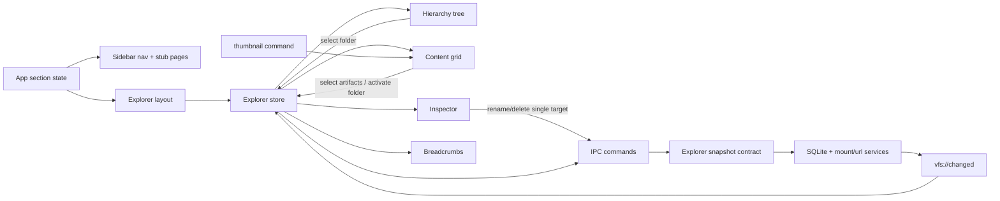
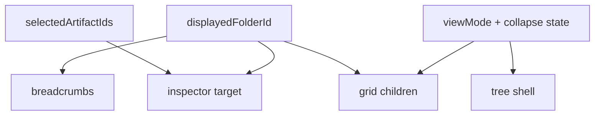
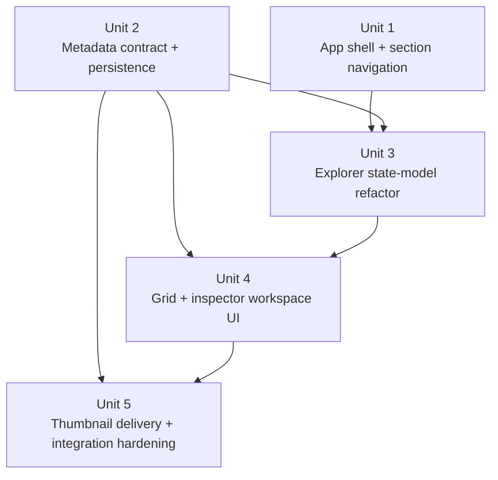

# feat: Build Explorer UI Milestone 2 workspace shell

## Overview

Replace the current Milestone 1 single-view Explorer scaffold with a product-grade application shell: persistent left navigation, a three-pane Explorer workspace, richer node metadata, multiple content-grid view modes, and image thumbnails for mounted image files.

This plan keeps the existing local-first VFS backend, full-snapshot IPC contract, and event-driven refresh model from Milestone 1, but extends both the backend contract and frontend state model so the Explorer can support a tree-driven folder location, independent artifact selection, and metadata-rich inspection without regressing live updates or mutation flows.

## Problem Frame

The current application is still a Milestone 1 shell: [src/app/App.tsx](src/app/App.tsx) renders a hero panel plus the Explorer tree/inspector layout, and [src/features/explorer/components/ExplorerLayout.tsx](src/features/explorer/components/ExplorerLayout.tsx) assumes one selection model for everything. The origin requirements define a materially different UI contract for Milestone 2: section navigation, a hierarchy panel, a content grid, an inspector with metadata, and thumbnail support, all while preserving the real-time VFS behavior from Milestone 1 (see origin: `docs/brainstorms/explorer-ui-milestone-2-requirements.md`).

The key planning challenge is not styling alone. Milestone 2 introduces a different interaction model: the tree determines the displayed folder, the grid renders that folder's children, the inspector reflects either the displayed folder or selected artifacts, and background refreshes must preserve that state coherently. The plan therefore treats the state-model split and metadata contract as first-class work, not incidental UI polish.

## Requirements Trace

- R1-R4. Add a persistent app shell with four sections, Explorer-default landing, active-nav styling, and stable navigation state.
- R5-R7. Preserve the hierarchy tree while making it the source of truth for the displayed folder and breadcrumb path.
- R8-R17. Build the content-grid experience: header metadata, Grid/List/Date modes, folder-card activation, and multi-select aggregate behavior.
- R18-R22. Extend the inspector so single-node, displayed-folder, and multi-select states all render the right metadata and preserve Milestone 1 rename/delete behavior for single-target flows.
- R23-R24. Extend the Explorer node contract to include timestamp and size metadata with node-kind-specific semantics.
- SC1-SC8. Meet the shell, responsiveness, thumbnail, metadata, stub-page, and no-regression success criteria defined in the origin document.

## Scope Boundaries

- No AI-derived metadata, recommendations, or content synthesis.
- No search, filtering, drag-and-drop, bulk mutation, deep-link routing, or browser-history integration.
- No inline file-content rendering inside the content grid beyond image thumbnails.
- No redesign of Milestone 1 creation flows beyond fitting them into the new shell.
- No React Router adoption unless implementation reveals a blocker severe enough to invalidate the lightweight section-state approach.

### Deferred to Separate Tasks

- Rich keyboard navigation beyond the minimum interaction rules needed to support single-select, modifier multi-select, and folder activation.
- Additional file preview types such as PDF, code, or markdown previews.
- Functional Home, Chat, or Memory Timeline implementations beyond stub states.

## Context & Research

### Relevant Code and Patterns

- [src/app/App.tsx](src/app/App.tsx) currently renders a hero panel plus `ExplorerLayout`; this is the right seam for introducing app-level section state and the new left navigation shell.
- [src/features/explorer/components/ExplorerLayout.tsx](src/features/explorer/components/ExplorerLayout.tsx) already owns Explorer composition, existing mutation dialogs, and inspector placement; Milestone 2 should evolve this file rather than replacing the Explorer feature boundary.
- [src/features/explorer/store/useExplorerStore.ts](src/features/explorer/store/useExplorerStore.ts) currently tracks a single `selectedId`, `expandedIds`, and derived breadcrumbs. Milestone 2 needs this store to split folder location from artifact selection while preserving full-snapshot refresh semantics.
- [src/features/explorer/components/ExplorerTree.tsx](src/features/explorer/components/ExplorerTree.tsx), [src/features/explorer/components/ExplorerRow.tsx](src/features/explorer/components/ExplorerRow.tsx), and [src/features/explorer/components/Breadcrumbs.tsx](src/features/explorer/components/Breadcrumbs.tsx) already establish the tree, row, and breadcrumb interaction surface to extend.
- [src/lib/contracts/vfs.ts](src/lib/contracts/vfs.ts) and [src-tauri/src/domain/vfs/node.rs](src-tauri/src/domain/vfs/node.rs) define the shared Explorer snapshot contract; all IPC-returning commands already flow through this shape.
- [src/features/explorer/hooks/useExplorerEvents.ts](src/features/explorer/hooks/useExplorerEvents.ts) and the `vfs://changed` emitter path in [src-tauri/src/lib.rs](src-tauri/src/lib.rs) are the existing real-time update mechanism and should remain authoritative.
- The backend already stores `created_at` and `updated_at` columns on `nodes` in [src-tauri/migrations/0001_initial.sql](src-tauri/migrations/0001_initial.sql); Milestone 2 should reuse and clarify these fields rather than inventing duplicate timestamp storage.
- Mounted-tree reconciliation and URL indexing already have strong integration tests in [src-tauri/tests/mount_live_sync.rs](src-tauri/tests/mount_live_sync.rs), [src-tauri/tests/mounted_path_mutations.rs](src-tauri/tests/mounted_path_mutations.rs), and [src-tauri/tests/url_indexing.rs](src-tauri/tests/url_indexing.rs). Milestone 2 should extend these patterns for metadata and thumbnail behavior.
- Frontend tests currently use Vitest + Testing Library in [src/app/App.test.tsx](src/app/App.test.tsx), [src/features/explorer/components/ExplorerTree.test.tsx](src/features/explorer/components/ExplorerTree.test.tsx), and [src/features/explorer/store/useExplorerStore.test.ts](src/features/explorer/store/useExplorerStore.test.ts); new UI coverage should follow that style.
- Repo guidance in `AGENTS.md` materially shapes execution: keep diffs small, preserve existing behavior with tests, and include explicit test files for feature-bearing units.

### Institutional Learnings

- No `docs/solutions/` corpus is present, so there are no stored institutional learnings to carry forward.

### External References

- Tauri v2 `convertFileSrc` docs describe the supported way to load local files in the webview and explicitly note that using the asset protocol requires CSP changes plus `app.security.assetProtocol.enable` and scoped access in `tauri.conf.json`. Source: [Tauri JavaScript core API](https://v2.tauri.app/reference/javascript/api/namespacecore/#convertfilesrc).
- Tauri v2 configuration docs confirm that `app.security.assetProtocol` is disabled by default and requires an explicit `scope` list. Source: [Tauri configuration reference](https://v2.tauri.app/reference/config/#assetprotocolconfig).

### Research Summary

- The repo already has a strong local pattern for React/Tauri feature work, full-snapshot IPC, and event-driven refresh. External research was only needed for the thumbnail-serving decision because the repo has no existing file-preview path and Tauri asset-serving behavior is version-sensitive.
- Inference from the Tauri docs plus the current repo: broad asset-protocol exposure for arbitrary user-mounted paths would require a wide filesystem scope in `tauri.conf.json`, so the safer Milestone 2 plan is a dedicated thumbnail delivery path scoped to mounted image nodes rather than exposing raw filesystem access broadly to the webview.

## Key Technical Decisions

- Use a lightweight app-level `section` state in [src/app/App.tsx](src/app/App.tsx) instead of adding React Router.
  Rationale: Home, Chat, and Memory Timeline are stub-only sections today, the repo has no routing infrastructure, and adding a router would create carrying cost with little Milestone 2 value.

- Keep the Explorer mounted while inactive instead of unmounting it on section switches.
  Rationale: the current Explorer store is hook-local state, and keeping the Explorer mounted is the smallest change that preserves selection, expansion, and displayed-folder state when users move between stub sections and back.

- Refactor the Explorer store to model `displayedFolderId`, `selectedArtifactIds`, `viewMode`, and `isHierarchyCollapsed` separately from the existing expansion state.
  Rationale: the Milestone 2 requirements explicitly separate tree location, grid selection, and inspector target; a single `selectedId` cannot represent those states without ambiguity.

- Keep the backend as the authoritative VFS source of truth and continue rehydrating the frontend from full snapshots plus `vfs://changed` events.
  Rationale: this preserves the proven Milestone 1 behavior for mount sync and URL indexing and avoids split-brain frontend mutations.

- Reuse the existing `nodes.created_at` and `nodes.updated_at` storage, but expose them through the IPC contract as Milestone 2 `created_at` / `modified_at` semantics and add persisted leaf-size support where needed.
  Rationale: the database already has timestamp columns, so the work is to maintain the correct semantics per node kind and extend the contract, not to invent a second timestamp system.

- Make mounted descendant identities stable across reconcile cycles.
  Rationale: the current mount reconciliation path deletes and reinserts mounted descendants, which would otherwise break displayed-folder continuity, artifact selection continuity, and thumbnail caching on normal watcher refreshes.

- Compute folder and mount aggregate sizes at snapshot-build time from persisted descendant leaf sizes rather than maintaining write-time aggregate rollups everywhere.
  Rationale: the snapshot path already traverses the full node graph, so this keeps the UI milestone scoped to exposed metadata and stable semantics without turning Milestone 2 into a broad cross-path rollup-maintenance project.

- Use a dedicated backend thumbnail command for mounted image nodes, with lazy frontend loading limited to currently visible cards, instead of relying on broad asset-protocol filesystem exposure.
  Rationale: Tauri's asset protocol is valid but requires explicit filesystem scope in configuration; for arbitrary user-selected mounts, a dedicated command keeps the capability narrower and the contract easier to test. This is an inference from the Tauri docs and the repo's current security/config posture.

- Define grid interaction as: plain click selects one artifact, `Cmd`/`Ctrl`-click toggles membership in the current selection, and double-click or `Enter` on a folder card activates it as the new displayed folder.
  Rationale: this matches desktop expectations, preserves the distinction between selection and navigation, and avoids checkbox-overlay complexity for Milestone 2.

- Group Date mode in local device time.
  Rationale: "Today", "Yesterday", and "This Week" are inherently user-local concepts, and there is no existing cross-timezone product requirement in scope.

## Alternative Approaches Considered

- Add React Router now for all four sections.
  Why not chosen: the non-Explorer sections are placeholders and there is no URL/deep-link requirement in scope, so a router would add structure without immediate user value.

- Keep a single `selectedId` and derive displayed-folder behavior heuristically.
  Why not chosen: grid multi-select, folder-card activation, breadcrumb ownership, and inspector precedence would all become ambiguous and brittle under refresh.

- Use Tauri asset protocol directly for mounted image thumbnails.
  Why not chosen: it is technically supported, but for arbitrary user-mounted paths it would require widening `assetProtocol.scope` in configuration. A dedicated thumbnail command is a narrower and more reviewable first implementation.

## Open Questions

### Resolved During Planning

- How should section navigation be implemented?
  Resolution: use local app-level section state in `App.tsx` and render stub pages for the non-Explorer sections.

- How should tree location and grid selection coexist?
  Resolution: split store state into displayed-folder location plus artifact selection and derive the inspector target from those states in a fixed precedence order.

- How should hierarchy collapse state be stored?
  Resolution: keep it inside the Explorer store (or an adjacent Explorer-local UI state container), not a global layout store.

- How should multi-select work for Milestone 2?
  Resolution: plain click selects a single artifact, `Cmd`/`Ctrl`-click toggles additional artifacts, multi-select is aggregate/inspect-only, and rename/delete stay single-target only.

- How should folder-card activation behave?
  Resolution: single click selects for inspection; double-click or `Enter` activates the folder as the new displayed folder.

- How should Date mode determine grouping buckets?
  Resolution: use local device time.

- How should thumbnails be delivered?
  Resolution: use a dedicated backend thumbnail path for mounted image nodes and load thumbnails lazily for visible cards only.

### Deferred to Implementation

- Exact thumbnail payload format (`data:` URL vs temporary cached preview path) as long as the frontend consumes a webview-safe image source from a dedicated backend command.
- Exact aggregation-update mechanics for `size_bytes` during mount reconciliation and file mutations, as long as the backend keeps the values transactionally coherent.
- Exact visual styling details for the navigation shell, cards, and inspector sections once the layout is rendered and reviewable.

## High-Level Technical Design

> *This illustrates the intended approach and is directional guidance for review, not implementation specification. The implementing agent should treat it as context, not code to reproduce.*

## Implementation Units

- [x] **Unit 1: Restructure the app into a persistent navigation shell**

**Goal:** Replace the current hero-plus-Explorer composition with the Milestone 2 application shell and stub section rendering.

**Requirements:** R1-R4, SC1, SC6

**Dependencies:** None

**Files:**
- Modify: `src/app/App.tsx`
- Create: `src/app/AppSidebar.tsx`
- Modify: `src/styles/app.css`
- Modify: `src/styles/tokens.css`
- Test: `src/app/App.test.tsx`

**Approach:**
- Replace the Milestone 1 hero panel with a left navigation sidebar and a right-hand section viewport.
- Include the CogniOS wordmark/logo at the top of the sidebar and a persistent system-status line at the bottom so the shell satisfies the full Milestone 2 chrome contract.
- Keep Explorer as the default active section and render Home, Chat, and Memory Timeline as explicit stub views with section labeling.
- Preserve the existing Explorer feature boundary by keeping `ExplorerLayout` as the Explorer section root instead of distributing Explorer logic across the app shell.
- Keep `ExplorerLayout` mounted even when another section is active so the existing hook-backed store retains state across section switches.

**Patterns to follow:**
- Existing app-entry/test setup in `src/app/App.tsx` and `src/app/App.test.tsx`
- Existing CSS token usage in `src/styles/tokens.css` and layout conventions in `src/styles/app.css`

**Test scenarios:**
- Happy path: opening the app renders the four sidebar items in the required order and shows Explorer as the active default section.
- Happy path: the sidebar renders the CogniOS wordmark/logo at the top and a visible system-status line at the bottom across all four sections.
- Happy path: clicking Home, Chat, and Memory Timeline swaps the main viewport to a stub page without unmounting or visually collapsing the sidebar.
- Edge case: switching away from Explorer and back preserves Explorer shell state rather than resetting to an empty initial render.
- Integration: existing Explorer data hydration still occurs when Explorer is the active section on first load.

**Verification:**
- The app lands in the Explorer shell by default and the other three sections are reachable stub states with no runtime errors.

- [x] **Unit 2: Extend the backend snapshot contract with Milestone 2 metadata**

**Goal:** Expose `created_at`, `modified_at`, and `size_bytes` with the semantics required by the origin document, while preserving Milestone 1 snapshot and mutation behavior and stabilizing mounted descendant identity across refreshes.

**Requirements:** R18-R24, SC5, SC8

**Dependencies:** None

**Files:**
- Modify: `src/lib/contracts/vfs.ts`
- Modify: `src/lib/tauri/ipc.ts`
- Create: `src-tauri/migrations/0004_node_metadata.sql`
- Modify: `src-tauri/src/domain/vfs/node.rs`
- Modify: `src-tauri/src/infrastructure/db/migrations.rs`
- Modify: `src-tauri/src/infrastructure/db/node_repository.rs`
- Modify: `src-tauri/src/infrastructure/db/mount_repository.rs`
- Modify: `src-tauri/src/infrastructure/db/url_repository.rs`
- Modify: `src-tauri/src/services/mounts/scanner.rs`
- Modify: `src-tauri/src/services/mounts/reconcile.rs`
- Modify: `src-tauri/src/services/mutations/rename_node.rs`
- Modify: `src-tauri/src/services/mutations/delete_node.rs`
- Test: `src-tauri/tests/vfs_persistence.rs`
- Create: `src-tauri/tests/explorer_snapshot_metadata.rs`
- Modify: `src-tauri/tests/mount_sync.rs`
- Modify: `src-tauri/tests/url_indexing.rs`
- Modify: `src-tauri/tests/mounted_path_mutations.rs`

**Approach:**
- Reuse `nodes.created_at` and `nodes.updated_at` as storage primitives, but expose them in the DTO/TypeScript contract with the Milestone 2 naming and semantics.
- Add persisted leaf-size support and keep it coherent across folder creation, mount reconciliation, URL indexing artifact writes, rename/delete flows, and restart hydration.
- Update snapshot-building code so every node returned to the frontend already includes the metadata required for grid cards and the inspector.
- Treat URL `size_bytes` as cached-artifact size and update it when raw HTML cache artifacts are written or removed.
- Make mounted descendant IDs stable across reconcile cycles so displayed-folder state, artifact selection, and thumbnail requests can survive normal watcher-driven refreshes for mounted content.

**Execution note:** Start with failing backend tests for DTO shape and metadata semantics before changing repository code paths.

**Technical design:** *(directional guidance, not implementation specification)* Backends should persist leaf-node metadata at write/reconcile time, preserve stable IDs for mounted descendants, and compute folder/mount aggregate sizes during snapshot assembly from the already-loaded descendant graph.

**Patterns to follow:**
- Snapshot assembly in `src-tauri/src/infrastructure/db/node_repository.rs`
- URL artifact lifecycle in `src-tauri/src/infrastructure/db/url_repository.rs`
- Existing migration pattern in `src-tauri/src/infrastructure/db/migrations.rs`

**Test scenarios:**
- Happy path: a persisted virtual folder round-trips through the snapshot with stable `created_at`, updated `modified_at` on child mutation, and `size_bytes = 0` when it has no file descendants.
- Happy path: a mounted file snapshot row exposes filesystem-derived timestamps and file size after mount reconciliation.
- Happy path: a mounted descendant keeps a stable node ID across reconcile cycles for the same mount-relative path.
- Happy path: a URL node exposes bookmark-time `created_at`, successful-index `modified_at`, and cached-HTML `size_bytes` after indexing completes.
- Edge case: a folder or mount with nested descendants returns aggregate `size_bytes` equal to the sum of descendant file sizes, not just direct children.
- Error path: deleting a URL removes cached artifacts and resets its stored artifact size instead of leaving orphaned bytes behind.
- Integration: rename/delete/mount-reconcile flows preserve metadata consistency while continuing to return a valid full snapshot.

**Verification:**
- Every node in the Explorer snapshot contract carries the Milestone 2 metadata fields with semantics that match the origin document and do not break existing persistence/mutation tests.

- [x] **Unit 3: Refactor Explorer state around displayed-folder and artifact selection**

**Goal:** Introduce the state model that makes the hierarchy, content grid, breadcrumbs, and inspector coherent under Milestone 2 interactions and background refreshes.

**Requirements:** R5-R9, R15-R17, R19-R22, SC2, SC7, SC8

**Dependencies:** Unit 1, Unit 2

**Files:**
- Modify: `src/features/explorer/store/useExplorerStore.ts`
- Modify: `src/features/explorer/store/useExplorerStore.test.ts`
- Modify: `src/features/explorer/types/explorer.ts`
- Modify: `src/features/explorer/hooks/useExplorerEvents.ts`
- Modify: `src/features/explorer/components/Breadcrumbs.tsx`
- Modify: `src/features/explorer/components/Breadcrumbs.test.tsx`

**Approach:**
- Split the current single-selection model into separate concepts: displayed folder, selected artifacts, inspector target derivation, view mode, and hierarchy collapse state.
- Define deterministic precedence rules: displayed-folder metadata appears in the inspector only when no grid artifact is selected; single artifact selection outranks folder inspection; multi-select produces aggregate inspector state and disables rename/delete actions.
- Preserve the backend-as-source-of-truth model by translating incoming full snapshots into updated selection/location state instead of optimistic local tree mutations.
- On refresh, prefer stable continuity: preserve the displayed folder and artifact selections when they still exist; otherwise fall back to the nearest valid folder context, then to the first root if needed.

**Execution note:** Implement store behavior test-first; it is the highest-leverage place to lock the Milestone 2 interaction contract before rendering the full UI.

**Technical design:** *(directional guidance, not implementation specification)* The store should expose selector-friendly derived values such as `displayedFolder`, `visibleArtifacts`, `inspectorMode`, and `selectionCount` so presentation components stay mostly declarative.

**Patterns to follow:**
- Existing store/test pattern in `src/features/explorer/store/useExplorerStore.ts`
- Current breadcrumb derivation in `src/features/explorer/components/Breadcrumbs.tsx`
- Event subscription boundary in `src/features/explorer/hooks/useExplorerEvents.ts`

**Test scenarios:**
- Happy path: selecting a folder in the hierarchy changes the displayed folder, updates breadcrumbs, and loads that folder's immediate children as visible artifacts.
- Happy path: selecting a single artifact leaves the displayed folder unchanged while switching the inspector target to that artifact.
- Happy path: `Cmd`/`Ctrl`-click adds and removes artifacts from the current selection and exposes the correct aggregate selection count.
- Edge case: activating a folder card from the grid changes the displayed folder without leaving stale selected artifacts from the previous folder.
- Edge case: when a refresh snapshot removes a selected artifact, the store clears just that selection while preserving the displayed folder if it still exists.
- Error path: when a refresh snapshot removes the displayed folder, the store falls back to a valid parent/root context instead of leaving breadcrumbs and grid state dangling.
- Integration: `vfs://changed` refreshes preserve stable Explorer state through watcher-driven updates and URL indexing transitions.

**Verification:**
- The store can represent every Milestone 2 interaction state without ambiguous selection behavior or breadcrumb/grid drift.

- [x] **Unit 4: Build the three-pane Explorer workspace UI**

**Goal:** Render the hierarchy panel, content grid, inspector, and shell interactions defined by the Milestone 2 requirements using the new state model and metadata contract.

**Requirements:** R3-R22, SC1-SC7

**Dependencies:** Unit 1, Unit 2, Unit 3

**Files:**
- Modify: `src/features/explorer/components/ExplorerLayout.tsx`
- Modify: `src/features/explorer/components/ExplorerTree.tsx`
- Modify: `src/features/explorer/components/ExplorerRow.tsx`
- Create: `src/features/explorer/components/ExplorerContentGrid.tsx`
- Create: `src/features/explorer/components/ArtifactCard.tsx`
- Create: `src/features/explorer/components/ExplorerInspector.tsx`
- Create: `src/features/explorer/components/ViewModeToggle.tsx`
- Modify: `src/features/explorer/components/DeleteConfirmationDialog.tsx`
- Modify: `src/features/explorer/components/CreateNodeDialog.tsx`
- Modify: `src/styles/app.css`
- Test: `src/features/explorer/components/ExplorerTree.test.tsx`
- Create: `src/features/explorer/components/ExplorerContentGrid.test.tsx`
- Create: `src/features/explorer/components/ExplorerInspector.test.tsx`
- Modify: `src/app/App.test.tsx`

**Approach:**
- Keep the existing hierarchy tree as the left Explorer panel and add a separate center grid plus right inspector rather than overloading the current tree/inspector layout.
- Render view modes entirely client-side from the current snapshot/store state so switching Grid/List/Date does not invoke IPC.
- Keep List mode name-sorted and Date mode grouped into the required local-time buckets (`Today`, `Yesterday`, `This Week`, `Earlier`), with stable name sorting inside each bucket.
- Reuse existing mutation dialogs and inspector actions, but gate rename/delete off when the inspector is in aggregate multi-select mode.
- Use type badges and icon/thumbnail slots consistently across grid and inspector so node kind/state remain visible in both navigation and content contexts, including URL indexing state in the inspector for URL nodes.
- Preserve responsive behavior by allowing the hierarchy panel to collapse while keeping selection state intact.

**Patterns to follow:**
- Existing tree rendering structure in `src/features/explorer/components/ExplorerTree.tsx`
- Existing mutation-dialog usage in `src/features/explorer/components/ExplorerLayout.tsx`
- Existing component-test style in `src/features/explorer/components/ExplorerTree.test.tsx`

**Test scenarios:**
- Happy path: the Explorer renders hierarchy, content grid, and inspector simultaneously with the displayed folder's children in the grid.
- Happy path: switching Grid/List/Date updates only presentation state and leaves the displayed folder and artifact selection intact.
- Happy path: List mode renders rows sorted by name, and Date mode renders the required bucket headings with stable name sorting inside each bucket.
- Happy path: selecting a single artifact updates the inspector with node name, kind label, timestamps, and human-readable size.
- Happy path: selecting a URL node shows its indexing state in the inspector alongside the rest of its metadata.
- Happy path: selecting multiple artifacts updates the grid header count and shows aggregate inspector metadata with single-target actions disabled.
- Edge case: when no folder is explicitly selected, the content grid renders top-level roots.
- Edge case: collapsing and re-expanding the hierarchy panel preserves displayed-folder and artifact-selection state.
- Error path: mutation failures surfaced from existing rename/delete flows display feedback in the shell without corrupting displayed-folder or artifact-selection state.
- Integration: existing create-folder, add-mount, and add-URL flows still insert nodes into the workspace and remain reachable from the new shell.

**Verification:**
- The Explorer matches the Milestone 2 shell contract while preserving the Milestone 1 node-management affordances and real-time behavior.

- [x] **Unit 5: Add image thumbnail delivery and workspace integration hardening**

**Goal:** Make image cards render real previews, keep the capability surface narrow, and harden the no-regression behavior around refresh, performance, and mounted-file interactions.

**Requirements:** R10-R11, R14, R20-R24, SC3-SC8

**Dependencies:** Unit 2, Unit 4

**Files:**
- Modify: `src/lib/tauri/ipc.ts`
- Modify: `src/features/explorer/api/explorerClient.ts`
- Modify: `src/features/explorer/types/explorer.ts`
- Modify: `src/features/explorer/components/ArtifactCard.tsx`
- Modify: `src/features/explorer/components/ExplorerContentGrid.tsx`
- Modify: `src-tauri/src/commands/mod.rs`
- Create: `src-tauri/src/commands/thumbnails.rs`
- Modify: `src-tauri/src/lib.rs`
- Create: `src-tauri/tests/image_thumbnails.rs`
- Modify: `src/features/explorer/components/ExplorerContentGrid.test.tsx`

**Approach:**
- Add a dedicated thumbnail command for mounted image nodes and keep frontend loading lazy so only visible cards request previews.
- Trigger thumbnail loads from visible-card lifecycle only, dedupe in-flight requests by node ID, and discard stale responses after folder/view/snapshot changes.
- Scope thumbnail generation to mounted image files already represented in the VFS graph; unsupported kinds should fall back to icon rendering instead of attempting ad hoc file reads.
- Canonicalize the requested file path at request time, verify it still descends from the mount root's canonical path, and reject symlinks or any path that escapes the mounted root.
- Keep the frontend thumbnail contract small and swappable so future changes to delivery format do not ripple across the rest of the grid implementation, and return only app-managed thumbnail bytes or app-owned cache handles rather than raw host filesystem paths.
- Bound thumbnail work with explicit file-size, decoded-pixel, concurrency, and failure limits so malformed or oversized images degrade gracefully instead of turning the thumbnail command into a local DoS path.
- Use this unit to verify the Milestone 1 no-regression success path under the new shell: live updates, URL state badges, and inspector-based rename/delete still behave correctly when content grid and thumbnails are active.

**Execution note:** Start with integration tests for supported/unsupported thumbnail cases before deciding the exact payload shape.

**Technical design:** *(directional guidance, not implementation specification)* The thumbnail command should accept a node identifier, resolve it to a mounted image file, canonicalize and revalidate the path against the canonical mount root, enforce decode/resource limits, and return only a webview-safe thumbnail artifact owned by the app rather than a raw host filesystem path.

**Patterns to follow:**
- Existing command registration pattern in `src-tauri/src/lib.rs` and `src-tauri/src/commands`
- Existing frontend IPC client pattern in `src/lib/tauri/ipc.ts` and `src/features/explorer/api/explorerClient.ts`
- Existing URL cache artifact behavior in `src-tauri/src/services/url_indexing/cache.rs`

**Test scenarios:**
- Happy path: a mounted image file card renders an actual thumbnail in the content grid.
- Happy path: a non-image file card renders an icon fallback and never requests a thumbnail.
- Happy path: repeated renders of the same visible image card reuse deduped thumbnail work rather than issuing duplicate IPC requests.
- Edge case: an inaccessible mounted image file falls back to icon rendering without crashing the grid.
- Edge case: a symlinked or path-escaped image request is rejected and falls back to icon rendering without exposing the underlying host path.
- Edge case: an oversized or malformed image is rejected within the configured resource limits and leaves the card in a safe fallback state.
- Error path: a thumbnail command request for an unsupported node kind is rejected cleanly and does not poison the card-render path.
- Integration: folder switches, view-mode changes, or snapshot refreshes discard stale thumbnail results instead of painting the wrong image into a reused card.
- Integration: enabling thumbnails does not break existing URL-state badges, rename/delete actions, or watcher-driven refresh updates in the workspace.

**Verification:**
- Visible image cards show real previews through a narrow backend capability, and the Explorer continues to satisfy Milestone 1 no-regression expectations under the new shell.

## System-Wide Impact

- **Interaction graph:** App shell state routes into Explorer layout state; Explorer store drives hierarchy, grid, breadcrumbs, and inspector; IPC snapshot/thumbnail commands bridge frontend behavior to SQLite, mount reconciliation, and URL indexing services.
- **Error propagation:** backend snapshot/thumbnail failures should continue surfacing as frontend error state or graceful per-card fallback, not as stale partial UI state.
- **Trust boundaries:** thumbnail IPC must accept opaque node identifiers, validate canonical mount containment server-side, and avoid exposing absolute filesystem paths or low-level IO details back to the renderer.
- **State lifecycle risks:** the main risk is divergence between displayed-folder location and artifact selection during refresh, delete, and folder activation flows.
- **API surface parity:** all snapshot-returning commands (`get_explorer_snapshot`, create, rename, delete, retry follow-up refreshes) must return the same enriched `ExplorerNode` contract; thumbnail loading adds a new command that must respect the same node identity model.
- **Integration coverage:** tests must cover snapshot refreshes after watcher updates, URL indexing state transitions, and inspector mutations while the grid and selection model are active.
- **Unchanged invariants:** the backend remains the VFS source of truth, URL indexing remains background-driven, mount reconciliation remains restart-safe, and rename/delete semantics from Milestone 1 do not broaden to bulk actions in Milestone 2.

## Risks & Dependencies

| Risk | Mitigation |
|------|------------|
| State-model ambiguity causes breadcrumb/grid/inspector drift | Land the store refactor before rendering the full workspace UI and lock it with focused store tests |
| Mounted descendant IDs change on reconcile and break UI continuity | Treat stable mounted-node identity as part of Unit 2, with dedicated reconcile tests before relying on continuity for mounted content |
| Metadata semantics diverge across node kinds | Add backend tests for each node kind and centralize DTO assembly in the snapshot path |
| Thumbnail support widens filesystem exposure too far | Use a dedicated backend thumbnail command scoped to mounted image nodes instead of broad raw-file asset exposure |
| Thumbnail decoding becomes a local DoS or path-escape primitive | Enforce canonical mount-root validation, reject symlinks/escaped paths, and add strict decode/resource limits plus normalized error responses |
| Aggregate size maintenance adds mutation complexity | Keep the write/update logic in repository/service boundaries already responsible for mount reconciliation, URL artifact writes, and delete flows |
| New shell regresses Milestone 1 live-update behavior | Carry forward no-regression coverage in app/component/integration tests and explicitly validate event-driven refresh paths |

## Documentation / Operational Notes

- Update `README.md` only if the shipped UX description still references the Milestone 1 hero-style Explorer shell.
- If the thumbnail implementation needs new Tauri capability or config entries, keep them narrowly documented alongside the command/config changes.
- No rollout or migration tooling beyond the SQLite migration path is expected for this local-only application.

## Sources & References

- **Origin document:** `docs/brainstorms/explorer-ui-milestone-2-requirements.md`
- Related code: `src/app/App.tsx`
- Related code: `src/features/explorer/components/ExplorerLayout.tsx`
- Related code: `src/features/explorer/store/useExplorerStore.ts`
- Related code: `src/lib/contracts/vfs.ts`
- Related code: `src-tauri/src/domain/vfs/node.rs`
- Related code: `src-tauri/src/infrastructure/db/node_repository.rs`
- Related code: `src-tauri/src/infrastructure/db/mount_repository.rs`
- Related code: `src-tauri/src/infrastructure/db/url_repository.rs`
- Related code: `src-tauri/src/lib.rs`
- External docs: https://v2.tauri.app/reference/javascript/api/namespacecore/#convertfilesrc
- External docs: https://v2.tauri.app/reference/config/#assetprotocolconfig
