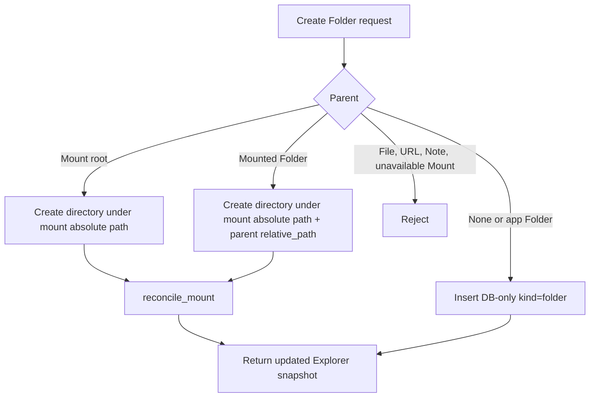

# feat: unify folder taxonomy under mounts

## Overview

Unify the VFS container model so users only reason about Folder, URL, Mount, File, and Note. Mount stays distinct as the local-folder connection/root object. Local subdirectories mirrored under a Mount become Folder nodes with mounted capabilities, rather than a separate Directory node type.

This also fixes folder creation semantics inside mounted trees: creating a Folder under a Mount or mounted Folder must create a real local directory on disk, then reconcile the mount mirror.

## Problem Frame

The origin requirements now define Folder as the canonical container concept, while Mount remains a distinct local-folder connection/root with watcher, ignore config, availability state, and unlink semantics (see origin: `docs/brainstorms/vfs-node-management-requirements.md`). The current implementation still exposes `directory` as a separate node kind and creates all folders as DB-only rows, even when the parent lives inside a mounted filesystem tree.

That mismatch creates user confusion and unsafe behavior. A folder created inside a mounted tree should exist on disk; otherwise it is visible only in CogniOS and can disappear or conflict during mount reconciliation.

## Requirements Trace

- R1. Users can create Folder nodes and nest them under other Folders.
- R2. App-created Folders are VFS-only.
- R6. Mounts mirror local folder trees beneath the mount point.
- R9. Mount watcher/reconciliation keeps the VFS mirror current.
- R16. Mounted file and mounted Folder rename operations apply to disk.
- R17. Mounted file and mounted Folder delete operations apply to disk.
- R19. Local directory descendants under a Mount are represented as Folder nodes, not Directory nodes.
- R20. Creating a Folder inside a Mount or mounted Folder creates a real local directory, then refreshes the VFS mirror.

## Scope Boundaries

- No historical data migration or backfill for existing `directory` rows. The implementation may keep a defensive parser alias if useful during development, but `directory` is not canonical and should not be newly written.
- No change to Mount as a distinct user-visible root/connection object.
- No new drag-and-drop, bulk operations, or file preview behavior.
- No search ranking or indexing scope expansion beyond keeping container kinds out of sidecar indexing state errors.

## Context & Research

### Relevant Code and Patterns

- `src-tauri/src/domain/vfs/node.rs` defines `NodeKind` and serializes `kind` into Explorer DTOs.
- `src/lib/contracts/vfs.ts` exports the frontend `NodeKind` union that currently includes `directory`.
- `src-tauri/src/services/mounts/scanner.rs` currently emits `NodeKind::Directory` for local directories discovered under a Mount.
- `src-tauri/src/infrastructure/db/mount_repository.rs` owns mount creation, scan persistence, reconciliation, and stable id reuse by `relative_path`.
- `src-tauri/src/infrastructure/db/node_repository.rs` currently creates all Folders as DB-only nodes and only checks that the parent exists.
- `src-tauri/src/services/mutations/rename_node.rs` and `src-tauri/src/services/mutations/delete_node.rs` already use the desired mounted-path pattern: apply filesystem mutation first, then call `reconcile_mount`.
- `src-tauri/src/services/mutations/reindex_node.rs` and `src-tauri/src/services/search/index_state_sync.rs` treat folder, directory, and mount as containers today. These should collapse to folder and mount.
- Frontend display and affordance code references `directory` in `src/features/explorer/utils/presentation.ts`, `src/features/explorer/store/useExplorerStore.ts`, `src/features/explorer/components/NodeStateDot.tsx`, and `src/features/explorer/components/ExplorerInspector.tsx`.

### Institutional Learnings

- No relevant `docs/solutions/` entries were present in this repo at planning time.
- Repo guidance favors small, reversible diffs, existing patterns, and focused tests before behavior changes.

### External References

- External research skipped. This is governed by existing local VFS and mount mutation patterns rather than external library behavior.

## Key Technical Decisions

- **Mounted Folder identity uses existing node metadata:** A node with `kind='folder'`, `mount_id` set, and `relative_path` set is a mounted Folder. A node with `kind='folder'` and no `mount_id` remains an app-created Folder.
- **Mount root stays `kind='mount'`:** The root connection needs separate unlink, availability, watcher, ignore config, and setup behavior.
- **Folder creation branches by parent source:** Root or app-created Folder parents create DB-only folders. Mount or mounted Folder parents create directories on disk first, then reconcile the mount.
- **No new canonical `directory` writes:** The scanner and persistence paths should emit Folder for local directories. Any `directory` compatibility is defensive only, not a product model.
- **Filesystem mutation remains disk-first:** Mounted create, rename, and delete should mutate disk before changing the VFS mirror, so failed filesystem operations do not leave fake VFS rows.

## Open Questions

### Resolved During Planning

- Should Mount be merged into Folder? No. Mount remains distinct as the local-folder connection/root.
- Should Directory remain a separate node type? No. Local subdirectories under Mount become Folder nodes.
- What should New Folder do inside a Mount? It creates a real local directory on disk, then reconciles.
- Is historical data migration required? No, per user direction.

### Deferred to Implementation

- Whether `NodeKind::from_db("directory")` remains as a temporary defensive alias: decide while updating tests. It must not preserve `directory` as a new-write path.
- Exact helper names and service boundaries for parent-source classification: choose names that fit the surrounding Rust modules.
- Exact ignore-rule precheck mechanism before `create_dir`: implementation should reuse existing mount ignore matcher logic if practical, or create and reconcile only if the folder will remain visible.

## High-Level Technical Design

> *This illustrates the intended approach and is directional guidance for review, not implementation specification. The implementing agent should treat it as context, not code to reproduce.*

## Implementation Units

- [x] **Unit 1: Collapse Directory Into Folder Taxonomy**

**Goal:** Stop exposing or writing `directory` as a canonical node kind; mounted subdirectories persist and serialize as Folder.

**Requirements:** R6, R11, R19.

**Dependencies:** None.

**Files:**
- Modify: `src-tauri/src/domain/vfs/node.rs`
- Modify: `src-tauri/src/services/mounts/scanner.rs`
- Modify: `src-tauri/src/infrastructure/db/mount_repository.rs`
- Modify: `src/lib/contracts/vfs.ts`
- Modify: `src/features/explorer/utils/presentation.ts`
- Modify: `src/features/explorer/components/NodeStateDot.tsx`
- Test: `src-tauri/tests/mount_sync.rs`
- Test: `src-tauri/tests/mount_restart_reconciliation.rs`
- Test: `src/features/explorer/utils/presentation.test.ts`

**Approach:**
- Make Folder the persisted and serialized kind for directories scanned under a Mount.
- Remove `directory` from the frontend `NodeKind` union and user-facing presentation helpers.
- Update container checks to use Folder and Mount only.
- Treat any retained `directory` parser support as compatibility-only, not as a write path.

**Execution note:** Add or adjust tests around mount scans before removing user-facing `directory` assumptions.

**Patterns to follow:**
- Existing scanner-to-persistence flow in `src-tauri/src/services/mounts/scanner.rs`.
- Existing stable relative-path id reuse in `src-tauri/src/infrastructure/db/mount_repository.rs`.

**Test scenarios:**
- Happy path: mounting a local folder with nested directories returns Explorer nodes where nested directories have `kind='folder'`.
- Integration: restart reconciliation of a nested mount preserves mounted subfolders as Folder nodes.
- Error path: no frontend presentation helper tries to handle `directory` as a user-visible kind.

**Verification:**
- Newly scanned mounted subdirectories are serialized as Folder.
- No frontend type or display path requires `directory`.

- [x] **Unit 2: Add Mounted-Aware Folder Creation**

**Goal:** Make `create_folder` create DB-only Folders under app-owned parents and real local directories under mounted parents.

**Requirements:** R1, R2, R6, R9, R20.

**Dependencies:** Unit 1.

**Files:**
- Modify: `src-tauri/src/commands/mod.rs`
- Modify: `src-tauri/src/infrastructure/db/node_repository.rs`
- Modify: `src-tauri/src/infrastructure/db/mount_repository.rs`
- Create or Modify: `src-tauri/src/services/mutations/create_folder.rs`
- Test: `src-tauri/tests/vfs_persistence.rs`
- Test: `src-tauri/tests/mounted_path_mutations.rs`
- Test: `src-tauri/tests/vfs_domain_invariants.rs`

**Approach:**
- Classify the parent before creation:
  - No parent or app-created Folder: insert DB-only Folder.
  - Mount root: create the target directory under the mount absolute path.
  - Mounted Folder: create the target directory under `absolute_path + relative_path`.
  - File, URL, Note: reject as non-container parents.
  - Unavailable Mount or mounted Folder under an unavailable Mount: reject before filesystem mutation.
- For mounted parents, validate the new name, reject collisions, reject paths outside the mount root, create the local directory, then call `reconcile_mount`.
- Return a fresh Explorer snapshot after the DB-only insert or mount reconciliation.

**Execution note:** Implement new domain behavior test-first because current behavior is known to be wrong for mounted parents.

**Patterns to follow:**
- Disk-first mutation plus `reconcile_mount` in `src-tauri/src/services/mutations/rename_node.rs`.
- Existing mount lookup and availability checks in `src-tauri/src/services/mutations/delete_node.rs`.

**Test scenarios:**
- Happy path: creating a Folder under a root app Folder inserts only a DB row and does not touch disk.
- Happy path: creating a Folder directly under a Mount creates a real directory under the mounted root and returns it as a Folder child.
- Happy path: creating a Folder under a mounted Folder creates a nested local directory and returns it as a Folder child.
- Error path: creating under URL, File, or Note returns a validation error and creates nothing.
- Error path: creating under an unavailable Mount returns a validation error and creates nothing.
- Error path: creating with a name that conflicts with an existing local file or folder returns an error and creates nothing.
- Error path: creating a folder that would be excluded by ignore rules returns an error or otherwise does not leave an invisible VFS result.
- Integration: after mounted creation and reconciliation, the new node keeps a stable id across a subsequent reconciliation.

**Verification:**
- User-visible New Folder behavior matches parent source.
- Mounted folder creation survives reconcile and app restart.

- [x] **Unit 3: Update Mounted Folder Mutations and Indexing Boundaries**

**Goal:** Ensure mounted Folder nodes behave like former Directory nodes for rename, delete, reindex, and search-state writeback.

**Requirements:** R16, R17, R19, R20.

**Dependencies:** Unit 1.

**Files:**
- Modify: `src-tauri/src/services/mutations/rename_node.rs`
- Modify: `src-tauri/src/services/mutations/delete_node.rs`
- Modify: `src-tauri/src/services/mutations/reindex_node.rs`
- Modify: `src-tauri/src/services/search/index_state_sync.rs`
- Modify: `src-tauri/src/services/search/forwarder.rs`
- Test: `src-tauri/tests/node_mutations.rs`
- Test: `src-tauri/tests/mounted_path_mutations.rs`
- Test: `src-tauri/src/services/mutations/reindex_node.rs`
- Test: `src-tauri/src/services/search/index_state_sync.rs`
- Test: `src-tauri/src/services/search/forwarder.rs`

**Approach:**
- Replace kind-only branching with a helper that distinguishes app Folder from mounted Folder using `mount_id` and `relative_path`.
- Rename mounted Folders on disk and reconcile, matching current Directory behavior.
- Delete mounted Folders from disk and reconcile, matching current Directory behavior.
- Keep app Folder delete as DB cascade with confirmation.
- Keep containers out of sidecar state writeback so Folder and Mount do not show indexing errors.
- Ensure reindex walks container descendants for Folder and Mount without needing Directory.

**Patterns to follow:**
- Existing `NodeKind::Directory | NodeKind::File` mutation branches before taxonomy collapse.
- Recursive descendant queries in `src-tauri/src/services/mutations/reindex_node.rs`.

**Test scenarios:**
- Happy path: renaming an app-created Folder updates only DB metadata.
- Happy path: renaming a mounted Folder renames the real directory, reconciles, and updates the tree.
- Happy path: deleting a mounted Folder removes the real directory, reconciles, and emits cleanup ids.
- Error path: deleting a non-empty app Folder without cascade still returns the cascade-required error.
- Error path: deleting or renaming a mounted Folder under an unavailable Mount is rejected without disk changes.
- Integration: reindexing a Folder container emits events only for file, note, and URL descendants.
- Integration: sidecar state sync ignores Folder and Mount container rows.

**Verification:**
- Former Directory behavior is preserved for mounted Folder nodes.
- App-owned Folder behavior remains unchanged.

- [x] **Unit 4: Align Frontend UX and Contracts**

**Goal:** Remove Directory from user-facing contracts and copy while making New Folder behavior understandable across app and mounted contexts.

**Requirements:** R11, R14, R19, R20.

**Dependencies:** Units 1 and 2.

**Files:**
- Modify: `src/lib/contracts/vfs.ts`
- Modify: `src/features/explorer/store/useExplorerStore.ts`
- Modify: `src/features/explorer/components/CreateMenu.tsx`
- Modify: `src/features/explorer/components/CreateNodeDialog.tsx`
- Modify: `src/features/explorer/components/ExplorerLayout.tsx`
- Modify: `src/features/explorer/components/ExplorerInspector.tsx`
- Modify: `src/features/explorer/components/DeleteConfirmationDialog.tsx`
- Modify: `src/features/explorer/components/SearchResultRow.tsx`
- Test: `src/features/explorer/store/useExplorerStore.test.ts`
- Test: `src/features/explorer/components/ExplorerLayout.test.tsx`
- Test: `src/features/explorer/components/ExplorerInspector.test.tsx`
- Test: `src/features/explorer/components/DeleteConfirmationDialog.test.tsx`
- Test: `src/app/App.test.tsx`

**Approach:**
- Remove `directory` from TypeScript contracts and every user-facing label/icon branch.
- Keep Mount-specific copy for unlink semantics.
- Use contextual copy for mounted Folder destructive actions so users understand disk effects.
- Keep Create Folder available on app Folder, Mount, and mounted Folder; reject or hide it for File, URL, and Note.
- If the UI cannot distinguish mounted Folder from app Folder from current DTO fields, defer copy precision to backend error messages or add the minimal DTO capability needed during implementation.

**Patterns to follow:**
- Existing create action flow in `src/features/explorer/components/ExplorerLayout.tsx`.
- Existing delete confirmation distinction for Mount in `src/features/explorer/components/ExplorerRow.tsx` and `src/features/explorer/components/DeleteConfirmationDialog.tsx`.

**Test scenarios:**
- Happy path: New Folder action remains available for Folder and Mount containers.
- Happy path: the frontend sends the selected Mount or mounted Folder id as `parentId`.
- Happy path: a mounted subfolder renders as Folder, not Directory.
- Error path: non-container rows do not expose New Folder as a valid contextual action.
- UX path: Mount delete copy still says unlink and preserve source files.
- UX path: mounted Folder delete copy communicates disk deletion when the UI has enough source context.

**Verification:**
- `directory` is absent from public TypeScript contracts and visible labels.
- The Explorer can still create, expand, rename, delete, and inspect Folder and Mount rows.

- [x] **Unit 5: Update Search, Recent Nodes, and Regression Coverage**

**Goal:** Keep adjacent systems correct after the taxonomy collapse.

**Requirements:** R11, R15, R19.

**Dependencies:** Units 1 through 4.

**Files:**
- Modify: `src/features/search/components/SearchFilterBar.tsx`
- Modify: `src/features/search/hooks/useRecentNodes.ts`
- Modify: `src/features/search/components/SearchResultRow.tsx`
- Modify: `sidecar/search_sidecar/index/dispatch.py`
- Modify: `sidecar/tests/test_lifecycle.py`
- Test: `src/features/search/components/SearchFilterBar.test.tsx`
- Test: `src/features/search/hooks/useRecentNodes.test.tsx`
- Test: `src/features/search/components/SearchPalette.test.tsx`
- Test: `src/features/search/components/SearchResultRow.test.tsx`

**Approach:**
- Ensure search filters and recent-node summaries do not depend on `directory`.
- Keep container kinds out of unsupported indexing state handling.
- Confirm sidecar dispatcher behavior remains stable when mounted local subfolders arrive as `kind='folder'`.
- Avoid expanding searchable content scope to containers unless requirements later ask for folder metadata search.

**Patterns to follow:**
- Existing search filter collection in `src/features/search/components/SearchFilterBar.tsx`.
- Existing recent-node container handling in `src/features/search/hooks/useRecentNodes.ts`.

**Test scenarios:**
- Happy path: recent nodes traversal treats Folder and Mount as containers.
- Happy path: search kind filters do not include Directory.
- Integration: mounted Folder rows do not generate user-visible indexing errors.
- Regression: File, Note, and URL search result rows still display their existing labels.

**Verification:**
- No user-facing search or recent-node path references Directory.
- Search/index state remains quiet for containers.

## System-Wide Impact

- **Interaction graph:** `create_folder` crosses frontend action state, Tauri command, VFS DB, filesystem mutation, mount reconciliation, VFS events, and search sidecar forwarding.
- **Error propagation:** Mounted create/rename/delete errors must return clear validation strings without partial DB changes. Filesystem errors should not be swallowed.
- **State lifecycle risks:** Disk-first creation must not leave invisible VFS-only nodes; reconciliation must reuse stable ids by relative path; unavailable mounts must reject mutations.
- **API surface parity:** Rust `NodeKind`, TypeScript `NodeKind`, Explorer presentation helpers, search filters, and tests must agree that Directory is not canonical.
- **Integration coverage:** Temp-directory mount tests are required because unit mocks cannot prove filesystem creation plus reconciliation.
- **Unchanged invariants:** Mount delete still unlinks only; app Folder delete still requires cascade confirmation; File/Note/URL indexing behavior remains unchanged.

## Risks & Dependencies

| Risk | Mitigation |
|------|------------|
| App Folder and mounted Folder share `kind='folder'`, causing wrong mutation behavior | Centralize source classification using `mount_id` and `relative_path`, and cover app vs mounted paths in rename/delete/create tests |
| Creating a local directory that ignore rules hide creates confusing no-op UX | Validate ignore visibility before or immediately after creation; return a clear error and avoid leaving invisible results |
| Removing Directory breaks stale test fixtures or defensive parsing | Update fixtures and decide whether to keep `from_db("directory")` as compatibility-only parser support |
| Reconcile deletes and re-adds mounted nodes unexpectedly | Preserve existing relative-path id reuse and add tests for stable id after create plus reconcile |
| Frontend cannot show correct destructive copy for mounted Folder | Either add minimal source/capability metadata to Explorer DTO or keep generic safe copy until that metadata exists |

## Documentation / Operational Notes

- Update requirements if implementation discovers a needed Explorer DTO capability to express mounted Folder source.
- No migration or rollback notes are required for old data because historical data migration is out of scope by user direction.

## Sources & References

- **Origin document:** `docs/brainstorms/vfs-node-management-requirements.md`
- Related plan: `docs/plans/2026-04-12-001-feat-vfs-node-management-plan.md`
- Related code: `src-tauri/src/domain/vfs/node.rs`
- Related code: `src-tauri/src/infrastructure/db/mount_repository.rs`
- Related code: `src-tauri/src/infrastructure/db/node_repository.rs`
- Related code: `src-tauri/src/services/mutations/rename_node.rs`
- Related code: `src-tauri/src/services/mutations/delete_node.rs`
- Related code: `src/features/explorer/components/ExplorerLayout.tsx`
