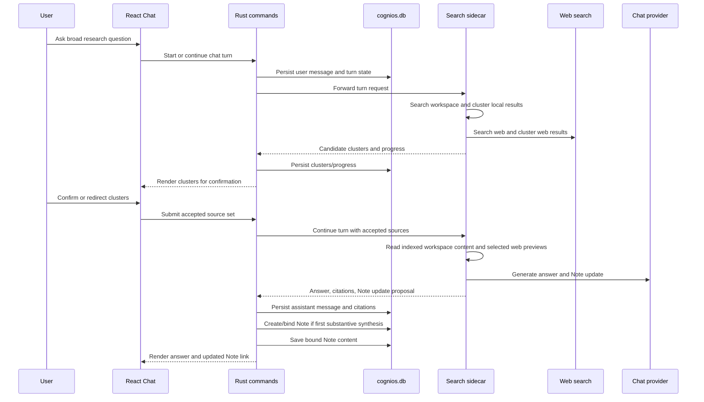
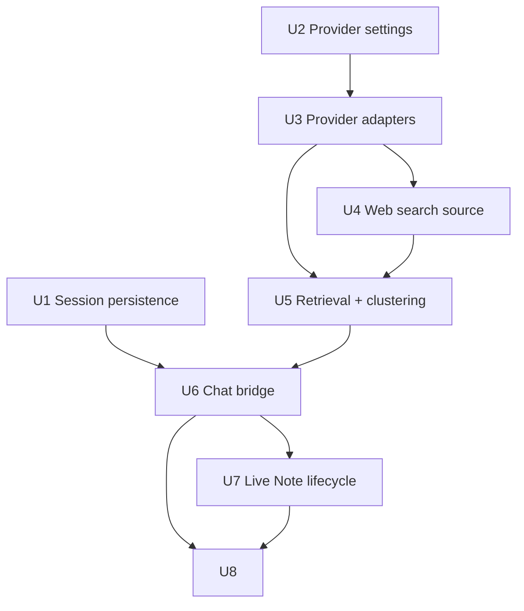
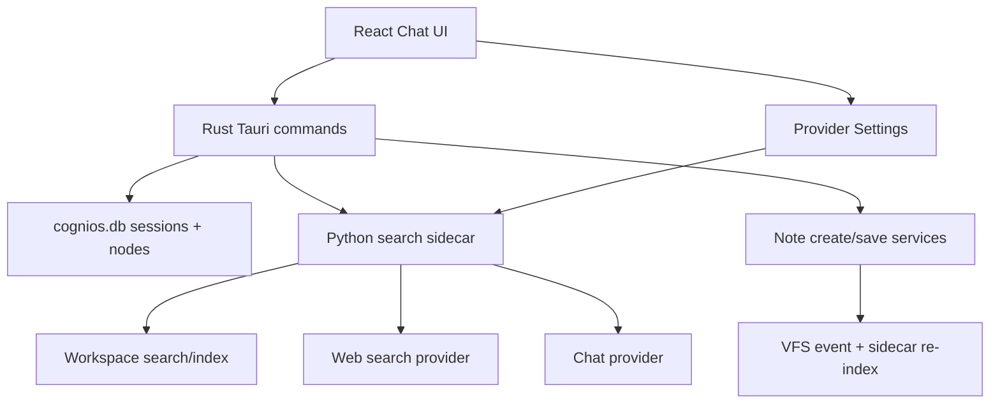

# feat: Build cluster-first agent chat

## Summary

Implement Chat by extending the existing search sidecar, provider settings,
Rust persistence layer, and Note infrastructure. Rust owns durable chat sessions
and Note writes; the sidecar owns provider calls, workspace/web retrieval,
clustering, and turn orchestration; React renders the cluster-first research
workbench.

---

## Problem Frame

The origin requirements redefine Chat from a generic answer box into a
cluster-first research workbench. The implementation must preserve that shape
while fitting the current Cognios architecture: Rust owns local workspace state,
the Python sidecar owns retrieval/model integrations, and React already has
Explorer, Settings, Search, and Note surfaces.

---

## Requirements

- R1. Support multi-turn Chat through configured chat providers.
- R2. Extend the existing provider/capability model with `chat` and web-search
  capability configuration.
- R3. Surface provider failure, missing configuration, unavailable local runtime,
  and unsupported model states without breaking non-Chat areas.
- R4. Search local Cognios workspace content through the existing indexed search
  and node-content surfaces.
- R5. Treat web search as a first-class v1 source, usable alongside workspace
  sources during normal research.
- R6. Use local path/folder/mount proximity as a relevance and clustering signal.
- R7. Preserve provenance distinctions between workspace and web sources.
- R8. Present candidate source clusters before the main synthesis for broad
  research prompts.
- R9. Let the user confirm, exclude, or redirect source clusters before the main
  synthesis.
- R10. Support accepted source sets that combine multiple local and web clusters.
- R11. Surface candidate additions when later turns discover relevant material
  outside the accepted cluster set.
- R12. Drive output shape from the user question rather than fixed templates.
- R13. Show interruptible stages: searching, clustering, reading, synthesizing,
  updating the session Note, and waiting for user correction.
- R14. Support lightweight user intervention through cluster changes, source
  category exclusions, and natural-language direction changes.
- R15. Include source references in answers and Note content, distinguishing
  local workspace and web sources.
- R16. Create at most one live Note per Chat session, after the first
  substantive synthesis.
- R17. Maintain the live Note as a readable working draft, not a transcript.
- R18. Automatically update only the Note bound to the current Chat session.
- R19. Do not add per-turn Note version history in v1.
- R20. Let Note structure emerge from the user's questions and found material.
- R21. Persist Chat history independently from the live Note.
- R22. Restore enough session history to understand how the live Note was
  produced.
- R23. Reopening a session restores records without replaying old provider calls,
  web requests, or searches.
- R24. Treat workspace and web content as untrusted source material.
- R25. Disclose off-device cloud chat and web-search behavior.
- R26. Avoid implying web sources were saved locally unless the user explicitly
  saves them.

**Origin actors:** A1 workspace user, A2 Chat assistant, A3 source systems.
**Origin flows:** F1 cluster-first research start, F2 user-driven synthesis and
follow-up, F3 live session Note creation and maintenance, F4 session recovery.
**Origin acceptance examples:** AE1 folder cluster discovery, AE2 workspace+web
source synthesis, AE3 user-driven Note update, AE4 live Note lifecycle, AE5
session recovery, AE6 web provenance.

---

## Scope Boundaries

- No fixed accident report, timeline, or cost-table template as the default
  product shape.
- No complex per-file or per-webpage reading control console in v1.
- No automatic modification of user-created Notes outside the current session's
  bound live Note.
- No per-turn Note version history or built-in rollback in v1.
- No multi-agent swarm behavior, plugin system, arbitrary tool registry, or
  long-running unattended task queue.
- No automatic saving of web pages as URL nodes or long-term indexed content
  unless the user explicitly requests that save action.
- No guarantee that every provider supports native tool/function calling; the
  plan uses an app-owned tool loop so providers with weaker native tool support
  can still participate.

### Deferred to Follow-Up Work

- Save web source as URL node: keep explicit save action out of v1 unless a
  later plan chooses to wire web-source persistence into the URL pipeline.
- Rich reading console: defer per-file/per-page read depth controls until the
  cluster-first path proves useful.
- Full cost/token dashboard: defer provider usage accounting beyond basic error
  and status surfaces.

---

## Context & Research

### Relevant Code and Patterns

- `src-tauri/src/lib.rs` wires `AppState`, the sidecar supervisor, the shared
  VFS event emitter, mutation forwarding, startup resync, and sidecar lifecycle.
- `src-tauri/src/commands/search.rs` and
  `src-tauri/src/services/search/client.rs` expose sidecar-backed commands
  through typed `ready | initialising | unavailable` envelopes.
- `sidecar/search_sidecar/routes/search.py` and
  `sidecar/search_sidecar/retrieval/search.py` implement indexed workspace
  search with pagination, degradation, and per-node aggregation.
- `sidecar/search_sidecar/routes/index.py` exposes indexed node content; this is
  the right read path for Chat's workspace tools because it returns the text that
  actually powered search.
- `sidecar/search_sidecar/providers/presets.py`,
  `sidecar/search_sidecar/settings.py`, and
  `src/features/settings/data/providerPresets.ts` define the mirrored
  provider/capability settings model. `chat` is intentionally absent today.
- `src-tauri/src/commands/notes.rs`,
  `src-tauri/src/services/notes/create_note.rs`, and
  `src-tauri/src/services/notes/save_note_content.rs` provide the local Note
  create/read/save behavior and emit index update events.
- `src/app/App.tsx` currently renders Chat as a placeholder; `src/app/AppSidebar.tsx`
  already has Chat navigation.
- `src/features/search/components/SearchPalette.tsx` provides useful patterns
  for sidecar envelope states, result lists, keyboard navigation, and local
  source activation.

### Institutional Learnings

- No `docs/solutions/` entries were present in this repo at planning time.
- Prior plans favor Rust-owned canonical workspace state, sidecar-owned ML/search
  execution, typed Tauri envelopes, and explicit degradation states rather than
  stringly error parsing.

### External References

- OpenAI Responses API web search supports hosted `web_search`, citations, domain
  filtering, and live-access controls. Useful for OpenAI-provider variants, but
  not sufficient as the only web-search path because local/Ollama providers need
  provider-independent web results.
- Ollama's `/api/chat` accepts chat history as messages and supports optional
  tools on the request body. Provider behavior can still vary by model, so the
  app-owned tool loop remains the safer baseline.
- Brave Search API exposes web search through `https://api.search.brave.com/res/v1/web/search`
  with `X-Subscription-Token` authentication, result count controls, freshness,
  safesearch, and rate-limit/error responses. It also has storage-rights and
  copyright constraints that support the origin boundary: do not persist web
  pages/results by default.

---

## Key Technical Decisions

- Rust-owned Chat persistence: Chat sessions, transcript history, cluster
  decisions, progress records, citations, and bound Note identity belong in
  `cognios.db` so they follow workspace backup and recovery expectations.
- Sidecar-owned turn orchestration: Provider calls, workspace search, web search,
  clustering, source reading, and synthesis assembly live in the Python sidecar
  where the retrieval/provider integration already exists.
- App-owned tool loop: The sidecar should decide when to call search/read/web
  tools and then call the provider with assembled context. Native provider tool
  calling can be an optimization, not the v1 contract.
- Provider-independent web search: Add web search as a separate provider
  capability rather than relying only on OpenAI hosted web search. This keeps web
  retrieval usable with local/Ollama chat providers.
- Indexed node content for workspace reads: Chat reads the text currently held
  by the sidecar index, not arbitrary filesystem paths, keeping provenance and
  prompt-injection boundaries aligned with search.
- Live Note as a bounded write surface: The only automatic write path is the
  current session's bound Note. All other Note/file mutations remain out of
  automatic Chat control.
- Source provenance is a domain concept: Local and web sources must be carried
  through clustering, answers, Note updates, history, and UI, not added only as
  display copy.

---

## Open Questions

### Resolved During Planning

- Where should durable session history live? Rust-owned SQLite, because it is
  workspace state and must survive sidecar restarts without replaying tools.
- Should web search depend only on OpenAI hosted `web_search`? No. Use a
  provider-independent web-search adapter first, with OpenAI hosted search as a
  possible future optimization.
- Should v1 depend on native tool calling? No. Use an app-owned tool loop because
  provider support varies and the origin explicitly allows a provider-compatible
  alternative.

### Deferred to Implementation

- Exact storage shape for session records and citations: choose during migration
  implementation, preserving the product contract in R21-R23.
- Exact cluster scoring weights for text relevance versus path proximity:
  implement a simple, inspectable first pass and tune once fixture corpora exist.
- Exact Note merge prompt and conflict behavior: implement deterministic tests
  around the merge contract, then refine prompt wording during execution.
- Exact web-search provider feature controls: choose minimal settings that cover
  API key, enabled state, country/language defaults, safesearch, and disclosure
  without overbuilding a search-provider dashboard.

---

## High-Level Technical Design

> *This illustrates the intended approach and is directional guidance for review, not implementation specification. The implementing agent should treat it as context, not code to reproduce.*

---

## Implementation Units

### U1. Add Rust-Owned Chat Session Persistence

**Goal:** Create durable storage and command contracts for Chat sessions,
messages, source cluster decisions, progress summaries, citations, and the bound
live Note relationship.

**Requirements:** R16, R18, R21, R22, R23, F4, AE4, AE5.

**Dependencies:** None.

**Files:**
- Create: `src-tauri/migrations/0005_chat_sessions.sql`
- Create: `src-tauri/src/domain/chat/mod.rs`
- Create: `src-tauri/src/infrastructure/db/chat_repository.rs`
- Create: `src-tauri/src/commands/chat.rs`
- Modify: `src-tauri/src/commands/mod.rs`
- Modify: `src-tauri/src/lib.rs`
- Create: `src-tauri/tests/chat_sessions.rs`
- Create: `src/lib/contracts/chat.ts`
- Modify: `src/lib/tauri/ipc.ts`
- Create: `src/features/chat/api/chatClient.ts`
- Create: `src/features/chat/api/chatClient.test.ts`

**Approach:**
- Add a Rust-owned persistence layer for Chat sessions and ordered session
  events. Store the transcript and research process separately from Note body
  content so session recovery never depends on the Note remaining pristine.
- Include stable references for bound Note identity, selected/excluded source
  clusters, source citations, progress/tool summaries, provider metadata needed
  for user understanding, and terminal/error state for turns.
- Expose Tauri commands for session create/list/open/delete/rename-like lifecycle
  and for appending session events. Keep commands thin, following the existing
  `commands/notes.rs` and repository split.
- Keep old sessions inert on open: reading history returns records only and does
  not trigger sidecar calls.

**Execution note:** Start with migration/repository tests that prove transcript
and Note identity survive restart-like reopen flows before wiring frontend
contracts. Make the migration idempotent and additive; any recovery strategy
should preserve existing node, mount, URL, and Note tables without destructive
schema rewrites.

**Patterns to follow:**
- Migration style in `src-tauri/migrations/0001_initial.sql` through
  `src-tauri/migrations/0004_node_metadata.sql`.
- Repository + command split in `src-tauri/src/services/notes/` and
  `src-tauri/src/commands/notes.rs`.
- Typed frontend contract mirroring in `src/lib/contracts/search.ts`.

**Test scenarios:**
- Happy path: creating a session, appending user/assistant messages, selecting
  clusters, and binding a Note can be read back in order.
- Covers AE5. Happy path: reopening a session returns transcript, cluster
  decisions, citations, progress summaries, and bound Note id without invoking
  sidecar commands.
- Edge case: a session with no bound Note is valid before the first substantive
  synthesis.
- Migration path: applying the chat migration to a database with existing nodes,
  mounts, URLs, and Notes preserves existing data and indexes.
- Error path: binding a second Note to the same session is rejected or updates
  only through an explicit single-bound-Note path.
- Integration: deleting a Chat session does not delete its bound Note unless a
  future explicit user action requests that behavior.

**Verification:**
- Durable session history is represented in Rust and reachable from TypeScript
  without relying on sidecar-local storage.

---

### U2. Extend Provider Settings for Chat and Web Search

**Goal:** Add `chat` and `web-search` capabilities to the existing provider and
feature settings model, with local Ollama/OpenAI-compatible chat and a
provider-independent web-search configuration path.

**Requirements:** R1, R2, R3, R5, R25.

**Dependencies:** None.

**Files:**
- Modify: `sidecar/search_sidecar/providers/presets.py`
- Modify: `sidecar/search_sidecar/settings.py`
- Modify: `sidecar/search_sidecar/routes/settings.py`
- Modify: `sidecar/search_sidecar/providers/keychain.py`
- Modify: `sidecar/tests/test_providers_presets.py`
- Modify: `sidecar/tests/test_settings.py`
- Modify: `sidecar/tests/test_settings_routes.py`
- Modify: `sidecar/tests/test_providers_keychain.py`
- Modify: `src/features/settings/data/providerPresets.ts`
- Modify: `src/features/settings/components/FeaturesList.tsx`
- Modify: `src/features/settings/components/ProvidersSection.tsx`
- Modify: `src/features/settings/components/SettingsDiagnostics.tsx`
- Modify: `src/features/settings/data/providerPresets.test.ts`

**Approach:**
- Add `chat` to the capability vocabulary and expose providers that can satisfy
  it. Treat Ollama as a local host runtime with base URL/model-list health
  behavior, not a ModelManager download.
- Add a distinct `web-search` capability/provider so web retrieval can work with
  local chat providers. Start with a Brave-style API-key provider because the
  API is search-focused, supports fresh web results, and uses secure header
  authentication.
- Keep API keys in the existing keychain-backed provider secret path. Settings
  should store provider ids, feature bindings, base URLs, model names, and
  consent state, not raw secrets.
- Extend the Settings UI with Chat and Web search rows using the existing
  feature/provider pattern rather than creating a Chat-only settings surface.

**Patterns to follow:**
- Existing mandatory/optional feature entries in `FEATURE_CATALOG`.
- Existing cloud consent and restart-required behavior in the settings routes.
- Existing provider secret lookup and cache invalidation conventions.

**Test scenarios:**
- Happy path: default settings include a usable local chat provider entry and an
  unconfigured web-search feature until a key/provider is supplied.
- Happy path: OpenAI-compatible provider presets advertise `chat` without
  changing embedding/vision defaults.
- Error path: missing web-search API key marks web search unavailable without
  disabling local workspace Chat.
- Error path: unsupported or disabled chat provider surfaces a Chat-unavailable
  state while Search and Explorer still load.
- Integration: frontend and sidecar provider preset mirrors remain aligned for
  `chat` and `web-search`.

**Verification:**
- Settings can represent chat provider choice and web-search provider choice
  through the same mental model already used by search features.

---

### U3. Add Sidecar Chat Provider Adapters

**Goal:** Implement provider adapters that let the sidecar generate chat turns
through Ollama and OpenAI-compatible cloud providers, independent of native
provider tool-calling support.

**Requirements:** R1, R3, R12, R13, R24, R25.

**Dependencies:** U2.

**Files:**
- Create: `sidecar/search_sidecar/chat/__init__.py`
- Create: `sidecar/search_sidecar/chat/types.py`
- Create: `sidecar/search_sidecar/chat/provider.py`
- Create: `sidecar/search_sidecar/chat/openai_compat.py`
- Create: `sidecar/search_sidecar/chat/ollama.py`
- Create: `sidecar/search_sidecar/chat/factory.py`
- Modify: `sidecar/search_sidecar/app.py`
- Create: `sidecar/tests/test_chat_provider_factory.py`
- Create: `sidecar/tests/test_chat_openai_compat.py`
- Create: `sidecar/tests/test_chat_ollama.py`

**Approach:**
- Define a narrow internal chat-provider protocol that accepts messages,
  provider/model settings, and bounded context. Return normalized assistant text,
  provider status, usage metadata when available, and recoverable errors.
- Support streaming internally only if it fits existing sidecar routing; otherwise
  keep v1 provider calls non-streaming and surface coarse progress states from
  orchestration. Do not let streaming complexity block the cluster-first loop.
- Implement Ollama against its local chat endpoint and OpenAI-compatible cloud
  providers against compatible chat endpoints. Avoid SDK dependencies unless the
  existing HTTP client patterns become insufficient.
- Treat retrieved workspace/web content as source context, never as system-level
  instructions. Keep prompt-injection isolation in the adapter contract and the
  orchestration layer.

**Patterns to follow:**
- Cloud HTTP adapter style in `sidecar/search_sidecar/embeddings/openai_compat.py`.
- Keychain resolution in `sidecar/search_sidecar/providers/keychain.py`.
- Extractor factory degradation behavior in `sidecar/search_sidecar/extract/factory.py`.

**Test scenarios:**
- Happy path: an OpenAI-compatible provider request produces normalized assistant
  content from a mocked HTTP response.
- Happy path: an Ollama provider request includes chat history messages and
  handles a successful local response.
- Error path: missing API key, unreachable local server, invalid model, and HTTP
  rate-limit responses map to actionable provider errors.
- Security path: source context is placed in lower-priority content slots and
  cannot replace system instructions in the adapter contract.
- Edge case: provider returns no content but no transport error; adapter surfaces
  a recoverable generation failure.

**Verification:**
- The sidecar has a provider-neutral way to ask a configured chat model for text,
  with consistent failure semantics.

---

### U4. Add Provider-Independent Web Search Source

**Goal:** Add web search as a source provider that returns citable web results
for Chat orchestration without automatically saving pages into Cognios.

**Requirements:** R5, R7, R10, R15, R24, R25, R26, AE2, AE6.

**Dependencies:** U2.

**Files:**
- Create: `sidecar/search_sidecar/web_search/__init__.py`
- Create: `sidecar/search_sidecar/web_search/types.py`
- Create: `sidecar/search_sidecar/web_search/brave.py`
- Create: `sidecar/search_sidecar/web_search/factory.py`
- Create: `sidecar/search_sidecar/web_search/fetch.py`
- Create: `sidecar/tests/test_web_search_brave.py`
- Create: `sidecar/tests/test_web_search_fetch.py`

**Approach:**
- Implement a search adapter that sends user-derived web queries to the
  configured provider and returns normalized web source candidates: title, URL,
  snippet, rank, source provider, retrieval timestamp, and optional metadata.
- Add bounded fetch/preview for accepted web results. Fetching should be limited
  by size, timeout, content type, and redirect safety. The fetched text is
  session context only unless a future explicit save action persists it.
- Reuse existing sidecar dependencies (`httpx` and `selectolax`) for HTTP and
  HTML preview extraction unless implementation proves a new dependency is
  necessary. If a dependency is added, update `sidecar/pyproject.toml` and
  `sidecar/uv.lock` in the same implementation unit.
- Keep search-result storage out of the long-term index in v1. Persist only the
  minimal session record needed for citations and recovery.
- Make web-source errors partial: a web failure should not prevent workspace-only
  research when local sources are available.

**Patterns to follow:**
- URL content extraction caution in `sidecar/search_sidecar/index/processors/url_cache.py`.
- HTTP error-to-state degradation style in sidecar provider routes.
- Settings/keychain patterns from U2.

**Test scenarios:**
- Happy path: a mocked Brave-style web search response normalizes to web source
  candidates with provenance and citation-ready URLs.
- Covers AE6. Happy path: web results remain session sources and are not written
  as URL nodes or index chunks.
- Error path: missing API key, 429, 4xx, 5xx, timeout, and malformed responses
  produce partial-source errors usable by Chat.
- Security path: fetch rejects unsupported content types, oversized responses,
  and unsafe redirects.
- Privacy path: persisted web-source records contain citation metadata and
  retrieval timestamps, not fetched page bodies or hidden caches.
- Edge case: duplicate URLs across web results are deduplicated while retaining
  enough query/rank context for explanation.

**Verification:**
- Chat orchestration can request current web sources without coupling itself to
  any one chat provider.

---

### U5. Implement Workspace/Web Retrieval and Source Clustering

**Goal:** Build the sidecar orchestration layer that finds local and web source
clusters, uses local path proximity as a relevance signal, and returns candidate
clusters before synthesis.

**Requirements:** R4, R5, R6, R7, R8, R9, R10, R11, R15, F1, AE1, AE2.

**Dependencies:** U3, U4.

**Files:**
- Create: `sidecar/search_sidecar/chat/retrieval.py`
- Create: `sidecar/search_sidecar/chat/clustering.py`
- Create: `sidecar/search_sidecar/chat/sources.py`
- Modify: `sidecar/search_sidecar/retrieval/search.py`
- Modify: `sidecar/search_sidecar/routes/index.py`
- Create: `sidecar/tests/test_chat_retrieval.py`
- Create: `sidecar/tests/test_chat_clustering.py`
- Modify: `sidecar/tests/test_retrieval_search.py`
- Modify: `src-tauri/src/services/search/client.rs`
- Modify: `src-tauri/src/commands/search.rs`
- Modify: `src/lib/contracts/search.ts`

**Approach:**
- Use existing workspace search for initial recall, then enrich local result rows
  with enough path/mount context for clustering. Do not bypass the current
  sidecar index or read arbitrary files directly.
- Cluster local sources by a weighted combination of result relevance, shared
  mount/folder/subtree/path hints, and result density. Keep the first pass
  inspectable rather than ML-heavy.
- Cluster web sources separately by query/source/theme. Mixed accepted source
  sets can contain both local and web clusters, but their provenance and
  relevance explanations stay distinct.
- Add an explicit "candidate addition" path for later turns that discover
  relevant material outside the accepted cluster set.
- Return source clusters as a product-level concept to Rust/UI. Avoid forcing
  users into single-file selection during v1.

**Execution note:** Build fixture corpora that include both organized-folder and
scattered-source cases before tuning cluster heuristics.

**Patterns to follow:**
- Per-node search aggregation in `sidecar/search_sidecar/retrieval/search.py`.
- Node content DTO role handling in `src-tauri/src/services/search/client.rs`.
- Existing search result path/citation rendering in Search components.

**Test scenarios:**
- Covers AE1. Happy path: local results concentrated under one mounted subtree
  produce a candidate cluster for that subtree.
- Happy path: scattered but text-relevant local nodes still appear as a weaker
  candidate cluster rather than disappearing behind path weighting.
- Covers AE2. Happy path: one local cluster and one web cluster can both be
  returned for the same broad research prompt.
- Edge case: empty workspace results but successful web results still produce
  web clusters and a clear local-empty state.
- Error path: workspace sidecar retrieval degraded/unavailable still reports a
  partial research state that can include web results.
- Integration: accepted cluster references can later be resolved to indexed node
  content or bounded web previews for synthesis.

**Verification:**
- Broad prompts return understandable candidate clusters with source provenance
  before any answer synthesis is required.

---

### U6. Add Chat Turn Orchestration and Rust Bridge

**Goal:** Connect persisted sessions to sidecar turn orchestration, including
progress events, cluster confirmation, accepted source sets, answers, citations,
and resumable turn records.

**Requirements:** R8, R9, R10, R11, R12, R13, R14, R15, R21, R22, R23, F1, F2,
F4, AE2, AE5.

**Dependencies:** U1, U3, U5.

**Files:**
- Create: `sidecar/search_sidecar/routes/chat.py`
- Create: `sidecar/search_sidecar/chat/orchestrator.py`
- Create: `sidecar/search_sidecar/chat/session_payloads.py`
- Modify: `sidecar/search_sidecar/app.py`
- Create: `sidecar/tests/test_chat_orchestrator.py`
- Create: `sidecar/tests/test_chat_routes.py`
- Modify: `src-tauri/src/services/search/client.rs`
- Create: `src-tauri/src/services/chat/mod.rs`
- Create: `src-tauri/src/services/chat/turns.rs`
- Modify: `src-tauri/src/commands/chat.rs`
- Modify: `src-tauri/src/lib.rs`
- Modify: `src/lib/contracts/chat.ts`
- Modify: `src/lib/tauri/ipc.ts`
- Modify: `src/features/chat/api/chatClient.ts`
- Create: `src-tauri/tests/chat_turns.rs`
- Create: `src/features/chat/api/chatClient.test.ts`

**Approach:**
- Model Chat turns as resumable state transitions: user message persisted, source
  discovery started, clusters returned, user confirms/redirects, synthesis runs,
  assistant message/citations/Note update recorded.
- Use Tauri events or polling-compatible command responses for progress updates.
  Persist coarse progress summaries so restored sessions explain prior work
  without replaying it.
- Keep source cluster confirmation explicit in the command contract. A turn that
  needs user confirmation pauses before the main synthesis.
- Carry provider and web-search failures as partial turn outcomes where possible.
  A failed web source should not erase successful workspace sources.

**Patterns to follow:**
- Sidecar envelope command pattern in `src-tauri/src/commands/search.rs`.
- Existing VFS event emission pattern in `src-tauri/src/lib.rs`.
- Frontend API wrapper pattern in `src/features/search/api/searchClient.ts`.

**Test scenarios:**
- Happy path: a broad prompt persists the user message, returns candidate
  clusters, and pauses synthesis until the accepted cluster set is submitted.
- Covers AE2. Happy path: accepted local+web clusters produce an assistant
  answer with both local and web citations.
- Covers AE5. Happy path: restoring a completed turn returns progress summaries
  and citations without sidecar replay.
- Covers AE5. Happy path: opening a historic session does not enqueue searches,
  web requests, provider calls, or live Note updates.
- Error path: provider failure after source confirmation persists the failure
  state and leaves the session recoverable for retry or follow-up.
- Edge case: user excludes all clusters; turn records the decision and asks for a
  redirect rather than generating from empty context.
- Integration: progress events and persisted progress summaries remain consistent
  across Rust and frontend reads.

**Verification:**
- Chat turns can move from prompt to cluster confirmation to answer while every
  durable state change is recoverable from Rust-owned storage.

---

### U7. Implement Live Session Note Lifecycle and Merge

**Goal:** Create and maintain one live Note per Chat session after the first
substantive synthesis, updating it through intelligent merges while preserving
the regular Note model.

**Requirements:** R16, R17, R18, R19, R20, R21, R22, F3, AE3, AE4.

**Dependencies:** U1, U3, U6.

**Files:**
- Create: `src-tauri/src/services/chat/live_note.rs`
- Modify: `src-tauri/src/commands/chat.rs`
- Modify: `src-tauri/src/infrastructure/db/chat_repository.rs`
- Modify: `src-tauri/src/services/notes/create_note.rs`
- Modify: `src-tauri/src/services/notes/save_note_content.rs`
- Create: `src-tauri/tests/chat_live_note.rs`
- Create: `sidecar/search_sidecar/chat/note_merge.py`
- Create: `sidecar/tests/test_chat_note_merge.py`
- Modify: `src/lib/contracts/chat.ts`
- Modify: `src/features/chat/api/chatClient.ts`

**Approach:**
- Create the bound Note only when a turn produces the first substantive synthesis.
  Do not create an empty Note for a newly opened Chat session.
- Use existing Note create/save services so the resulting artifact behaves like a
  normal local Note in Explorer, deletion, indexing, and editing paths.
- Store the bound Note id in chat session persistence. Automatic updates must
  check that they target the session-bound Note and no other Note.
- Implement a merge step that takes current Note content, the latest answer,
  source citations, and user direction, then returns updated markdown. Keep the
  merge prompt/algorithm bounded and testable with deterministic fixtures.
- Persist the assistant answer and the Note update as separate session records so
  history explains how the Note changed even without per-turn Note versions.

**Execution note:** Add Rust authorization tests around "only the bound Note" before
adding automatic Note writes.

**Patterns to follow:**
- Existing Note save size/timestamp/index event behavior.
- Search plan guidance that notes mutations emit `node-saved` after persistence
  so the sidecar can re-index updated content.

**Test scenarios:**
- Covers AE4. Happy path: no Note exists before first synthesis; first synthesis
  creates and binds exactly one Note.
- Covers AE3. Happy path: a follow-up answer about a new aspect updates related
  Note content into a readable current draft rather than appending transcript.
- Error path: attempt to auto-update a non-bound Note is rejected.
- Edge case: user manually deletes the bound Note before a follow-up; session
  surfaces a missing-Note state and does not silently recreate without a clear
  product state.
- Integration: saving the live Note emits the same indexing event as normal Note
  saves.

**Verification:**
- Chat can maintain its durable working draft while normal Note safety and
  Explorer behavior remain intact.

---

### U8. Build the Cluster-First Chat UI and Hardening Pass

**Goal:** Replace the Chat placeholder with a usable research workbench that
shows sessions, provider state, source clusters, progress, citations, the live
Note link, and lightweight intervention controls.

**Requirements:** R1-R26, F1-F4, AE1-AE6.

**Dependencies:** U1, U2, U5, U6, U7.

**Files:**
- Create: `src/features/chat/components/ChatLayout.tsx`
- Create: `src/features/chat/components/ChatSessionList.tsx`
- Create: `src/features/chat/components/ChatComposer.tsx`
- Create: `src/features/chat/components/SourceClusterPanel.tsx`
- Create: `src/features/chat/components/ChatTranscript.tsx`
- Create: `src/features/chat/components/ProgressTimeline.tsx`
- Create: `src/features/chat/components/CitationList.tsx`
- Create: `src/features/chat/components/LiveNotePanel.tsx`
- Create: `src/features/chat/hooks/useChatSession.ts`
- Create: `src/features/chat/hooks/useChatTurn.ts`
- Create: `src/features/chat/types/chat.ts`
- Modify: `src/app/App.tsx`
- Modify: `src/styles/app.css`
- Create: `src/features/chat/components/ChatLayout.test.tsx`
- Create: `src/features/chat/components/SourceClusterPanel.test.tsx`
- Create: `src/features/chat/components/LiveNotePanel.test.tsx`
- Modify: `src/app/App.test.tsx`
- Create: `docs/security/chat-trust-boundaries.md`

**Approach:**
- Render Chat as the first screen of the Chat section, not a landing page.
  Include session list/access, transcript, composer, cluster confirmation panel,
  provider/tool state, citation surfaces, and live Note affordance.
- Make candidate clusters the main pre-answer interaction for broad prompts.
  Local clusters should read as workspace/path groups; web clusters should read
  as external source groups.
- Show interruptible progress using coarse stages from U6. Avoid raw traces as
  the primary UI while still making search/read/synthesis activity legible.
- Display citations as provenance-aware source chips or lists. Web citations must
  be clickable and visually distinct from local workspace nodes.
- Provide lightweight intervention: confirm/exclude clusters, exclude source
  category, and send natural-language correction. Defer detailed read controls.
- Add privacy/trust copy only where it affects user decisions: provider state,
  web-search use, and source provenance. Do not turn Chat into a settings page.
- Document trust boundaries for retrieved content, web search, cloud providers,
  and automatic Note writes.

**Execution note:** Use screenshot/browser verification after the UI lands because
this is a new primary product surface with dense interactive states.

**Patterns to follow:**
- Search palette state handling and sidecar envelope rendering in
  `src/features/search/components/SearchPalette.tsx`.
- Explorer tree/Note layout density and keyboard handling in
  `src/features/explorer/components/ExplorerLayout.tsx`.
- Settings provider state disclosure patterns in
  `src/features/settings/components/SettingsLayout.tsx`.

**Test scenarios:**
- Covers AE1. Happy path: a broad prompt renders candidate local source clusters
  before answer generation controls appear.
- Covers AE2 and AE6. Happy path: mixed workspace and web citations render with
  distinct provenance and clickable targets.
- Covers AE3. Happy path: after a follow-up turn, the UI shows the live Note as
  updated and keeps the transcript distinct from Note content.
- Covers AE5. Happy path: reopening a session restores transcript, clusters,
  progress summaries, citations, and bound Note link.
- Error path: missing chat provider, missing web-search key, and sidecar
  unavailable states are actionable and do not blank the Chat shell.
- Accessibility path: composer, cluster confirmation, citation links, session
  list, and live Note affordance are keyboard reachable with clear focus order.
- Responsive path: on narrow widths, session list and source cluster controls do
  not obscure the active transcript/composer.

**Verification:**
- Chat replaces the placeholder with a working cluster-first research surface
  that supports end-to-end session recovery and live Note visibility.

---

## System-Wide Impact

- **Interaction graph:** Chat spans React `App`, new Chat components, Tauri
  chat commands, Rust DB repositories, existing Note services, search sidecar
  routes, provider settings, and web/chat provider adapters.
- **Error propagation:** Sidecar/provider failures should travel as typed,
  recoverable states that the UI can render; Rust persistence errors remain hard
  command failures because durable state is required before claiming progress.
- **State lifecycle risks:** Turns can pause at cluster confirmation, fail during
  provider generation, or update a Note after session restore. Each state must be
  persisted before the UI moves on.
- **API surface parity:** Settings, Rust DTOs, TypeScript contracts, and sidecar
  DTOs all need the same capability/source/provenance vocabulary.
- **Integration coverage:** Unit tests should cover adapters and repositories;
  integration tests should prove full turn persistence, cluster confirmation,
  Note binding, and restored-session behavior.
- **Unchanged invariants:** Existing Search Palette, Explorer, Note editor, and
  Settings surfaces should continue working when Chat providers are unconfigured
  or web search is unavailable.

---

## Risks & Dependencies

| Risk | Likelihood | Impact | Mitigation |
|------|------------|--------|------------|
| Provider APIs differ in tool/function support | High | High | Use app-owned tool loop and normalized provider adapters; native tool calling is optional. |
| Web search expands privacy and compliance surface | High | High | Separate web-search provider settings, explicit disclosure, keychain secrets, no default long-term web persistence. |
| Cluster heuristics over-weight folder proximity and miss scattered evidence | Medium | High | Keep text relevance in the cluster candidate set and include "candidate addition" behavior for later discoveries. |
| Automatic Note updates overwrite user edits unexpectedly | Medium | High | Only update the bound session Note; read current Note content before merging; surface missing/edited states in session history. |
| Chat UI becomes too broad for one PR | Medium | Medium | Land backend contracts first, then UI with mocked/stubbed states, then wire progressively. |
| Sidecar restart loses in-flight state | Medium | Medium | Persist turn/session state in Rust before sidecar calls and restore from durable records without replaying old calls. |
| Chat migration accidentally disturbs existing workspace data | Low | High | Keep schema additive, cover existing-node/mount/URL/Note databases in migration tests, and avoid destructive table rewrites. |
| Web result storage rights are misunderstood | Medium | Medium | Persist minimal session citation metadata only; do not cache page bodies long-term in v1. |

---

## Phased Delivery

### Phase 1: Durable Foundation
- U1 and U2. Establish session persistence plus provider/settings vocabulary.

### Phase 2: Research Runtime
- U3, U4, U5, and U6. Add chat/web adapters, clustering, and turn orchestration.

### Phase 3: Durable Output and UI
- U7 and U8. Add live Note maintenance and the cluster-first Chat interface.

---

## Documentation / Operational Notes

- Add `docs/security/chat-trust-boundaries.md` to document provider payloads,
  web-search behavior, source trust, and automatic Note write boundaries.
- Update release notes or user-facing docs when Chat ships because web search and
  cloud chat can send query/context off-device.
- Keep web-search provider API keys in the same secure storage/keychain model as
  cloud model provider keys.
- Browser/visual verification is required for the final Chat UI because this is a
  new primary surface with dense state transitions.

---

## Sources & References

- **Origin document:** [docs/brainstorms/2026-05-10-cluster-first-agent-chat-requirements.md](../brainstorms/2026-05-10-cluster-first-agent-chat-requirements.md)
- Previous chat brainstorm: [docs/brainstorms/2026-05-09-agent-chat-workbench-requirements.md](../brainstorms/2026-05-09-agent-chat-workbench-requirements.md)
- Workspace search plan: [docs/plans/2026-04-26-004-feat-cross-workspace-search-plan.md](2026-04-26-004-feat-cross-workspace-search-plan.md)
- Provider settings plan: [docs/plans/2026-05-02-002-feat-feature-oriented-settings-plan.md](2026-05-02-002-feat-feature-oriented-settings-plan.md)
- Notes plan: [docs/plans/2026-04-14-001-feat-notes-node-type-plan.md](2026-04-14-001-feat-notes-node-type-plan.md)
- OpenAI web search guide: [developers.openai.com/api/docs/guides/tools-web-search](https://developers.openai.com/api/docs/guides/tools-web-search)
- OpenAI Responses API reference: [developers.openai.com/api/reference/overview](https://developers.openai.com/api/reference/overview)
- Ollama chat API: [docs.ollama.com/api/chat](https://docs.ollama.com/api/chat)
- Brave Search API authentication: [api-dashboard.search.brave.com/documentation/guides/authentication](https://api-dashboard.search.brave.com/documentation/guides/authentication)
- Brave Web Search API reference: [api-dashboard.search.brave.com/api-reference/web/search/post](https://api-dashboard.search.brave.com/api-reference/web/search/post)
