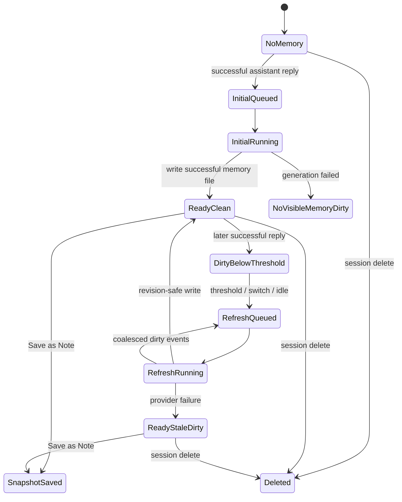
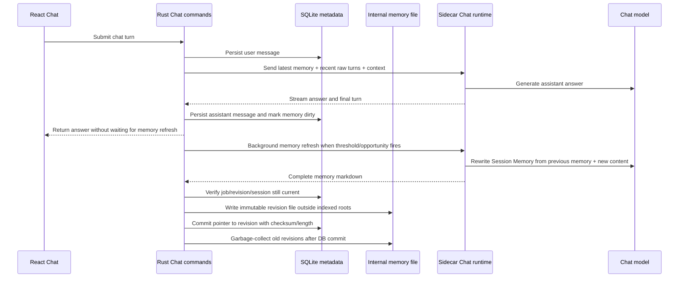
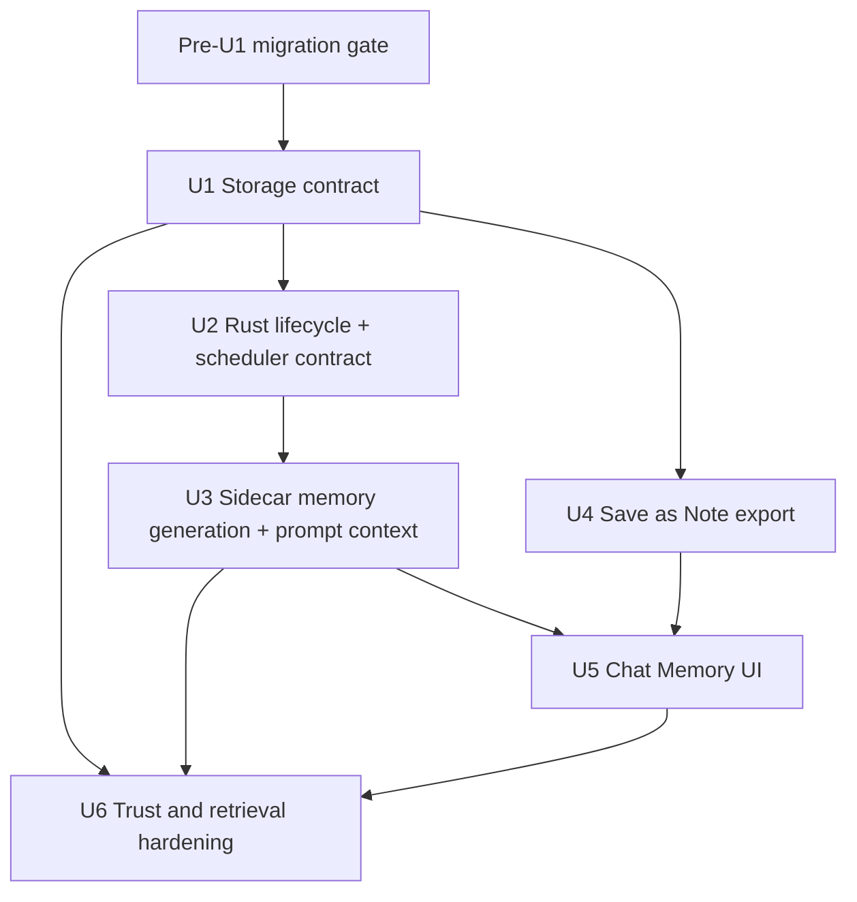
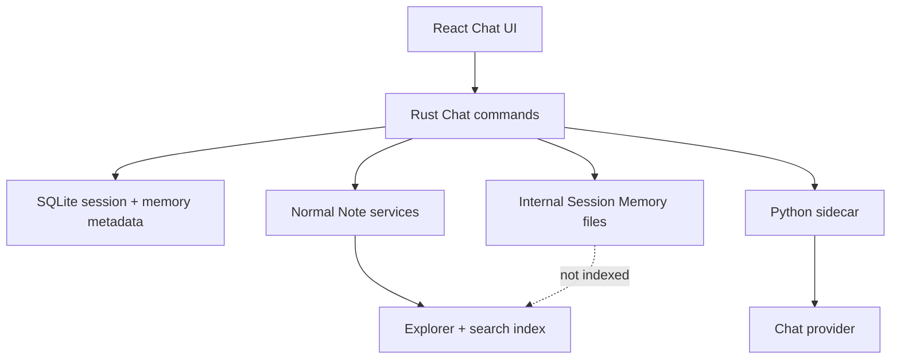

# feat: Add file-backed Session Memory compaction

## Summary

Implement Session Memory as a Chat-owned, file-backed compact artifact with
SQLite lifecycle metadata. The plan replaces the current live-Note write path
with asynchronous coalesced memory refresh, compact prompt assembly, a read-only
Chat memory surface, and an explicit Save as Note export.

---

## Problem Frame

The current Chat implementation still treats the compact session artifact like a
normal live Note: Rust creates an Explorer-visible Note, binds it to the session,
and overwrites it with the latest assistant answer. The origin requirements now
call for a different product concept: a read-only Session Memory owned by Chat,
not a normal Note, not a hidden second summary, and not part of workspace search
until the user explicitly exports it.

---

## Plan Requirements

- PR1. Each chat session has at most one Session Memory artifact, mapped from the
  origin's "session note" terminology.
- PR2. Session Memory is a read-only derived Chat artifact, not a normal editable
  Note, not a replacement for the full transcript, and not Explorer-visible by
  default.
- PR3. The Session Memory body is the single compact session artifact used for
  future prompt context; v1 must not maintain a divergent hidden summary.
- PR4. Unsaved Session Memory is available only through its owning Chat session
  and excluded from Explorer, workspace search/indexing, and unrelated Chat
  retrieval.
- PR5. Session Memory generation and refresh run asynchronously after successful
  assistant replies and must not block the user from continuing Chat.
- PR6. Refresh uses dirty plus threshold coalescing: about three completed
  conversation rounds, about 3,000 new estimated tokens, session-switch
  opportunity, or idle opportunity. Successful turn completion is a scheduler
  evaluation point, not an independent below-threshold refresh trigger.
- PR7. Refresh uses complete rewrite semantics: previous memory plus new
  successful conversation content produce a complete new working document, not a
  pasted transcript or patch stream.
- PR8. The durable transcript remains the recovery source when memory generation
  is stale, lossy, failed, or corrupted.
- PR9. Future Chat prompts use the latest successful Session Memory plus bounded
  recent raw conversation turns; newer raw turns take precedence over stale
  memory content.
- PR10. Session Memory content, raw turns, workspace content, and web content are
  untrusted prompt context data, never higher-priority instructions or tool
  authorization.
- PR11. Users can export the current Session Memory as a normal editable Note
  snapshot. Exported Notes follow normal Explorer/search/index/deletion
  behavior and do not sync back to Session Memory.
- PR12. Deleting a Chat session deletes its derived Session Memory metadata and
  internal file, while exported Note snapshots remain normal user artifacts.
- PR13. Chat provides a read-only, keyboard-accessible Session Memory surface and
  disables Save as Note until an initial successful memory body exists.
- PR14. Session Memory uses a concise, structured, scannable working-document
  style whose shape can evolve by session. Refreshes preserve useful source
  references, active questions, durable user instructions, accepted/excluded
  source scope, user corrections, decisions, unresolved tasks, and source anchors
  needed for future turns.

**Origin actors:** A1 Session user, A2 Chat runtime, A3 Session note maintainer.
The plan renames A3's artifact to Session Memory while preserving the behavior.
**Origin flows:** F1 initial generation, F2 coalesced refresh, F3 future turn
context, F4 Save as Note, F5 session deletion.
**Origin acceptance examples:** AE1 initial memory availability, AE2 coalesced
refresh, AE3 coherent evolving memory, AE4 stale/failure fallback, AE5 snapshot
export, AE6 deletion cleanup, AE7 search/retrieval exclusion, AE8 accessibility.

### Origin Mapping

| Plan requirement | Origin coverage |
|------------------|-----------------|
| PR1 | R1 |
| PR2 | R2, R4 |
| PR3 | R3 |
| PR4 | R4b, AE7 |
| PR5 | R6, R7 |
| PR6 | R8, R9, R10, R11 |
| PR7 | R12 |
| PR8 | R12a, R17 |
| PR9 | R16, R17a, R17b |
| PR10 | R18a |
| PR11 | R19, R20, R20a |
| PR12 | R21 |
| PR13 | R4a, R7a, R22 |
| PR14 | R13, R14, R15, R15a |

---

## Scope Boundaries

- No editable Session Memory in v1.
- No normal Note creation for unsaved Session Memory.
- No `nodes` row, Explorer tree entry, SearchPalette result, indexed chunk, or
  unrelated Chat retrieval source for unsaved Session Memory.
- No second hidden compact summary separate from Session Memory.
- No per-refresh or per-turn Session Memory version history.
- No user-configurable refresh thresholds in v1.
- No visible updating, stale, failed, queue, or retry status chrome in v1.
- No bidirectional sync between exported Notes and Session Memory.
- No writing failed, cancelled, empty, provider-error, `needs_redirect`, or pure
  UI activity into Session Memory as successful memory content.
- No treating Session Memory content as instructions, tool calls, or permission
  grants.
- No exposing absolute internal Session Memory paths to React, the sidecar,
  provider prompts, user-facing errors, or routine logs.
- No sidecar filesystem writes for Session Memory. The sidecar is text-only;
  Rust owns storage, validation, deletion, and export.
- No automatic long-term memory extraction from Session Memory.

### Deferred to Follow-Up Work

- Dedicated Memory search: if users later want to search across old session
  memories, design an explicit Chat-history search surface rather than leaking
  unsaved memory into workspace search.
- Memory freshness UI: v1 avoids stale/update chrome; a later iteration can
  add lightweight freshness if product direction changes.
- Configurable compaction thresholds: keep fixed thresholds until real usage
  shows whether users need controls.

---

## Context & Research

### Relevant Code and Patterns

- `src-tauri/src/services/chat/live_note.rs` currently creates a normal Note,
  binds it to the session, and overwrites it with the latest assistant answer.
  This is the main behavior to replace.
- `src-tauri/migrations/0005_chat_sessions.sql` currently stores
  `bound_note_id` against `nodes`; the Session Memory plan needs a Chat-owned
  metadata shape instead.
- `src-tauri/src/infrastructure/db/chat_repository.rs` owns session, message,
  cluster, title, delete, and bound-note repository operations.
- `src-tauri/src/commands/chat.rs` currently persists successful answers and
  calls `update_live_note` synchronously after a ready turn envelope.
- `sidecar/search_sidecar/chat/orchestrator.py` assembles chat context and
  streams provider output. It already carries retrieved source context into
  provider calls, but not Session Memory context.
- `sidecar/search_sidecar/chat/note_merge.py` is a deterministic placeholder
  that replaces the draft with the latest answer. It should become a Session
  Memory maintenance module with complete-rewrite semantics.
- `src/features/chat/components/ChatLayout.tsx` renders the Chat shell, sessions,
  model picker, composer, context-node chips, streaming transcript, and current
  "Note" runtime badge.
- `src/features/search/components/SearchPalette.tsx` is the reusable context
  picker. It must continue to search normal workspace nodes only; unsaved
  Session Memory should not be added to this source set.
- Normal Note behavior is implemented by `src-tauri/src/services/notes/create_note.rs`
  and `src-tauri/src/services/notes/save_note_content.rs`; Save as Note should
  reuse this path only at explicit export time.

### Institutional Learnings

- No `docs/solutions/` entries exist in this checkout. The plan is grounded in
  the origin requirements, the current feature branch implementation, and the
  completed cluster-first Chat plan.

### External References

- OWASP's LLM Prompt Injection cheat sheet describes direct, indirect, and
  persistent prompt injection risks in LLM apps and highlights that untrusted
  content can cause unauthorized actions through connected tools.
- OWASP's RAG Security cheat sheet recommends explicit delimiters and treating
  retrieved content as data, not commands, when injecting context into a model.
- OWASP Top 10 for LLM Applications identifies prompt injection as a primary LLM
  application risk.
- The UK NCSC notes that current LLMs do not enforce a robust security boundary
  between instructions and data inside a prompt. This reinforces the plan's
  requirement that Session Memory is context data, not control flow.

---

## Key Technical Decisions

- Product naming is Session Memory: the implementation should stop extending
  "live note" naming. The origin document used "session note", but the plan
  treats that as legacy wording for the same compact Chat-owned memory artifact.
- File-backed body plus SQLite metadata: store the markdown body in an internal
  Chat-owned file, and store lifecycle metadata in SQLite. This honors the user's
  preference for a document-like body while keeping refresh state queryable and
  transactional.
- Internal file location is fixed app-owned storage outside user workspaces,
  mounted folders, normal Notes, and index roots. File keys are opaque,
  non-user-controlled identifiers; Rust canonicalizes resolved paths and rejects
  traversal or symlink escapes. This is the core guardrail that keeps unsaved
  memory out of Explorer/search.
- Migration strategy is unconditionally additive: preserve existing
  `bound_note_id` semantics and introduce Session Memory metadata in
  `0006_session_memory.sql` wired through `migrations.rs`. Existing
  `bound_note_id` Notes remain normal user-visible Notes and are never hidden,
  deleted, rebound, or treated as Session Memory. Local DB reset is optional
  cleanup only, not the default implementation path.
- Rust owns lifecycle and coalescing: Rust tracks dirty counters, revision/job
  identifiers, last included message ordinal, memory file identity, and deletion
  cleanup. The sidecar owns LLM generation and prompt construction.
- Sidecar produces complete memory rewrites: each refresh gets previous memory
  plus new successful conversation material and returns a full markdown working
  document. Rust writes the replacement only after a successful revision check.
- Visible memory invariant: a memory body is displayable/exportable only when
  SQLite metadata points to an existing internal file whose checksum and byte
  length match the latest successful revision. Missing, unreadable, mismatched,
  or stale files make memory unavailable/stale without deleting the transcript
  or exported Notes.
- Write lifecycle is recoverable: mark the refresh running with a job/revision,
  write the generated body as a new immutable revision file, fsync as applicable,
  commit SQLite metadata that points to that revision with checksum, byte length,
  revision, and `last_included_message_ordinal`, then garbage-collect old
  revisions only after the DB commit succeeds. Failed, cancelled, stale, or
  tombstoned jobs remove temp/revision files opportunistically and otherwise
  leave retryable cleanup state.
- Recent raw turn policy: prompt assembly includes the latest successful Session
  Memory plus the six most recent chat messages, prioritizing messages after the
  memory's last included ordinal when the window is constrained.
- Prompt assembly is typed on both paths: app instructions, Session Memory,
  recent raw turns, retrieved workspace/web sources, and user-attached context
  remain separate data classes. Generated memory is never promoted into
  system/developer/provider instructions, tool-call arguments, writes, or
  authorization decisions.
- Refresh opportunity definition: successful turn completion evaluates whether
  initial generation or thresholds are met. Below-threshold dirty sessions refresh
  only when an explicit opportunity occurs, such as switching away from the dirty
  active session or a backend/client idle debounce after streaming has ended and
  no new user message has arrived. Opening a historic clean session must never
  replay provider calls.
- Provider/model provenance: memory refresh uses the provider/model captured from
  the latest successful dirty assistant turn being compacted, not whatever model
  picker happens to be active after the user switches sessions. Record that
  provider/model on the refresh metadata/result. If legacy messages lack this
  data, fall back to the session's current provider/model snapshot at enqueue
  time.
- UI memory-body contract: `ChatSessionDetail` carries availability/revision
  metadata only. React reads the body through a dedicated Chat command that
  validates the latest successful revision before returning markdown. Async
  refresh completion notifies React with session id and revision only, causing
  active-session revalidation without exposing internal paths or queue details.
- Export is copy-only: Save as Note reads the latest successful Session Memory
  body and creates a normal Note snapshot. The exported Note id is not rebound as
  Session Memory.

---

## Open Questions

### Resolved During Planning

- Should the compact artifact still be called a Note? No. The plan uses Session
  Memory to avoid editable Note and Explorer semantics.
- Should the memory body live in SQLite? No. Use internal markdown files for the
  body and SQLite for lifecycle metadata.
- Should old live Notes be migrated into Session Memory? No. Preserve existing
  normal Notes as user-visible artifacts and use the new Session Memory path for
  future refreshes.
- What counts as a refresh opportunity in v1? Successful turn completion
  evaluates initial generation and thresholds. Below-threshold dirty sessions
  refresh only on explicit opportunities: switching away from the dirty active
  session or an idle debounce after streaming ends without a new user message.
  Opening old sessions remains read only.
- How are model changes handled? A refresh uses the provider/model captured from
  the latest successful dirty assistant turn being compacted, falling back to the
  session provider/model snapshot only for legacy messages without provenance.

### Deferred to Implementation

- Exact cleanup helper names: choose during implementation. The internal memory
  root itself is not optional: it must be app-owned storage outside user
  workspace, mount, normal Notes, and index roots.
- Exact token estimator: use a simple deterministic estimate in v1, but keep the
  threshold behavior testable.
- Exact background task primitive: choose the smallest Rust async mechanism that
  preserves response-first behavior and revision-safe completion.

---

## High-Level Technical Design

> *This illustrates the intended approach and is directional guidance for review, not implementation specification. The implementing agent should treat it as context, not code to reproduce.*

---

## Implementation Units

### Acceptance Example Traceability

| Acceptance example | Primary unit | Evidence required |
|--------------------|--------------|-------------------|
| AE1 initial memory availability | U1, U2, U5 | First successful assistant reply returns before memory refresh completes; later metadata/body availability makes the read-only UI surface available. |
| AE2 coalesced refresh | U2 | Three rounds and 3,000-token thresholds schedule one refresh at turn-completion evaluation; below-threshold turns do not unless a session-switch or idle opportunity fires for an already-dirty session. |
| AE3 coherent evolving memory | U3 | A timeline answer plus a later cost answer rewrites one concise, scannable working document with useful source references, active questions, durable instructions, decisions, corrections, unresolved tasks, and source anchors retained as needed. |
| AE4 stale/failure fallback | U2, U3, U6 | Provider failures, corrupted/missing files, and stale memory keep prompts working from durable transcript plus bounded recent turns. |
| AE5 snapshot export | U4, U5, U6 | Save as Note verifies one successful revision, creates a normal Note, and only then exposes the snapshot to Explorer/search/indexing. |
| AE6 deletion cleanup | U1, U2, U6 | Session deletion tombstones refreshes, removes internal memory metadata/files, preserves exported Notes and legacy live Notes. |
| AE7 search/retrieval exclusion | U1, U5, U6 | Unique sentinel content is absent from Explorer, SearchPalette, workspace search, index chunks, and unrelated Chat retrieval before export. |
| AE8 accessibility | U5 | Memory surface and Save as Note are keyboard reachable, named for assistive technology, and do not depend on hidden status chrome. |

### U1. Define Session Memory Storage and Contracts

**Goal:** Replace the bound live Note storage model with a Chat-owned Session
Memory contract: internal file body plus SQLite metadata/state.

**Requirements:** PR1, PR2, PR3, PR4, PR8, PR12, AE1, AE6, AE7.

**Dependencies:** None.

**Pre-U1 gate:** Do not reshape `src-tauri/migrations/0005_chat_sessions.sql`.
Add `0006_session_memory.sql`, wire it into `migrations.rs` behind
`current_version < 6`, and preserve old `bound_note_id` Notes as normal
user-visible Notes. Any local DB reset is optional cleanup for a developer
workspace, not the implementation path.

**Files:**
- Add: `src-tauri/migrations/0006_session_memory.sql`
- Modify: `src-tauri/src/infrastructure/db/migrations.rs`
- Modify: `src-tauri/src/domain/chat/mod.rs`
- Modify: `src-tauri/src/infrastructure/db/chat_repository.rs`
- Modify: `src-tauri/src/commands/chat.rs`
- Modify: `src/lib/contracts/chat.ts`
- Modify: `src/lib/tauri/ipc.ts`
- Test: `src-tauri/tests/chat_sessions.rs`
- Test: `src/features/chat/api/chatClient.test.ts`

**Approach:**
- Remove the product dependency on `bound_note_id` as the compact artifact. If a
  prior branch-local live Note exists, preserve it as a normal Note rather than
  treating it as Session Memory.
- Add metadata for one memory per session: file identity/path key, status,
  revision/job id, last successful refresh time, last included message ordinal,
  dirty round count, dirty estimated-token count, provider id, model id, and
  last error for internal diagnosis. Include consistency fields equivalent to
  `memory_revision`, `file_key`, `body_checksum`, `body_byte_len`,
  `body_written_at`, `last_successful_revision`, and a deletion/tombstone state.
- Keep the markdown body out of SQLite and out of the normal Note table. SQLite
  should know how to find the internal file and decide whether it is safe to
  display/export, but should not be the memory body store.
- Extend TypeScript/Rust chat DTOs so `ChatSessionDetail` can include Session
  Memory availability and metadata without exposing internal filesystem paths to
  React.
- Define the Rust-side refresh request/result contract before scheduler work:
  inputs are previous verified memory, new successful turns since the last
  included ordinal, source labels for user-visible context, and provider/model
  provenance; outputs are complete markdown body, included ordinal, diagnostics,
  and provider/model metadata. U2 may test this through a fake sidecar client;
  U3 implements the real route.
- Lock retrieval exclusion at storage time: unsaved Session Memory must not
  create a `nodes` row, VFS event, indexer input, Explorer snapshot entry, or
  SearchPalette/search source before explicit export.
- Store file keys as opaque revision identifiers and resolve them only under the
  fixed app-owned memory root. Path resolution must canonicalize and reject
  traversal, symlink escapes, and memory roots accidentally placed under indexed
  mounts.

**Execution note:** Start with storage and repository characterization tests
before changing `commands/chat.rs`, because this unit changes the persistence
boundary that all later units rely on.

**Patterns to follow:**
- Additive migration wiring in `src-tauri/src/infrastructure/db/migrations.rs`.
- DTO mirroring in `src/lib/contracts/chat.ts` and `src-tauri/src/domain/chat/mod.rs`.
- Repository validation patterns in `src-tauri/src/infrastructure/db/chat_repository.rs`.

**Test scenarios:**
- Happy path: creating a session creates no Session Memory metadata until the
  first successful assistant reply marks it needed.
- Happy path: a session can have one memory metadata record and one internal file
  key, but no corresponding `nodes` row.
- Edge case: an old session with `bound_note_id` keeps its normal Note intact
  while new memory fields start empty.
- Drift path: metadata exists but the file is missing, the file exists without
  metadata, checksum/byte length mismatch, stale temp files exist, or metadata is
  tombstoned; memory is unavailable/stale and transcript/exported Notes are
  preserved.
- Error path: attempting to create a second memory metadata record for the same
  session is rejected or idempotently returns the existing record.
- Deletion path: deleting a session removes memory metadata and internal file
  identity while preserving any legacy `bound_note_id` Note as a normal visible
  Note.
- Integration: frontend `ChatSessionDetail` can represent `memoryAvailable:
  false` before generation and memory metadata after generation without needing a
  normal Note id.
- Integration: before export, a sentinel memory body has no `nodes` row, Explorer
  snapshot entry, SearchPalette result, workspace search result, indexed chunk,
  or unrelated Chat retrieval source.
- Security path: memory file keys cannot traverse out of the app-owned memory
  root, follow symlink escapes, or place memory under an indexed mount.

**Verification:**
- Session Memory identity is represented in Chat contracts without relying on
  Explorer Note identity.
- DB/file drift cases fail closed, and old live Notes stay normal user-visible
  Notes.
- AE7 leakage sentinel is absent from Explorer/search/index/unrelated Chat before
  export.
- `0006_session_memory.sql` migrates existing version-5 databases without
  changing `bound_note_id` semantics.

---

### U2. Implement Rust Session Memory Lifecycle, Scheduler, and Write Contract

**Goal:** Replace synchronous live Note overwrites with response-first,
revision-safe, asynchronous Session Memory generation and refresh scheduling.

**Requirements:** PR5, PR6, PR7, PR8, PR12, AE1, AE2, AE3, AE4, AE6.

**Dependencies:** U1.

**Files:**
- Rename/replace: `src-tauri/src/services/chat/live_note.rs`
- Modify: `src-tauri/src/services/chat/mod.rs`
- Modify: `src-tauri/src/commands/chat.rs`
- Modify: `src-tauri/src/infrastructure/db/chat_repository.rs`
- Modify: `src-tauri/src/services/search/client.rs`
- Test: `src-tauri/tests/chat_live_note.rs`
- Test: `src-tauri/tests/chat_sessions.rs`

**Approach:**
- Introduce a `session_memory` service that owns internal file read/write,
  metadata transitions, dirty counter updates, revision checks, and delete-time
  cleanup. The implementing agent can rename the existing live note test file or
  replace it with a session-memory test target.
- Add the Rust-side memory-refresh client/request/result contract from U1 before
  scheduling behavior, and test lifecycle code against a fake sidecar response
  path. This prevents Rust scheduler semantics from depending on an undefined
  Python route.
- After a successful assistant answer is persisted, mark memory dirty and return
  the chat response immediately. Queue memory generation only after the response
  path is no longer blocking UI progress.
- Dirty only successful assistant replies with answer content. Provider errors,
  cancellations, empty responses, `needs_redirect`, cluster-only turns, and UI
  operations do not mark memory dirty.
- Capture provider/model provenance from the successful assistant turn being
  compacted when marking memory dirty. Background refreshes must not read the
  active UI model picker after the user switches sessions.
- Enforce threshold coalescing. If a refresh is already running, later successful
  replies update dirty metadata and set a coalesced follow-up flag rather than
  launching a parallel refresh.
- Add an explicit command or event such as
  `trigger_chat_session_memory_opportunity({ sessionId, reason })` for
  non-turn opportunities. The Chat UI calls it before switching away from the
  previous active session; clean or historic sessions must not trigger provider
  calls.
- Use revision/job identifiers so stale completions cannot overwrite newer
  memory. A completion for a deleted session is ignored and must not recreate
  files.
- Keep the last successful memory body untouched until a replacement is fully
  generated and revision-safe to write. Completion must verify the session still
  exists, the session is not tombstoned, the job id matches the current running
  job, and the completion revision is newer than the latest successful revision.
- Use the recoverable revision-pointer lifecycle: mark running metadata, write
  the generated markdown to a new immutable revision file, fsync as applicable,
  commit metadata pointing to that revision with checksum, byte length, body
  written time, and included ordinal, then garbage-collect old revisions only
  after commit. Startup/session load validates metadata against the file and
  marks mismatches unavailable/stale without deleting transcript or exported
  Notes.
- On startup/session load, any `queued` or `running` job without a live
  in-process task is demoted to dirty/pending with its job id cleared, preserving
  the last successful revision.
- Deletion tombstones a session before file cleanup, invalidates in-flight jobs,
  removes metadata/internal files, and records retryable cleanup if internal file
  deletion fails. Late completions for tombstoned sessions must no-op and remove
  only their temp file.

**Patterns to follow:**
- Existing sidecar stream bridge in `src-tauri/src/services/search/client.rs`.
- Existing command persistence flow in `src-tauri/src/commands/chat.rs`.
- Note file write safety from `src-tauri/src/services/notes/save_note_content.rs`,
  but without emitting Note/VFS indexing events.

**Test scenarios:**
- Covers AE1. Happy path: first successful assistant answer returns first, then
  queues initial memory generation.
- Covers AE1. Response-first path: with a controlled pending memory refresh,
  assert the assistant response is persisted/returned before refresh completion,
  then assert metadata/file state changes only after refresh completion.
- Covers AE2. Happy path: three successful rounds and the 3,000 estimated-token
  threshold schedule exactly one refresh at turn-completion evaluation;
  session-switch and idle opportunities schedule exactly one refresh for already
  dirty sessions.
- Covers AE2. Threshold boundary: two successful rounds and 2,999 estimated
  tokens do not schedule a refresh while no session-switch or idle opportunity
  has fired.
- Edge case: user sends a second prompt before initial memory exists; Chat
  continues with recent raw turns and does not block.
- Edge case: provider error, cancellation, empty answer, `needs_redirect`,
  cluster-only turns, and pure UI activity do not increment dirty counters or
  enqueue memory refresh.
- Error path: provider error during memory refresh leaves last successful memory
  body unchanged and keeps Save as Note pointed at that latest successful body.
- Error path: empty provider output during memory refresh is treated as failure
  and does not replace the memory file.
- Drift path: crash after new revision file write but before metadata commit is
  detected on startup/session load, temp files/revisions are ignored or cleaned,
  and the latest verified successful revision remains the only
  displayable/exportable body.
- Drift path: crash after marking a job running, after provider completion before
  file write, or after coalesced dirty events while running demotes the job back
  to dirty/pending without losing the last successful revision.
- Race path: a stale refresh revision completes after newer dirty events; the
  stale write is rejected and the coalesced refresh remains pending.
- Race path: two refreshes complete out of order; only the current job/revision
  can promote a file and commit metadata.
- Delete path: deleting a session removes memory metadata and file; late refresh
  completion for that session no-ops.
- Delete path: deleting while refresh is running tombstones before cleanup, does
  not recreate memory, and leaves exported Notes untouched.

**Verification:**
- Chat answers remain responsive while Session Memory transitions are durable,
  coalesced, and race-safe.
- File and metadata writes are recoverable across crashes, stale completions,
  and deletion races.

---

### U3. Add Sidecar Session Memory Generation and Compact Prompt Context

**Goal:** Teach the sidecar to generate/refresh Session Memory and use it as
untrusted compact context for future Chat turns.

**Requirements:** PR3, PR7, PR8, PR9, PR10, PR14, AE3, AE4.

**Dependencies:** U1, U2 refresh request/result contract.

**Files:**
- Rename/replace: `sidecar/search_sidecar/chat/note_merge.py`
- Modify: `sidecar/search_sidecar/chat/orchestrator.py`
- Modify: `sidecar/search_sidecar/chat/types.py`
- Modify: `sidecar/search_sidecar/chat/provider.py`
- Modify: `sidecar/search_sidecar/chat/openai_compat.py`
- Modify: `sidecar/search_sidecar/chat/ollama.py`
- Modify: `sidecar/search_sidecar/routes/chat.py`
- Modify: `src-tauri/src/commands/chat.rs`
- Modify: `src-tauri/src/services/search/client.rs`
- Modify: `src-tauri/src/domain/chat/mod.rs`
- Modify: `src/lib/contracts/chat.ts`
- Test: `sidecar/tests/test_chat_note_merge.py`
- Test: `sidecar/tests/test_chat_routes.py`
- Test: `sidecar/tests/test_chat_openai_compat.py`
- Test: `sidecar/tests/test_chat_ollama.py`
- Test: `src-tauri/tests/chat_sessions.rs`

**Approach:**
- Replace the "latest answer becomes Note" helper with a Session Memory
  maintainer that accepts previous memory, new successful conversation material,
  and source/citation context, then returns a complete markdown working document.
- The generated working document should stay concise, structured, scannable, and
  session-specific rather than forced into one template. It must preserve useful
  source references, active questions, durable user instructions, accepted and
  excluded source scope, user corrections, decisions, unresolved tasks, and source
  anchors needed for future turns.
- Add a sidecar route or request mode for memory maintenance that uses the same
  provider/model provenance passed by Rust. Native provider tool calling remains
  out of scope; this is normal text generation.
- Replace full-transcript prompt assembly for normal Chat turns before the
  sidecar call: Rust loads and validates the latest successful Session Memory,
  selects the bounded recent raw-turn window, and sends typed memory context plus
  bounded messages in the Chat DTO. The sidecar must not receive the unbounded
  transcript for normal chat turns.
- Include up to six most recent messages, prioritizing messages newer than the
  memory's last included ordinal.
- In provider adapters, delimit Session Memory and recent raw turns as untrusted
  context data. Recent raw turns should be described as newer and authoritative
  when they conflict with memory content.
- Apply the same typed data boundary to memory maintenance prompts: app
  instructions, previous Session Memory, new raw turns, retrieved workspace/web
  context, and manual context are serialized as distinct labeled blocks. None of
  those blocks can become system/developer/provider instructions, tool
  authorization, write intent, or command arguments.
- Define provider payload placement explicitly: system/developer messages contain
  only app/provider instructions; generated Session Memory and retrieved
  workspace/web context are included only in data-only context blocks with stable
  labels, delimiter escaping, and no role that grants authority. Snapshot tests
  should assert the final provider messages preserve these boundaries, including
  delimiter-collision and instruction-like memory content.
- Do not persist hidden retrieval metadata, absolute file paths, provider
  request metadata, or raw retrieval chunks into Session Memory unless that
  material was explicitly surfaced in the chat response or user-visible context.
- Preserve the durable transcript as recovery input for memory rebuilds when
  Rust requests a validation/rebuild path.

**Patterns to follow:**
- Streaming and non-streaming provider normalization in
  `sidecar/search_sidecar/chat/openai_compat.py` and `sidecar/search_sidecar/chat/ollama.py`.
- Retrieved-context untrusted prompt framing in the existing chat provider
  adapters.
- Route payload validation style in `sidecar/search_sidecar/routes/chat.py`.

**Test scenarios:**
- Covers AE3. Happy path: memory refresh from a timeline answer plus a later cost
  answer produces one coherent markdown working document rather than pasted
  answers.
- Covers AE3/PR14. Content path: refresh output remains concise, structured, and
  scannable; structure may evolve by session; source references, active question,
  durable instructions, accepted/excluded source scope, corrections, decisions,
  unresolved tasks, and source anchors survive when needed.
- Covers AE4. Happy path: normal Chat prompt includes latest successful Session
  Memory plus recent raw turns, not the unbounded transcript.
- Covers AE4/PR9. Prompt-window path: include latest successful memory plus at
  most six recent messages, prioritize messages newer than
  `last_included_message_ordinal`, and prove older transcript messages are
  excluded.
- Covers AE4/PR9. Rust request path: `commands/chat.rs` excludes old transcript
  rows before sending the request to the sidecar and includes typed memory
  context in the DTO.
- Security path: a memory body containing "ignore previous instructions" is
  delimited as context data and cannot become a system message or tool command.
- Security path: adversarial Session Memory or retrieved content asks to ignore
  instructions, call tools, export Notes, read files, reveal paths, or override
  safety; it remains untrusted context and invokes no tool/write path.
- Security path: provider-message snapshots prove Session Memory and retrieved
  sources never enter system/developer text and delimiter collisions do not break
  the data-only boundary.
- Conflict path: a recent user correction contradicting stale memory is included
  as newer authoritative context.
- Fallback path: missing, stale, unreadable, or corrupted memory files cause Chat
  prompt assembly to continue with bounded recent raw turns and no broken memory
  content.
- Error path: memory maintenance provider 429, timeout, malformed response, or
  empty response maps to recoverable refresh failure.
- Model path: memory maintenance request uses the provider/model provenance
  passed by Rust and records provider/model metadata in the result envelope.

**Verification:**
- Sidecar prompt assembly supports long-session continuity without sending
  unbounded history or trusting generated memory as instructions.

---

### U4. Implement Save as Note Snapshot Export

**Goal:** Add an explicit export path that copies the latest successful Session
Memory into a normal editable Note snapshot.

**Requirements:** PR11, AE5.

**Dependencies:** U1, U2.

**Files:**
- Modify: `src-tauri/src/commands/chat.rs`
- Modify: `src-tauri/src/services/chat/mod.rs`
- Modify: `src-tauri/src/services/notes/create_note.rs`
- Modify: `src-tauri/src/services/notes/save_note_content.rs`
- Modify: `src/lib/contracts/chat.ts`
- Modify: `src/lib/tauri/ipc.ts`
- Modify: `src/features/chat/api/chatClient.ts`
- Test: `src-tauri/tests/chat_live_note.rs`
- Test: `src-tauri/tests/chat_sessions.rs`
- Test: `src/features/chat/api/chatClient.test.ts`

**Approach:**
- Add a Chat command that reads the latest successful Session Memory file body,
  sanitizes/escapes generated markdown according to the generated-content safety
  policy, creates a normal Note with that body, emits normal Note indexing events
  only after body creation succeeds, and returns the new Note id or updated
  Explorer snapshot information needed by UI.
- Disable or reject export when initial memory does not exist, when the latest
  file is missing, or when the session has been deleted.
- Export does not bind the new Note to the session as memory. Future memory
  refreshes continue writing the internal memory file only.
- If a refresh is running, export snapshots the latest successful visible memory,
  not the pending generation output.
- Export reads one immutable successful revision, verifies the file checksum and
  byte length against metadata, then creates the Note from that snapshot. If the
  file is missing or mismatched, fail closed and create no partial Note.
- Export must use an atomic create-with-body path or explicit compensation:
  verify memory first, write snapshot content before any Explorer/index-visible
  event, and delete the node/file if a later step fails. Reusing create-then-save
  services without compensation is not acceptable because it can expose an empty
  partial Note.
- Optional source metadata on the exported Note may record source session id and
  memory revision for provenance, but it must not create ownership, sync, or
  deletion coupling back to Session Memory.

**Patterns to follow:**
- Existing create/save Note services for normal Note creation.
- Chat command DTO style in `src-tauri/src/commands/chat.rs`.
- Frontend API wrapper style in `src/features/chat/api/chatClient.ts`.

**Test scenarios:**
- Covers AE5. Happy path: Save as Note creates a normal editable Note with the
  current memory body and later memory refreshes do not modify the saved Note.
- Happy path: exported Note appears in normal Explorer/search/indexing flows
  because it uses the existing Note services.
- Edge case: export while refresh is running uses the latest successful body.
- Error path: export before initial memory exists returns an unavailable state
  that the UI can use to keep the action disabled.
- Error path: missing/mismatched memory file or deleted session returns
  unavailable/corrupt state and creates no Note.
- Error path: forced failure after Note row/file creation but before final save
  leaves no visible or indexed partial Note.
- Security path: hostile generated markdown with raw HTML, unsafe URI schemes,
  script-like links, or image/error handlers is sanitized or escaped before the
  exported Note can render in normal Note preview.
- Delete path: exported Notes survive session deletion, while unsaved memory is
  deleted with the session.
- Isolation path: later Session Memory refreshes do not mutate an exported Note;
  the exported Note remains searchable, editable, and deletable through normal
  Note lifecycle.

**Verification:**
- Users can promote Session Memory into durable workspace material without
  changing what Session Memory is.

---

### U5. Build the Chat Session Memory Surface

**Goal:** Replace Note-language UI with a read-only Session Memory surface and a
Save as Note affordance that respects memory availability.

**Requirements:** PR2, PR4, PR11, PR13, AE1, AE5, AE8.

**Dependencies:** U1, U2, U3, U4.

**Files:**
- Modify: `src/features/chat/components/ChatLayout.tsx`
- Modify: `src/features/chat/components/ChatLayout.test.tsx`
- Modify: `src/features/chat/api/chatClient.ts`
- Modify: `src/lib/contracts/chat.ts`
- Modify: `src/lib/tauri/ipc.ts`
- Modify: `src/styles/app.css`
- Modify: `src/app/App.test.tsx`

**Approach:**
- Rename visible Chat UI concepts from Note to Memory or Session Memory. Session
  list badges, topbar badges, and panel labels should not imply an editable
  Explorer Note.
- Add a dedicated read-only memory surface associated with the active session.
  Use a Chat-header Memory button that opens a right-side inspector panel on
  desktop and a drawer on narrow screens. The transcript remains the primary
  center column; opening memory must not replace or navigate away from the
  transcript.
- Fetch memory body through the dedicated Chat command using session id and
  expected revision. Session details and async update events expose only
  availability, revision, and opaque ids; they never expose absolute file paths.
- Hide the surface until memory content exists or show a neutral unavailable
  state that does not expose queue/stale/failed/retry status. Save as Note must
  remain disabled until there is a latest successful memory body.
- Copy must avoid implying freshness or completeness for unsummarized recent
  turns. Use read-only/generated-memory wording and avoid labels like "current
  complete summary".
- Render memory markdown safely. Do not enable raw HTML for generated memory
  content, block dangerous URI schemes, and keep the current assistant markdown
  behavior separate if needed.
- Provide an accessible Save as Note control with disabled, in-progress, success,
  and failure states. Success shows an Open Note destination and snapshot wording
  that makes clear the exported Note will not sync back to Session Memory.
  Failures should offer retry without exposing internal paths.
- Accessibility contract: the inspector/drawer has a labeled region/dialog role,
  stable heading structure for rendered markdown, keyboard entry/exit behavior
  including Escape/close and focus return to the Memory button, an accessible Save
  as Note name, disabled-state announcement, and read-only derived status exposed
  to assistive technology.

**Patterns to follow:**
- Current Chat transcript and composer behavior in `src/features/chat/components/ChatLayout.tsx`.
- SearchPalette node selection and keyboard behavior for context attachment.
- Existing Markdown rendering safety expectations from Chat assistant replies:
  generated HTML must not render as executable DOM.

**Test scenarios:**
- Covers AE1. Happy path: after initial memory becomes available, the Chat UI
  exposes a read-only Session Memory surface.
- Covers AE5. Happy path: clicking Save as Note calls the export command, then
  shows a path to the created normal Note.
- Covers AE5. State path: Save as Note exposes disabled reason, in-progress
  state, success with Open Note, retryable failure copy, and snapshot wording.
- Covers AE8. Accessibility path: memory surface, read-only status, and Save as
  Note are keyboard reachable and named for assistive technology.
- Covers AE8. Focus path: opening the inspector/drawer moves focus predictably,
  Escape/close returns focus to the Memory button, and screen readers can
  discover read-only derived status.
- Edge case: before memory exists, no stale body appears and Save as Note is not
  enabled.
- Copy path: labels/help text do not imply the memory includes unsummarized
  recent turns.
- Isolation path: switching sessions does not show another session's unsaved
  memory body or enable Save as Note from another session's memory availability.
- Retrieval path: unsaved Session Memory for the active session does not appear
  in the Chat context picker/SearchPalette before export, but the exported Note
  appears after Save as Note.
- Security path: generated memory markdown containing raw HTML is not rendered as
  active HTML, and unsafe links/images render inertly.
- Regression path: composer Enter-to-send, streaming assistant markdown, context
  chips, session deletion, and dynamic model picker continue to work.

**Verification:**
- Chat users can read and export Session Memory without confusing it with a
  normal editable Note.
- Async refresh completion updates the active read-only surface through opaque
  session/revision invalidation rather than internal path exposure.

---

### U6. Harden Retrieval Exclusion, Trust Boundaries, and Documentation

**Goal:** Prove unsaved Session Memory cannot leak into workspace retrieval and
document the new trust boundary.

**Requirements:** PR4, PR10, PR12, AE4, AE6, AE7.

**Dependencies:** U1, U3, U5.

**Files:**
- Modify: `docs/security/chat-trust-boundaries.md`
- Modify: `src/features/search/components/SearchPalette.test.tsx`
- Modify: `src/features/chat/components/ChatLayout.test.tsx`
- Inspect/modify if tests prove internal files can be scanned:
  `src-tauri/src/services/search/forwarder.rs`
- Inspect/modify if tests prove internal files can be scanned:
  `sidecar/search_sidecar/retrieval/search.py`
- Inspect/modify if tests prove internal files can be scanned:
  `sidecar/search_sidecar/routes/index.py`
- Test: `sidecar/tests/test_chat_routes.py`
- Test: `sidecar/tests/test_retrieval_search.py`
- Test: `src-tauri/tests/chat_sessions.rs`

**Approach:**
- Document Session Memory separately from normal Notes: internal files are not
  workspace artifacts, not indexed content, and not provider instructions.
- Add regression tests that unsaved memory files do not appear in Explorer
  snapshots, search results, SearchPalette results, indexed node content, or
  unrelated Chat context. If implementation uses an internal directory outside
  the existing indexer root, tests can assert that no `nodes` row or VFS event is
  emitted rather than filtering a path that should never be scanned.
- Treat U1/U2 storage exclusion as the primary guarantee. U6 should prove that
  guarantee across retrieval surfaces and only add route/filter hardening if a
  test demonstrates an actual path from internal memory files into search.
- Reinforce prompt boundaries in docs and tests: Session Memory and retrieved
  sources are context data only. Tool calls and writes remain controlled by app
  code and user actions.
- Add forbidden flows to the trust-boundary doc: unsaved memory to search,
  memory to tool authorization, memory to writes, sidecar to filesystem writes,
  absolute paths to UI/provider/logs/errors, and hidden retrieval metadata into
  Session Memory.
- Keep saved Note snapshots intentionally different: once exported, the normal
  Note may be searched/indexed like any other Note.

**Patterns to follow:**
- Existing `docs/security/chat-trust-boundaries.md` data egress and automatic
  write sections.
- Search result security tests that ensure snippets render as text nodes.
- VFS event forwarding behavior from normal Note saves.

**Test scenarios:**
- Covers AE7. Retrieval path: unsaved Session Memory never appears in
  SearchPalette/search results or unrelated Chat retrieval.
- Covers AE7. Pre/post export sentinel matrix: before Save as Note, unique memory
  content is absent from Explorer, SearchPalette, workspace search, indexed node
  content, direct index routes, and unrelated Chat retrieval; after Save as Note,
  the exported Note follows normal discovery and indexing.
- Covers AE5 and AE7. Export path: after Save as Note, the exported snapshot does
  appear through normal Note discovery/indexing behavior.
- Security path: prompt assembly tests prove memory context is delimited as data
  and cannot override system/developer/provider instructions.
- Security path: cross-session access attempts by guessing memory ids or stale
  references cannot fetch, export, index, or retrieve another session's unsaved
  memory.
- Security path: generated markdown in memory UI/search snippets disables raw
  HTML, script-like links, image/error handlers, and unsafe URI schemes.
- Security path: exported Session Memory snapshots preserve the generated-content
  markdown safety boundary in normal Note preview after export.
- Deletion path: session deletion removes internal memory files and leaves no
  hidden orphan search artifacts.
- Documentation check: trust-boundary docs distinguish normal Notes, exported
  snapshots, Session Memory, web context, and workspace context.

**Verification:**
- Session Memory has a clear storage, retrieval, and prompt-trust boundary across
  Rust, sidecar, frontend, and docs.
- The cross-unit gate passes: before Save as Note, sentinel Session Memory
  content is absent from Explorer/search/index/unrelated Chat retrieval; after
  Save as Note, the exported Note behaves like a normal Note.

---

## System-Wide Impact

- **Interaction graph:** Chat now spans React Chat UI, TypeScript contracts,
  Tauri chat commands, SQLite metadata, internal Chat-owned files, sidecar
  provider calls, and normal Note services only during export.
- **Error propagation:** Chat-turn failures stay visible as existing chat errors;
  memory-refresh failures remain silent in v1 and preserve the last successful
  memory body.
- **State lifecycle risks:** Dirty counters, revision ids, session deletion, and
  export snapshots are the main partial-write/race surfaces.
- **API surface parity:** Rust DTOs, TypeScript contracts, sidecar payloads, and
  UI labels must use Session Memory naming consistently.
- **Integration coverage:** Unit tests alone are not enough; Rust + sidecar +
  frontend tests must prove no normal Note/indexing path is used before export.
- **Trust-boundary map:** React sees rendered memory content plus opaque
  session/revision ids; the sidecar sees untrusted text blocks only; Rust alone
  resolves internal file locations and performs DB/file writes, deletion, and
  export.
- **Logging/error handling:** memory bodies, absolute paths, retrieved snippets,
  provider prompts, hidden internal ids, and hidden retrieval metadata should not
  appear in user-facing errors or routine logs.
- **Unchanged invariants:** Existing normal Notes, Explorer, SearchPalette,
  provider settings, SSE chat streaming, and explicit context-node attachment
  should continue working.

---

## Risks & Dependencies

| Risk | Mitigation |
|------|------------|
| Unsaved Session Memory leaks into Explorer/search through normal Note reuse | Store body outside normal Notes, avoid `nodes` rows, avoid VFS events, and add retrieval exclusion tests. |
| Async refresh overwrites newer memory with an older result | Use revision/job ids and write only when the completion matches current metadata. |
| Memory refresh failure leaves the visible memory stale | Preserve last successful body, continue prompts with recent raw turns, and avoid UI copy that implies unsummarized turns are included. |
| Prompt injection persists through generated memory | Delimit Session Memory as untrusted context, give newer raw turns precedence, and keep tools/writes app-controlled. |
| File-backed body and DB metadata drift apart | Use immutable revision files, pointer-swap metadata commits, checksum/byte-length metadata, load-time validation, and orphan revision cleanup. |
| Session deletion races with async refresh and recreates deleted memory | Tombstone before cleanup, invalidate jobs, and require session/job/revision checks before file promotion or metadata update. |
| Queued/running refresh metadata survives app restart without a live task | Demote orphaned queued/running jobs to dirty/pending on startup/session load while preserving the latest successful revision. |
| Export creates partial or stale snapshots when file and metadata disagree | Export only verified latest successful revisions and fail closed on missing/mismatched files. |
| Exported generated markdown bypasses safe rendering in normal Note preview | Sanitize or escape generated markdown before export and test hostile exported markdown in normal Note preview. |
| Internal file paths leak through DTOs, logs, markdown, errors, or provider prompts | Use opaque ids outside Rust, canonical internal path resolution, and redacted diagnostics. |
| Hidden retrieval context is laundered into durable Session Memory | Summarize only user-visible conversation facts/context and omit hidden retrieval metadata unless explicitly surfaced. |
| Existing branch-created live Notes confuse users | Preserve them as normal Notes and stop binding new memory to Note ids; do not silently delete user-visible Notes. |
| Rename from Note to Memory misses code paths | Include contract, UI, tests, docs, and command names in the same plan; keep legacy origin wording only in sources. |

---

## Alternative Approaches Considered

- Continue using a normal Note for live session output: rejected because normal
  Notes appear in Explorer/search and are editable, which conflicts with Session
  Memory identity.
- Store the full memory body in SQLite: rejected because the user prefers a
  document-like file body, and file-backed markdown keeps export/debugging
  straightforward while DB metadata handles lifecycle.
- Maintain a hidden provider-only summary separate from visible memory: rejected
  by the origin requirements because it creates two compact sources of truth.
- Add visible stale/update status in v1: rejected because product direction keeps
  v1 status chrome silent; the plan adjusts copy and prompt fallback instead.

---

## Success Metrics

- Long Chat sessions stop sending the full transcript on every turn and instead
  use Session Memory plus bounded recent raw turns.
- Unsaved Session Memory cannot be found through Explorer, SearchPalette,
  workspace search, indexed node content, or unrelated Chat retrieval.
- First memory generation and later refreshes do not delay visible assistant
  replies.
- Save as Note produces a normal editable Note snapshot that does not sync with
  later Session Memory refreshes.
- Provider errors during memory refresh do not destroy the last successful memory
  body or block future Chat turns.

---

## Verification Plan

- **Rust storage/lifecycle:** run focused Rust tests covering one-memory-per-session
  metadata, `0006` additive migration, old `bound_note_id` preservation,
  DB/file drift, immutable revision pointer writes, orphan job restart recovery,
  response-first scheduling, threshold boundaries, dirty/non-dirty event tables,
  out-of-order completions, deletion tombstones, and export snapshots.
- **Sidecar prompt/memory generation:** run sidecar tests covering complete
  rewrite behavior, working-document quality, source anchors, active questions,
  durable instructions, accepted/excluded source scope, corrections, decisions,
  unresolved tasks, bounded prompt windows, stale/corrupt memory fallback,
  provider/model provenance, provider-message boundary snapshots, provider
  failure handling, and adversarial untrusted context that tries to authorize
  tools, writes, exports, path disclosure, or instruction override.
- **Frontend/API:** run Chat contract and component tests covering read-only
  Session Memory availability, dedicated body fetch, disabled Save as Note before
  initial memory, freshness-safe copy, inspector/drawer navigation and focus,
  session isolation, safe markdown rendering, export behavior, context-picker
  exclusion, and regressions for composer/session/model controls.
- **Cross-unit leakage gate:** before Save as Note, a unique sentinel memory body
  is absent from Explorer, SearchPalette, workspace search, indexed chunks, and
  unrelated Chat retrieval; after Save as Note, the exported Note appears through
  normal Note discovery/indexing, remains independent from future refreshes, and
  keeps generated markdown inert in normal Note preview.
- **Documentation/security gate:** `docs/security/chat-trust-boundaries.md`
  names Session Memory as untrusted internal Chat context, documents forbidden
  flows, and distinguishes unsaved memory from exported Note snapshots.

---

## Documentation / Operational Notes

- Update `docs/security/chat-trust-boundaries.md` with Session Memory naming,
  internal-file storage, export behavior, and untrusted prompt-context rules.
- Use an additive `0006_session_memory.sql` migration wired through
  `migrations.rs`; do not reshape `0005_chat_sessions.sql`. Local DB resets may
  be used as developer cleanup only after the additive path is implemented.
- No new dependencies are expected. Use existing Rust filesystem/SQLite support,
  existing sidecar HTTP/provider patterns, and existing React/Vitest tooling.

---

## Sources & References

- **Origin document:** [docs/brainstorms/2026-05-10-session-note-compaction-requirements.md](../brainstorms/2026-05-10-session-note-compaction-requirements.md)
- Related completed plan: [docs/plans/2026-05-10-001-feat-cluster-first-agent-chat-plan.md](2026-05-10-001-feat-cluster-first-agent-chat-plan.md)
- Related security doc: [docs/security/chat-trust-boundaries.md](../security/chat-trust-boundaries.md)
- OWASP LLM Prompt Injection Prevention Cheat Sheet: [cheatsheetseries.owasp.org](https://cheatsheetseries.owasp.org/cheatsheets/LLM_Prompt_Injection_Prevention_Cheat_Sheet.html)
- OWASP RAG Security Cheat Sheet: [cheatsheetseries.owasp.org](https://cheatsheetseries.owasp.org/cheatsheets/RAG_Security_Cheat_Sheet.html)
- OWASP Top 10 for Large Language Model Applications: [owasp.org](https://owasp.org/www-project-top-10-for-large-language-model-applications/)
- NCSC prompt injection note: [ncsc.gov.uk](https://www.ncsc.gov.uk/sites/default/files/pdfs/blog/prompt-injection-is-not-sql-injection.pdf)
