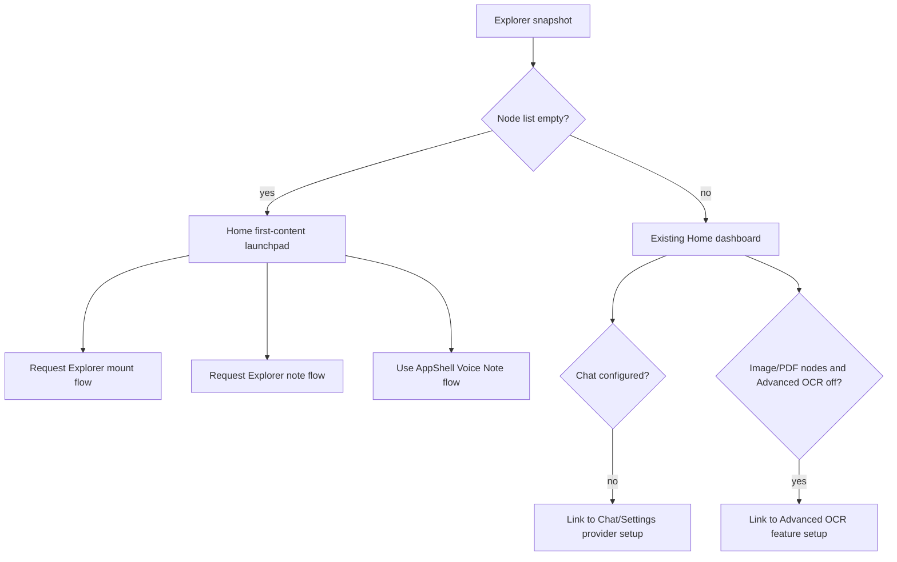

# feat: Add Empty Node Onboarding

## Summary

Add state-driven onboarding for users whose node list is empty. Home becomes a non-blocking launchpad for Mount Folder, Create Note, and Voice Note while the workspace is empty; once nodes exist, Home returns to the existing observability dashboard and may show secondary prompts for Chat provider setup or Advanced OCR when those prompts are relevant.

---

## Problem Frame

Home currently works well for established users because it is an observability dashboard, but an empty workspace turns the same surface into empty metrics and inert charts. The plan keeps the established dashboard intact for non-empty workspaces while adding first-content guidance only when the explorer node list has no roots (see origin: `docs/brainstorms/2026-05-17-empty-node-onboarding-requirements.md`).

---

## Requirements

- R1. Onboarding is triggered by an empty explorer node list, not by a first-run flag alone.
- R2. Empty Home shows a launchpad instead of empty dashboard charts as the primary content.
- R3. The launchpad offers Mount Folder, Create Note, and Start Voice Note.
- R4. The launchpad is non-blocking; normal navigation and app actions remain available.
- R5. Launchpad copy is about creating local content, not completing setup.
- R6. Once the node list becomes non-empty, Home returns to the normal dashboard as the primary surface.
- R7. Secondary onboarding after content exists is dismissible and not the main Home layout.
- R8. Chat provider setup is prompted after content exists, not before first content creation.
- R9. Chat provider prompts explain the limitation and route users to setup or verification.
- R10. Advanced OCR is suggested only when broad content signals indicate likely benefit, such as images or PDFs.
- R11. Advanced OCR prompting explains the extraction benefit and added model/download/indexing cost.
- R12. Advanced OCR remains optional and does not block indexing, search, note creation, folder mounting, or chat setup.
- R13. Explorer, Chat, and Search empty states support the Home launchpad rather than becoming separate onboarding flows.
- R14. Search and Chat are not presented as primary first actions while the node list is empty.

**Origin actors:** A1 New or empty-workspace user, A2 returning empty-workspace user, A3 CogniOS app shell, A4 search/model subsystem.
**Origin flows:** F1 empty node launchpad, F2 first content created, F3 Chat provider prompt, F4 Advanced OCR prompt.
**Origin acceptance examples:** AE1 empty Home first-content actions, AE2 first note removes dominant launchpad, AE3 Chat provider prompt after nodes exist, AE4 Advanced OCR prompt for image/PDF content, AE5 Search empty state points to adding content.

---

## Scope Boundaries

- No blocking onboarding wizard, tutorial, or mandatory setup checklist.
- No broad redesign of Home's non-empty observability dashboard.
- No requirement that users configure Chat or Advanced OCR before creating content.
- No new provider configuration system; reuse existing Settings and Chat setup surfaces.
- No file-quality or scan-quality classifier for Advanced OCR in this plan.
- No promise that Search or Chat is useful before local nodes exist.
- No backend schema change or sidecar API change. If implementation reveals a real frontend contract gap, update the plan before expanding scope.

### Deferred to Follow-Up Work

- Richer OCR recommendation heuristics: document-quality, failed-basic-OCR, or scan-likeness signals can be added later after the lightweight image/PDF signal proves useful.
- Persistent multi-step onboarding checklist: deliberately outside this plan because the origin rejects a setup-completion flow.
- Product analytics for onboarding conversion: useful later, but not required to ship the state-driven UX.

---

## Context & Research

### Relevant Code and Patterns

- `src/app/App.tsx` owns global section navigation, Voice Note start, SearchPalette open/close, and the Explorer store context. It is the right place to route Home actions into existing app flows.
- `src/features/explorer/components/ExplorerLayout.tsx` owns Mount Folder and Create Note behavior through `CreateMenu` and modal state. Home should request these flows rather than duplicate explorer client calls.
- `src/features/home/components/HomeDashboard.tsx` currently polls search subsystem status and observability and renders KPI/chart panels. Empty-node onboarding should be a conditional primary state, not a replacement for this dashboard when nodes exist.
- `src/features/settings/components/FeatureRow.tsx`, `ProviderChooserModal.tsx`, and `SettingsLayout.tsx` already provide feature-scoped provider setup, including Advanced OCR and Chat capability selection.
- `src/features/chat/components/ChatLayout.tsx` already renders inline provider setup when chat models report provider unavailable. The Home prompt should lead users to that existing setup surface instead of introducing a second editor.
- `src/features/search/components/SearchPalette.tsx` already reads the Explorer store for mount filters and recent nodes, so it can distinguish an actually empty workspace from a workspace with no recent matches.
- `src/features/explorer/utils/presentation.ts` already exposes broad image/PDF detection helpers through `isImageNode`, `isPdfNode`, and `hasExtractArtifacts`; these are enough for the v1 Advanced OCR prompt.

### Institutional Learnings

- No `docs/solutions/` directory is present in this checkout.

### External References

- Skipped. The plan extends existing local React/Tauri patterns and does not introduce unfamiliar external APIs or dependencies.

---

## Key Technical Decisions

- Empty state source of truth is the Explorer snapshot roots: `snapshot.roots.length === 0` is the frontend signal for primary onboarding. This matches the origin's state-driven requirement and avoids relying on `firstRunSkipped`.
- Home action routing is app-shell mediated: Home receives callbacks for Mount Folder, Create Note, and Start Voice Note. AppShell switches to Explorer and lets ExplorerLayout execute mount/note creation through its existing code paths; Voice Note uses the existing AppShell recording path.
- Chat provider prompt is configuration-led on Home and runtime-led in Chat: Home should prompt when content exists and chat is unbound/disabled or its configured provider is disabled. ChatLayout remains responsible for provider-unavailable/provider-error/warming states because it already has model/runtime status.
- Advanced OCR prompt uses broad file-type presence in the current node tree: image and PDF nodes are enough to suggest Advanced OCR. No scan classifier or OCR-quality inspection ships in this plan.
- Secondary prompt dismissal is lightweight but explicit: empty-node launchpad is not dismissible while the workspace is empty, but Chat/OCR prompts use local UI persistence keyed by prompt and relevance signal so they can be dismissed and reappear when the underlying relevance changes.
- Contextual empty states stay supportive: Search, Chat, and Explorer should point users toward adding content, but the Home launchpad remains the primary onboarding surface.

---

## Open Questions

### Resolved During Planning

- Advanced OCR trigger signal: use recursive image/PDF presence in the Explorer snapshot for v1.
- Chat unavailable states: Home uses settings/configuration readiness; Chat keeps handling runtime provider unavailable, provider error, and model-list states.
- Secondary prompt dismissal: make Chat/OCR prompts dismissible with lightweight local persistence that resets when the relevant signal changes; keep empty-node launchpad state-driven and visible while there are no nodes.

### Deferred to Implementation

- Exact helper/component names: choose names that fit the surrounding files once implementation starts.
- Exact prompt copy: keep it short and local-content-focused, then adjust during UI implementation.
- Exact dismissal storage key names: choose implementation-local names that make prompt versioning and relevance reset clear.

---

## High-Level Technical Design

> *This illustrates the intended approach and is directional guidance for review, not implementation specification. The implementing agent should treat it as context, not code to reproduce.*

---

## Implementation Units

### U1. App-Shell Creation Routing

**Goal:** Let Home trigger the existing Mount Folder, Create Note, and Voice Note flows without duplicating Explorer or Voice Note business logic.

**Requirements:** R3, R4, R5, AE1.

**Dependencies:** None.

**Files:**
- Modify: `src/app/App.tsx`
- Modify: `src/features/explorer/components/ExplorerLayout.tsx`
- Test: `src/app/App.test.tsx`
- Test: `src/features/explorer/components/ExplorerLayout.test.tsx`

**Approach:**
- Add an app-shell action bridge for first-content actions. Home calls app-level callbacks; AppShell switches to Explorer when needed and signals ExplorerLayout to open the mount modal or create a note.
- Keep Voice Note on the existing `startVoiceNoteRecording` path so model readiness, snapshot updates, focus behavior, and recording preview stay consistent with the sidebar button.
- Make ExplorerLayout handle one-shot requested create actions idempotently, so repeated Home clicks do not create duplicate notes or reopen stale modal state.
- Preserve current CreateMenu behavior; the new Home path should be an additional entry point into the same actions.

**Patterns to follow:**
- `AppShell.focusExplorerNode` and `voiceNoteFocusRequest` for one-shot cross-component requests.
- `ExplorerLayout.handleCreateSelect`, `handleMountSubmit`, and `handleNoteCreate` for creation behavior.

**Test scenarios:**
- Happy path: From empty Home, clicking Mount Folder switches to Explorer and opens the existing mount dialog without calling `createMount` until the user submits a path.
- Happy path: From empty Home, clicking Create Note switches to Explorer, calls `createNote` through the explorer client, applies the snapshot, and enters inline rename for the new note.
- Happy path: From empty Home, clicking Start Voice Note follows the same path as the sidebar Voice Note button and opens the recording preview in Explorer.
- Edge case: Re-rendering ExplorerLayout after consuming a requested note action does not create the note a second time.
- Integration: Home action callbacks remain available while other navigation buttons still switch sections normally.

**Verification:**
- Home first-content buttons route into the existing Explorer/Voice Note flows.
- Existing Explorer create menu tests and Voice Note sidebar behavior continue to pass.

---

### U2. Empty Home Launchpad State

**Goal:** Replace empty Home metrics with a first-content launchpad only while the explorer node list is empty.

**Requirements:** R1, R2, R3, R4, R5, R6, AE1, AE2.

**Dependencies:** U1.

**Files:**
- Modify: `src/app/App.tsx`
- Modify: `src/features/home/components/HomeDashboard.tsx`
- Modify: `src/styles/app.css`
- Test: `src/features/home/components/HomeDashboard.test.tsx`
- Test: `src/app/App.test.tsx`

**Approach:**
- Pass the explorer snapshot emptiness signal and first-content callbacks from AppShell into HomeDashboard.
- When the workspace is empty, render a compact, action-oriented launchpad as Home's primary content and hide the empty KPI/chart dashboard.
- When the workspace becomes non-empty, render the existing dashboard unchanged as the primary Home surface.
- Avoid treating search-sidecar metrics as the empty-workspace source of truth; index status may be loading or zero even when local nodes exist.

**Patterns to follow:**
- Existing Home panel class structure and dense dashboard styling in `HomeDashboard.tsx`.
- Existing app shell section rendering in `App.tsx`.

**Test scenarios:**
- Covers AE1. Given `snapshot.roots` is empty, Home renders Mount Folder, Create Note, and Start Voice Note actions and does not render empty charts as the primary content.
- Covers AE2. Given a first note is created and the explorer snapshot becomes non-empty, Home renders the normal dashboard rather than the launchpad.
- Edge case: Empty Home still allows sidebar navigation to Explorer, Chat, Settings, and Search.
- Edge case: Search/index/model envelopes loading or unavailable do not suppress the empty-node launchpad when the node list is empty.
- Integration: HomeDashboard tests still cover the existing metrics/charts when `workspaceIsEmpty` is false.

**Verification:**
- Empty and non-empty Home states are visually distinct and driven by explorer snapshot state.
- Existing Home observability behavior is preserved for non-empty workspaces.

---

### U3. Secondary Home Prompts for Chat and Advanced OCR

**Goal:** Show dismissible secondary prompts after content exists when Chat setup or Advanced OCR is contextually useful.

**Requirements:** R7, R8, R9, R10, R11, R12, AE3, AE4.

**Dependencies:** U2.

**Files:**
- Create: `src/features/home/utils/onboardingSignals.ts`
- Create: `src/features/home/utils/onboardingSignals.test.ts`
- Modify: `src/features/home/components/HomeDashboard.tsx`
- Modify: `src/styles/app.css`
- Test: `src/features/home/components/HomeDashboard.test.tsx`

**Approach:**
- Add small pure helpers that traverse the Explorer node tree and derive:
  - whether the workspace is empty,
  - whether image/PDF-like content exists,
  - whether Advanced OCR is disabled or unbound in search settings,
  - whether Chat is disabled, unbound, or bound to a disabled provider in search settings.
- Fetch search settings in Home only for secondary prompts and tolerate loading/unavailable settings by hiding those prompts rather than blocking Home.
- Render prompts below or near the dashboard as secondary affordances once the workspace is non-empty.
- Route Chat prompt actions to the existing Chat or Settings setup path; route Advanced OCR prompt actions to the existing feature-oriented Settings surface.
- Add dismiss affordances for secondary prompts with local UI persistence. Use prompt-specific relevance fingerprints so dismissing "Advanced OCR for current PDF/image content" does not permanently suppress the prompt after a materially different relevant workspace state appears.

**Patterns to follow:**
- `SettingsLayout` and `FeatureRow` for feature/provider copy and capability names.
- `hasExtractArtifacts` in `src/features/explorer/utils/presentation.ts` for broad image/PDF detection.
- Home's existing compact controls for restrained dashboard-level affordances.

**Test scenarios:**
- Covers AE3. Given nodes exist and Chat has no usable configured provider, Home shows a non-blocking Chat setup prompt.
- Covers AE4. Given nodes include a PDF or image and Advanced OCR is disabled/unbound, Home shows an Advanced OCR prompt that can be dismissed.
- Happy path: Given nodes exist and Chat/Advanced OCR are already configured or not relevant, Home does not show those prompts.
- Edge case: Given settings are loading or unavailable, Home still renders the normal dashboard and does not show misleading setup prompts.
- Edge case: Given the workspace is empty, Home shows only first-content onboarding and suppresses Chat/OCR secondary prompts.
- Edge case: Given a secondary prompt was dismissed, it remains hidden until the prompt's relevance fingerprint changes.
- Integration: Clicking each prompt action navigates to the intended existing setup surface without changing provider settings directly.

**Verification:**
- Secondary prompts appear only after content exists and only when their state signals are relevant.
- Dismissing a secondary prompt does not affect indexing, search, note creation, folder mounting, or chat setup.

---

### U4. Contextual Empty States in Search, Chat, and Explorer

**Goal:** Align non-Home empty states with the empty-node onboarding story without turning each surface into its own onboarding flow.

**Requirements:** R13, R14, AE5.

**Dependencies:** U1, U2.

**Files:**
- Modify: `src/features/search/components/SearchPalette.tsx`
- Modify: `src/features/chat/components/ChatLayout.tsx`
- Modify: `src/features/explorer/components/ExplorerTree.tsx`
- Modify: `src/features/explorer/components/ExplorerLayout.tsx`
- Modify: `src/styles/app.css`
- Test: `src/features/search/components/SearchPalette.test.tsx`
- Test: `src/features/chat/components/ChatLayout.test.tsx`
- Test: `src/features/explorer/components/ExplorerLayout.test.tsx`

**Approach:**
- SearchPalette already reads the Explorer store; when there are no nodes and no recent items, change the idle empty state to point users toward adding content instead of implying search should already work.
- ChatLayout should accept or derive a workspace-empty signal and adjust the empty transcript copy so it does not present Chat as the primary first action before local content exists.
- Explorer should show a lightweight empty tree/detail affordance while preserving its existing toolbar, so users can still use Mount Folder and New Note directly there.
- Keep all contextual empty states shallow: concise copy and links/actions into existing flows, not step-by-step onboarding.

**Patterns to follow:**
- `SearchPalette` ARIA combobox/listbox structure; do not move keyboard focus away from the input.
- Existing Chat provider setup branch in `ChatLayout.tsx`.
- Explorer toolbar and detail placeholder patterns.

**Test scenarios:**
- Covers AE5. Given the node list is empty, SearchPalette idle state points users toward adding content rather than saying only "start typing."
- Happy path: Given nodes exist but no recent nodes are available, SearchPalette keeps the normal search-oriented idle guidance.
- Happy path: Given Chat opens with an empty workspace and a configured provider, the empty transcript copy indicates content should be added before grounded answers are useful.
- Edge case: Given Chat provider is unavailable, the existing provider setup UI remains the dominant Chat prompt even if the workspace is empty.
- Happy path: Given Explorer opens with an empty tree, the create toolbar remains usable and the empty detail state guides toward first content.

**Verification:**
- Search, Chat, and Explorer empty states support the Home launchpad but remain independently navigable and usable.
- Existing keyboard and focus behavior in SearchPalette is unchanged.

---

### U5. Visual Polish and Regression Coverage

**Goal:** Keep the onboarding UI consistent with CogniOS's operational app style and protect the cross-surface state transitions with focused tests.

**Requirements:** R4, R5, R7, R12, R13.

**Dependencies:** U2, U3, U4.

**Files:**
- Modify: `src/styles/app.css`
- Test: `src/app/App.test.tsx`
- Test: `src/features/home/components/HomeDashboard.test.tsx`
- Test: `src/features/search/components/SearchPalette.test.tsx`
- Test: `src/features/chat/components/ChatLayout.test.tsx`
- Test: `src/features/explorer/components/ExplorerLayout.test.tsx`

**Approach:**
- Style the launchpad as a compact app surface, not a marketing hero. Use icon+text buttons for the three concrete actions and restrained prompt rows for secondary guidance.
- Ensure text fits at narrow and desktop widths; avoid nested cards and broad one-note color themes.
- Add integration coverage where state crosses AppShell, Home, Explorer, and Voice Note.
- Keep styling scoped to existing Home/empty-state class families where possible.

**Patterns to follow:**
- Current Home dashboard density and chart panels.
- Existing `settings-action`, toolbar, and prompt styling conventions.

**Test scenarios:**
- Happy path: Empty Home action buttons remain reachable by accessible names.
- Edge case: Secondary prompt dismissal controls are accessible and do not remove the normal dashboard.
- Integration: App-level tests prove Mount Folder, Create Note, and Voice Note Home actions do not regress sidebar equivalents.
- Regression: Existing SearchPalette IME Enter behavior remains covered and unaffected by empty-state copy changes.

**Verification:**
- Unit and app-level tests cover empty, first-content, and secondary-prompt states.
- The UI remains non-blocking and consistent with the existing application shell.

---

## System-Wide Impact

- **Interaction graph:** AppShell becomes the router for Home first-content actions, ExplorerLayout consumes requested create actions, HomeDashboard reads explorer emptiness and settings-derived secondary signals, and Search/Chat/Explorer render contextual empty states.
- **Error propagation:** Mount and note creation errors should continue to surface through Explorer's existing store/action error handling. Voice Note errors continue through the existing recording state. Settings fetch failures should hide secondary prompts rather than block Home.
- **State lifecycle risks:** One-shot create requests must be consumed exactly once. Secondary prompt dismissal must not hide primary empty-node onboarding.
- **API surface parity:** No new Tauri/sidecar API is planned. Existing SearchClient, ExplorerClient, ChatLayout, and Settings flows remain the integration points.
- **Integration coverage:** App-level tests should prove Home-to-Explorer and Home-to-VoiceNote handoffs because component tests alone will not catch routing regressions.
- **Unchanged invariants:** The non-empty Home dashboard stays the observability dashboard; Explorer's CreateMenu remains the canonical manual create control; Chat remains responsible for runtime provider setup and errors.

---

## Risks & Dependencies

| Risk | Mitigation |
|------|------------|
| Home duplicates Explorer creation behavior and drifts later | Route actions through AppShell and ExplorerLayout instead of direct Home client calls |
| Empty detection becomes inconsistent across surfaces | Use Explorer snapshot roots as the primary frontend source of truth |
| Chat prompt appears too early and distracts from first content | Suppress Chat provider prompts while workspace is empty |
| Advanced OCR prompt over-promises quality | Use copy that frames it as better extraction for eligible files with added cost, not guaranteed perfect OCR |
| Secondary prompt dismissal becomes a hidden checklist system | Keep dismissal scoped to prompts and reset only when relevance changes |
| Cross-surface tests become brittle | Test observable behavior and accessible labels, not internal helper names or exact visual layout |

---

## Documentation / Operational Notes

- No external user documentation is required for this plan.
- The plan should not change sidecar startup, model downloads, or indexing behavior. Any provider/model work remains routed through existing Settings and Chat surfaces.
- If visual verification is run during implementation, check both empty and non-empty Home states.

---

## Sources & References

- **Origin document:** [docs/brainstorms/2026-05-17-empty-node-onboarding-requirements.md](../brainstorms/2026-05-17-empty-node-onboarding-requirements.md)
- Related code: `src/app/App.tsx`
- Related code: `src/features/home/components/HomeDashboard.tsx`
- Related code: `src/features/explorer/components/ExplorerLayout.tsx`
- Related code: `src/features/search/components/SearchPalette.tsx`
- Related code: `src/features/chat/components/ChatLayout.tsx`
- Related code: `src/features/settings/components/SettingsLayout.tsx`
- Related code: `src/features/settings/components/FeatureRow.tsx`
- Related code: `src/features/explorer/utils/presentation.ts`
