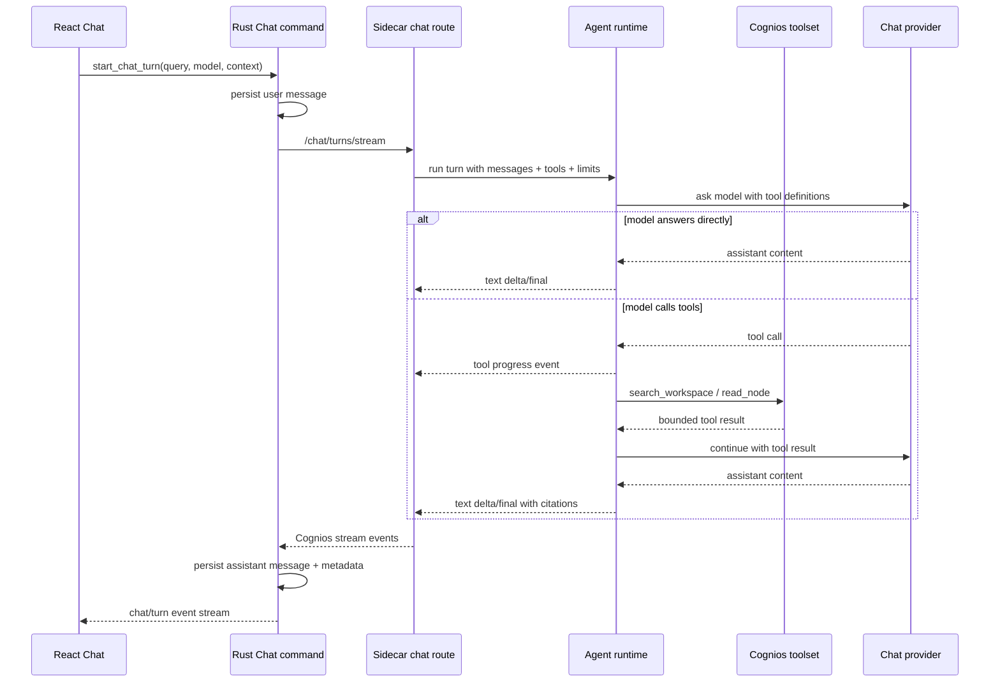
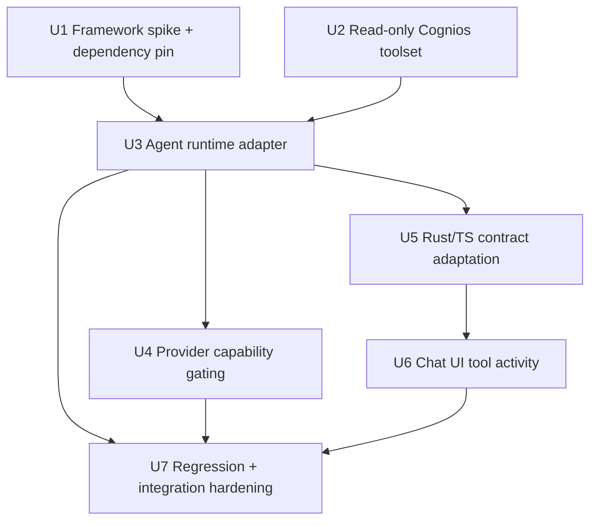
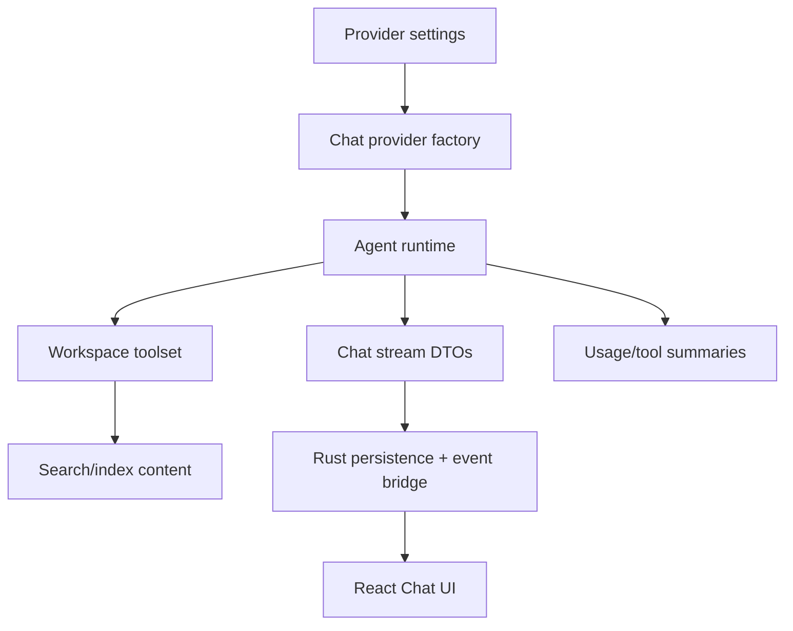

# feat: Build agentic chat tool loop

## Summary

Replace Chat's unconditional retrieval-first orchestration with an external-framework-backed agent runtime. The sidecar will expose bounded read-only Cognios tools to the model, adapt framework events back into the existing Rust/React Chat stream, and clearly gate providers that cannot support native tool calling.

---

## Problem Frame

The origin document identifies a core product failure: Chat searches before the model decides whether search is useful, so even a greeting like "hi" can trigger retrieval and source UI noise. The implementation needs to preserve Cognios' current Rust-owned session persistence and sidecar-owned provider/retrieval boundary while making tool use model-directed.

---

## Requirements

- R1. Use an external agent SDK/framework as the execution layer for agentic Chat turns.
- R2. Let the model decide whether to call tools; do not run search/read as unconditional pre-processing.
- R3. Support a bounded loop where the model can call tools, observe results, and continue or answer.
- R4. Enforce turn limits and clear failure behavior for tool errors, unsupported providers, and loop exhaustion.
- R5. Surface user-comprehensible tool activity without leaking raw framework internals into the transcript.
- R6. Expose a read-only `search_workspace` tool returning ranked workspace candidates with stable node identifiers and source metadata.
- R7. Expose a read-only `read_node` tool returning bounded node content and recoverable stale/unavailable-node results.
- R8. Preserve citations/source references for answers grounded in workspace tool results.
- R9. Do not expose write tools in V1.
- R10. Require providers/models to satisfy the selected framework's native tool-calling path for agentic mode.
- R11. Preserve a direct-answer path for greetings and casual conversation.
- R12. Do not require all existing Chat providers to support agentic mode before V1 ships.
- R13. Treat retrieved workspace content as untrusted data.
- R14. Preserve the existing privacy posture for cloud-provider payloads.
- R15. Persist user-visible tool summaries, source references, and errors without storing full raw provider payloads by default.

**Origin actors:** A1 workspace user, A2 Chat model, A3 agent runtime framework, A4 Cognios workspace tools.
**Origin flows:** F1 direct conversational turn, F2 workspace-grounded research turn, F3 unsupported provider path.
**Origin acceptance examples:** AE1 greeting does not search, AE2 workspace question searches/reads/cites, AE3 stale node is recoverable, AE4 retrieved content cannot create writes, AE5 unsupported provider does not silently fallback.

---

## Scope Boundaries

- No write tools in V1.
- No arbitrary plugin marketplace or user-defined tool registry in V1.
- No multi-agent behavior, swarm orchestration, unattended task queue, or long-running background agent jobs in V1.
- No provider-agnostic text/JSON tool-call simulation in V1.
- No requirement that every existing Chat provider remain available in agentic mode.
- No automatic pre-turn source clustering for every message.
- No automatic saving of web results or workspace mutations as a side effect of read-only research.

### Deferred to Follow-Up Work

- Framework-driven write tools: create/update Note tools need a separate permission, confirmation, and conflict plan.
- Durable long-running agent jobs: keep V1 turn-scoped; background plans/tasks need a later lifecycle model.
- Rich configurable tool registry: V1 can structure tools for extension without exposing user-defined tools yet.
- Native web-search tool migration: keep this plan focused on workspace `search_workspace` and `read_node`; web-search agent tools can follow after the read-only workspace loop is proven.

---

## Context & Research

### Relevant Code and Patterns

- `sidecar/search_sidecar/chat/orchestrator.py` currently calls `_prepare_turn()` before provider generation; `_prepare_turn()` always retrieves, clusters, and assembles context. This is the main behavior to replace.
- `sidecar/search_sidecar/chat/provider.py`, `types.py`, `ollama.py`, and `openai_compat.py` define a provider-neutral text-generation interface. They do not currently represent tool calls, framework events, or unsupported-agentic-provider states.
- `sidecar/search_sidecar/routes/chat.py` exposes `/chat/turns` and `/chat/turns/stream`, converting sidecar events into SSE frames consumed by Rust.
- `src-tauri/src/commands/chat.rs` persists the user message before forwarding to the sidecar, streams `chat/turn` events to React, then persists assistant messages, citations, warnings, clusters, and provider metadata.
- `src-tauri/src/services/search/client.rs` already wraps sidecar HTTP responses in `ready | initialising | unavailable` envelopes and has `node_content()` for `/index/node/{node_id}/content`.
- `sidecar/search_sidecar/routes/index.py` implements indexed node-content assembly, including artifact-backed image/OCR content. This logic should be extracted into a reusable service before `read_node` uses it.
- `sidecar/search_sidecar/chat/retrieval.py` already wraps workspace search and optional web search into `ChatSource` values. V1 agent tools should use the workspace-search portion directly and not include web search unless a later plan adds a web tool.
- `src/features/chat/components/ChatLayout.tsx` and `ChatLayout.test.tsx` already render streaming assistant deltas, citations, provider/model state, context nodes, and status errors. Tool progress can extend the current stream event contract.
- `sidecar/pyproject.toml` is the sidecar dependency surface. Any agent framework dependency belongs there, not in the React app.

### Institutional Learnings

- No `docs/solutions/` directory exists in this repo at planning time.
- Existing plans consistently keep durable workspace state in Rust/SQLite, ML/retrieval/provider execution in the Python sidecar, and UI-facing failure states typed rather than inferred from strings.

### External References

- Pydantic AI docs: agents, function tools, toolsets, event streaming, usage limits, model providers, and Ollama/OpenAI-compatible model support.
- OpenAI Agents SDK docs: useful alternative if OpenAI becomes the primary runtime, especially for hosted tracing and OpenAI-native tool semantics.
- LangGraph docs: useful alternative for durable graph workflows and long-running state machines, but heavier than V1's single-turn tool loop.

---

## Key Technical Decisions

- Pydantic AI as the primary candidate: It matches the current Python/FastAPI/Pydantic sidecar, supports typed tools/toolsets, event streaming, usage limits, and multiple model providers. Validate it in U1 before spreading framework assumptions through the codebase.
- Existing Chat SSE contract stays the integration boundary: adapt framework events into Cognios `metadata | delta | final` plus tool-progress events instead of making React understand framework-native traces.
- Agentic mode is provider-gated: providers that cannot satisfy native tool calling surface an unsupported state rather than falling back to unconditional retrieval or simulated JSON tool calls.
- Search/read tools are sidecar services, not frontend actions: the model calls sidecar-local read-only functions, and Rust remains responsible for durable transcript persistence and UI event bridging.
- Node reads use indexed content: `read_node` should read the same extracted/indexed content Search exposes, not arbitrary filesystem paths.
- Tool results are untrusted context: retrieved text supports the answer but cannot grant permissions, request writes, or override runtime instructions.

---

## Open Questions

### Resolved During Planning

- Which external framework is the primary candidate? Pydantic AI, because it best matches the existing Python/Pydantic sidecar and V1's single-agent tool loop.
- Should the plan keep the existing Chat frontend protocol? Yes. The framework is an internal runtime; Rust/React should receive Cognios-shaped stream events.
- Should Ollama remain universally supported in agentic mode? No. Only Ollama models reachable through a native tool-calling path should be agentic-capable; others surface unsupported.
- Should web search be part of V1 agent tools? No. The origin V1 proof is workspace `search_workspace` plus `read_node`; web can follow after the local loop works.

### Deferred to Implementation

- Exact Pydantic AI version pin: choose during U1 after confirming compatibility with Python 3.13, sidecar packaging, streaming, usage limits, and provider paths.
- Exact event names for tool progress: choose during implementation while preserving user-visible semantics and existing final response behavior.
- Exact provider capability flag shape: decide while wiring settings/provider metadata, keeping unsupported-agentic-provider behavior explicit.
- Exact prompt wording: refine during tests, but keep the trust boundary and citation requirements from `sidecar/search_sidecar/chat/prompting.py`.

---

## High-Level Technical Design

> *This illustrates the intended approach and is directional guidance for review, not implementation specification. The implementing agent should treat it as context, not code to reproduce.*

---

## Implementation Units

### U1. Framework Spike And Dependency Pin

**Goal:** Validate Pydantic AI as the external agent runtime candidate and add it as a sidecar dependency only after the minimum agent/tool loop works in isolation.

**Requirements:** R1, R3, R4, R10, R12

**Dependencies:** None

**Files:**
- Modify: `sidecar/pyproject.toml`
- Modify: `sidecar/uv.lock`
- Create: `sidecar/search_sidecar/chat/agent_runtime.py`
- Test: `sidecar/tests/test_agent_runtime.py`

**Approach:**
- Add a narrow `AgentRuntime` abstraction owned by Cognios so the rest of the sidecar is not coupled directly to framework-specific classes.
- Validate Pydantic AI with a fake model/tool path first: one direct-answer turn, one single-tool turn, one multi-tool turn, and one tool-call-limit failure.
- Pin the dependency after validation and keep the adapter surface small enough that OpenAI Agents SDK or LangGraph could replace it later if U1 invalidates Pydantic AI.
- Record framework limitations in comments only where they affect Cognios behavior; do not duplicate external docs in source.

**Execution note:** Implement this test-first. The first failing tests should prove direct-answer turns do not require tools and tool-call limits fail predictably.

**Patterns to follow:**
- `sidecar/tests/test_chat_routes.py` for fake providers and sidecar-level DTO tests.
- `sidecar/search_sidecar/chat/types.py` for small dataclass DTOs around provider/runtime boundaries.

**Test scenarios:**
- Happy path: given a fake model that returns text without tool calls, running an agent turn returns a final answer and no tool events.
- Happy path: given a fake model that requests `search_workspace`, the runtime executes the tool once and then returns the model's final answer.
- Edge case: given a fake model that requests more tool calls than allowed, the runtime returns a recoverable limit-exhausted state without crashing.
- Error path: given a tool that raises a recoverable error, the runtime converts it into a tool-result/error event the model can observe or the final response can report.
- Integration: dependency import works under the sidecar's Python version and test environment.

**Verification:**
- The sidecar has a pinned, importable framework dependency.
- The Cognios-owned adapter can run direct, tool, and limit-failure turns without touching Chat routes yet.

---

### U2. Read-Only Cognios Toolset

**Goal:** Create sidecar-local `search_workspace` and `read_node` tools with bounded, citation-ready results.

**Requirements:** R6, R7, R8, R9, R13, R14

**Dependencies:** None

**Files:**
- Create: `sidecar/search_sidecar/chat/tools.py`
- Create: `sidecar/search_sidecar/index/content.py`
- Modify: `sidecar/search_sidecar/routes/index.py`
- Test: `sidecar/tests/test_chat_tools.py`
- Test: `sidecar/tests/test_index_routes.py`

**Approach:**
- Extract node-content assembly from `routes/index.py` into a reusable service so both `/index/node/{node_id}/content` and `read_node` share behavior.
- Build a `CogniosChatToolset` around the existing `SearchOrchestrator` and the extracted node-content reader.
- Keep `search_workspace` workspace-only for V1. Do not call web search from this tool.
- Return stable source metadata from `search_workspace`: node id, title, kind, path, snippet, score, and a source label that the runtime can later map to citations.
- Bound `read_node` output by character budget and chunk count; include truncation metadata so the model and final answer can avoid implying full-document coverage when content was clipped.
- Represent stale/missing/unindexed nodes as recoverable tool results, not thrown framework exceptions.

**Execution note:** Add characterization coverage around the existing `/index/node/{node_id}/content` response before extracting the shared reader.

**Patterns to follow:**
- `sidecar/search_sidecar/chat/retrieval.py` for converting search results into Chat-friendly source objects.
- `sidecar/search_sidecar/routes/index.py` for node-content behavior and artifact fallback.
- `src/lib/contracts/search.ts` for the frontend-facing content shape that should remain stable.

**Test scenarios:**
- Happy path: `search_workspace` returns ranked workspace candidates with node id, title, snippet, path, score, and source kind.
- Happy path: `read_node` returns joined indexed content and chunk metadata for an indexed text node.
- Happy path: `read_node` returns artifact-backed OCR/caption content for an image node using the same behavior as the preview endpoint.
- Edge case: `read_node` truncates long content and marks the result as truncated.
- Edge case: `read_node` for an unindexed or empty node returns an empty recoverable result.
- Error path: stale node id returns a recoverable not-found/unavailable tool result.
- Integration: `/index/node/{node_id}/content` keeps its existing route response after the shared content reader extraction.

**Verification:**
- Chat tools are read-only, bounded, and share content behavior with the existing index route.
- Existing index preview behavior remains intact.

---

### U3. Agentic Chat Orchestration

**Goal:** Replace unconditional retrieval-first Chat turns with the framework-backed agent runtime while preserving Cognios-shaped responses.

**Requirements:** R1, R2, R3, R4, R5, R8, R11, R13, R15

**Dependencies:** U1, U2

**Files:**
- Modify: `sidecar/search_sidecar/lifecycle.py`
- Modify: `sidecar/search_sidecar/chat/orchestrator.py`
- Modify: `sidecar/search_sidecar/chat/types.py`
- Modify: `sidecar/search_sidecar/chat/prompting.py`
- Modify: `sidecar/search_sidecar/routes/chat.py`
- Test: `sidecar/tests/test_chat_routes.py`
- Test: `sidecar/tests/test_agentic_chat_orchestrator.py`

**Approach:**
- Route normal Chat turns through the new agent runtime and remove unconditional `_retrieval.retrieve()` from the pre-generation path.
- Instantiate the agent runtime and read-only toolset during sidecar lifecycle wiring, alongside the existing search orchestrator and chat provider.
- Preserve session memory and user-attached context as untrusted context blocks available to the model at turn start.
- Convert tool calls and results into concise Cognios stream events for tool activity. Keep final answer, citations, warnings, provider metadata, and state in the existing `ChatTurnResponse` shape where possible.
- Build citation metadata from actual tool results used in the turn. Do not invent citations for direct-answer turns.
- Keep cluster persistence optional and downstream of tool use. If no search tool ran, `clusters` should be empty.
- Use explicit terminal states for provider errors, tool-limit exhaustion, unsupported agentic provider, and empty model response.

**Execution note:** Start with regressions for AE1 and AE2: `hi` must not search, and a workspace question must search/read only through model-requested tool calls.

**Patterns to follow:**
- Current `stream_turn()` event handling in `sidecar/search_sidecar/chat/orchestrator.py`.
- `sidecar/search_sidecar/chat/prompting.py` trust-boundary language and citation instructions.
- Existing `ChatTurnResponse` and `ChatTurnStreamEvent` DTOs for backward-compatible stream shape.

**Test scenarios:**
- Covers AE1. Given a fake agent model that answers directly to "hi", `stream_turn()` emits no tool events, no clusters, no citations, and a ready answer.
- Covers AE2. Given a fake agent model that calls search then read, `stream_turn()` emits tool activity, returns a cited answer, and includes citation metadata for the read node.
- Covers AE3. Given a stale node tool result, the model can continue and the final response includes a warning or explanation without crashing.
- Covers AE4. Given retrieved content that asks for note creation, no write action is exposed or executed.
- Edge case: user-attached context can be used in a direct answer without forcing `search_workspace`.
- Error path: repeated tool calls beyond the configured limit return a typed non-ready state with a clear warning.
- Error path: framework/provider returns an empty response and the orchestrator surfaces provider error without persisting a fake assistant answer.
- Integration: `/chat/turns/stream` still emits valid SSE frames ending with exactly one final turn.

**Verification:**
- Existing Chat route consumers still receive Cognios-shaped stream events.
- Direct-answer and tool-using turns are both supported by the same runtime path.

---

### U4. Provider Capability Gating

**Goal:** Make agentic Chat availability explicit per provider/model so unsupported models do not silently fall back to non-agentic behavior.

**Requirements:** R4, R10, R12, R14

**Dependencies:** U1, U3

**Files:**
- Modify: `sidecar/search_sidecar/chat/factory.py`
- Modify: `sidecar/search_sidecar/chat/provider.py`
- Modify: `sidecar/search_sidecar/chat/openai_compat.py`
- Modify: `sidecar/search_sidecar/chat/ollama.py`
- Modify: `sidecar/search_sidecar/providers/presets.py`
- Modify: `src/features/settings/data/providerPresets.ts`
- Test: `sidecar/tests/test_chat_factory.py`
- Test: `sidecar/tests/test_openai_compat_chat.py`
- Test: `sidecar/tests/test_ollama_chat.py`
- Test: `src/features/settings/components/ProviderEditor.test.tsx`

**Approach:**
- Add a provider capability concept for agentic Chat/tool calling separate from plain `chat`.
- Prefer OpenAI-compatible tool-calling model paths for agentic mode, including providers that expose compatible `/chat/completions` tools.
- For Ollama, support only the path validated by U1/U4; if a configured local model cannot satisfy tool calling, surface agentic unsupported rather than running old retrieval-first Chat.
- Keep existing plain chat model listing where possible, but make Chat send/availability states distinguish plain chat unavailable from agentic-mode unsupported.
- Preserve privacy disclosure behavior for cloud providers because tool definitions, tool arguments, and selected workspace content may leave the device.

**Patterns to follow:**
- `sidecar/search_sidecar/providers/presets.py` and `src/features/settings/data/providerPresets.ts` mirrored provider metadata.
- `sidecar/search_sidecar/routes/settings.py` for runtime settings refresh after provider changes.
- Existing provider error surfaces in `routes/chat.py`.

**Test scenarios:**
- Covers AE5. Given a provider without agentic tool-calling support, Chat models or turn startup returns an unsupported-agentic state rather than executing retrieval-first fallback.
- Happy path: OpenAI-compatible provider with agentic support is selected and passed into the agent runtime.
- Happy path: Ollama agentic support is available only for the validated compatible endpoint/model path.
- Error path: missing cloud API key remains a provider error, not an unsupported-agentic error.
- Integration: changing Chat provider in settings refreshes the live orchestrator provider without requiring app restart.
- UI/settings: provider metadata can describe agentic support without breaking existing feature rows.

**Verification:**
- Agentic mode cannot silently run against a non-tool-calling provider.
- Existing provider settings still load and render.

---

### U5. Rust And TypeScript Contract Adaptation

**Goal:** Carry tool activity, unsupported-agentic states, and citation metadata through Rust IPC and frontend contracts without changing Rust's ownership of durable session history.

**Requirements:** R5, R8, R10, R11, R15

**Dependencies:** U3, U4

**Files:**
- Modify: `src-tauri/src/services/search/client.rs`
- Modify: `src-tauri/src/commands/chat.rs`
- Modify: `src/lib/contracts/chat.ts`
- Modify: `src/features/chat/api/chatClient.test.ts`
- Test: `src-tauri/src/commands/chat.rs`
- Test: `src/features/chat/api/chatClient.test.ts`

**Approach:**
- Extend `ChatTurnStreamEventDto` / TypeScript `ChatTurnStreamEvent` to carry tool-progress events while preserving current metadata/delta/final handling.
- Persist assistant message metadata with concise tool summaries, citation metadata, provider metadata, warnings, and final state.
- Avoid persisting full raw framework payloads, raw prompts, or unbounded tool results.
- Stop treating `includeWeb: true` as a meaningful default for this V1 agentic workspace loop; keep the field only if needed for backward compatibility and ensure it no longer forces retrieval.
- Map unsupported-agentic-provider state to a user-facing error/status without recording a successful assistant turn.

**Execution note:** Add contract-level tests before changing frontend UI so protocol regressions are visible at the API boundary.

**Patterns to follow:**
- Existing `ChatTurnStreamEventDto` parsing in `src-tauri/src/services/search/client.rs`.
- `persist_turn_response()` metadata persistence in `src-tauri/src/commands/chat.rs`.
- `src/lib/contracts/chat.ts` as the TypeScript mirror of Rust/sidecar DTOs.

**Test scenarios:**
- Happy path: a tool-progress SSE frame from the sidecar is parsed by Rust and emitted to React with the same turn event id.
- Happy path: final cited answer persists citations and concise tool summaries in assistant message metadata.
- Covers AE1. Direct-answer final response persists no tool summaries or citations when no tool was called.
- Error path: unsupported-agentic-provider state surfaces to the frontend and does not append an assistant message as if the turn succeeded.
- Error path: malformed or unknown stream event remains non-fatal when the final event is valid.
- Integration: TypeScript client still sends session id, query, turn event id, model, and context nodes without requiring the caller to decide search behavior.

**Verification:**
- Rust/TS contracts represent agentic tool activity while preserving existing direct-answer flows.
- Session persistence contains useful tool summaries without raw provider/tool payloads.

---

### U6. Chat UI Tool Activity And Unsupported State

**Goal:** Update Chat UI to show model-directed tool use and clear unsupported-provider states without making tool traces the primary conversation.

**Requirements:** R5, R8, R10, R11, R14, R15

**Dependencies:** U5

**Files:**
- Modify: `src/features/chat/components/ChatLayout.tsx`
- Modify: `src/features/chat/components/ChatLayout.test.tsx`
- Modify: `src/styles/app.css`
- Test: `src/features/chat/components/ChatLayout.test.tsx`

**Approach:**
- Render compact in-turn activity such as searching workspace, reading a node, tool error/retry, or unsupported provider.
- Keep direct-answer turns visually simple: no source cluster area, no citation section, no search badge when no tool ran.
- Reuse existing inline citation rendering for final answers and source activation.
- Remove or de-emphasize UI assumptions that every turn is "workspace + web" or cluster-first.
- Surface unsupported-agentic-provider as an actionable state near provider/model controls and composer error handling.
- Ensure activity text is accessible via live regions but does not spam transcript history.

**Patterns to follow:**
- Existing stream delta rendering and "Thinking" state in `ChatLayout.tsx`.
- Existing inline citation rendering and source activation tests.
- Settings/provider status patterns for actionable configuration errors.

**Test scenarios:**
- Covers AE1. Sending "hi" and receiving a direct response renders no search/read activity, clusters, or source UI.
- Covers AE2. A stream with search/read tool activity renders compact progress and then a cited final answer.
- Covers AE5. Unsupported agentic provider renders an actionable composer/status message and leaves the user's prompt visible.
- Edge case: tool activity followed by provider error leaves a clear failure state and does not show stale assistant content as final.
- Accessibility: tool activity updates are announced without stealing focus from the composer.
- Regression: manual attached context still renders on user messages and is sent with the next turn.

**Verification:**
- Users can distinguish direct answers from tool-grounded answers.
- Unsupported providers are visible and actionable.

---

### U7. Regression And Integration Hardening

**Goal:** Prove the end-to-end agentic behavior and protect against fallback to retrieval-first Chat.

**Requirements:** R1, R2, R3, R4, R5, R8, R10, R11, R13, R15

**Dependencies:** U3, U4, U5, U6

**Files:**
- Modify: `sidecar/tests/test_chat_routes.py`
- Modify: `src/features/chat/components/ChatLayout.test.tsx`
- Modify: `src/features/chat/api/chatClient.test.ts`
- Modify: `src-tauri/src/services/search/client.rs`
- Test: `sidecar/tests/test_chat_routes.py`
- Test: `src/features/chat/components/ChatLayout.test.tsx`
- Test: `src/features/chat/api/chatClient.test.ts`

**Approach:**
- Add regression tests that explicitly fail if `ChatRetrieval.retrieve()` runs before the model requests `search_workspace`.
- Add sidecar route tests for direct-answer, search/read/cite, stale-read, unsupported-provider, and limit-exhaustion paths.
- Add frontend tests for "hi" direct answer, tool-progress rendering, and unsupported-provider UX.
- Keep tests fixture-driven with fake runtime/provider/tool objects; do not require real external model calls in CI.

**Patterns to follow:**
- Existing fake provider/retrieval style in `sidecar/tests/test_chat_routes.py`.
- Existing React testing-library patterns in `ChatLayout.test.tsx`.
- Existing Rust stream frame parsing tests in `src-tauri/src/services/search/client.rs`.

**Test scenarios:**
- Covers AE1. A direct greeting returns ready answer with no retrieval spy calls.
- Covers AE2. Workspace question executes model-requested search/read and returns citations.
- Covers AE3. Stale read produces recoverable tool error and final state remains controlled.
- Covers AE4. Tool result text that asks for writes does not create any write event or action.
- Covers AE5. Unsupported provider path is tested from sidecar response through frontend display.
- Integration: route stream, Rust event bridge, and React listener agree on tool-progress and final-event shapes.

**Verification:**
- Test coverage proves both positive and negative agentic behavior.
- No CI path requires live OpenAI/Ollama credentials or a running local model.

---

## System-Wide Impact

- **Interaction graph:** Provider settings, sidecar chat routes, search/index content, Rust Chat commands, and React Chat all participate in a turn.
- **Error propagation:** Provider unsupported, provider error, tool error, loop-limit exhaustion, and sidecar unavailable must stay distinct until the UI renders them.
- **State lifecycle risks:** User messages are persisted before sidecar execution; failed agent turns must not create misleading assistant records or fake successful memory refreshes.
- **API surface parity:** `/chat/turns` and `/chat/turns/stream` should remain coherent. The stream path is primary, but non-stream response behavior must not regress silently.
- **Integration coverage:** Sidecar route tests plus frontend stream tests are required because unit tests on the runtime alone will not prove persistence/UI behavior.
- **Unchanged invariants:** V1 remains read-only from the model's perspective; Rust remains canonical for chat session persistence; indexed node content remains the source for workspace reads.

---

## Risks & Dependencies

| Risk | Mitigation |
|------|------------|
| Pydantic AI does not fit Python 3.13, packaging, streaming, or provider constraints | U1 validates before broad integration; keep a small Cognios-owned runtime adapter so another framework can replace it |
| Ollama model support for tools is inconsistent | Gate agentic support per provider/model and show unsupported state instead of fallback |
| Framework events leak implementation detail into UI | Adapt to Cognios stream events and persist concise tool summaries only |
| Retrieval-first behavior survives through legacy code paths | Add explicit negative tests where retrieval spies must not run for direct-answer turns |
| Tool results become prompt-injection channels | Preserve untrusted-context prompt language and expose only read-only tools in V1 |
| Context payloads grow too large | Enforce `search_workspace` result limits and `read_node` truncation metadata |
| Plan accidentally reintroduces cluster-first as default | Keep clusters downstream of model-directed search/read and test direct-answer turns with no clusters |

---

## Alternative Approaches Considered

- Thin self-built loop: rejected because the user explicitly wants an external framework for extensibility, and future tool/permission/trace growth would otherwise harden around a temporary orchestrator.
- OpenAI Agents SDK first: attractive for OpenAI-native workflows and hosted tracing, but too centered on OpenAI as the primary runtime for a local-first product that still needs Ollama/OpenAI-compatible paths.
- LangGraph first: strong for durable graph/state-machine workflows, but heavier than the V1 single-turn tool loop and more likely to introduce graph ceremony before it is needed.
- Provider-agnostic JSON simulation: rejected by origin scope; V1 should use native tool calling and mark unsupported providers clearly.

---

## Documentation / Operational Notes

- Update developer-facing comments/docs near Chat provider settings to explain plain chat vs agentic Chat support.
- Note that `includeWeb` is no longer the switch controlling whether a turn searches; model-directed tools decide workspace search use.
- Keep user-facing privacy copy aligned with existing cloud-provider disclosures because tool arguments and selected workspace content may be sent to cloud chat providers.

---

## Sources & References

- **Origin document:** [docs/brainstorms/2026-05-17-agentic-chat-tool-loop-requirements.md](docs/brainstorms/2026-05-17-agentic-chat-tool-loop-requirements.md)
- Related plan: [docs/plans/2026-05-10-001-feat-cluster-first-agent-chat-plan.md](docs/plans/2026-05-10-001-feat-cluster-first-agent-chat-plan.md)
- Related code: `sidecar/search_sidecar/chat/orchestrator.py`
- Related code: `sidecar/search_sidecar/routes/chat.py`
- Related code: `sidecar/search_sidecar/routes/index.py`
- Related code: `src-tauri/src/commands/chat.rs`
- Related code: `src/features/chat/components/ChatLayout.tsx`
- External docs: [Pydantic AI documentation](https://ai.pydantic.dev/)
- External docs: [OpenAI Agents SDK documentation](https://openai.github.io/openai-agents-python/)
- External docs: [LangGraph documentation](https://langchain-ai.github.io/langgraph/)
