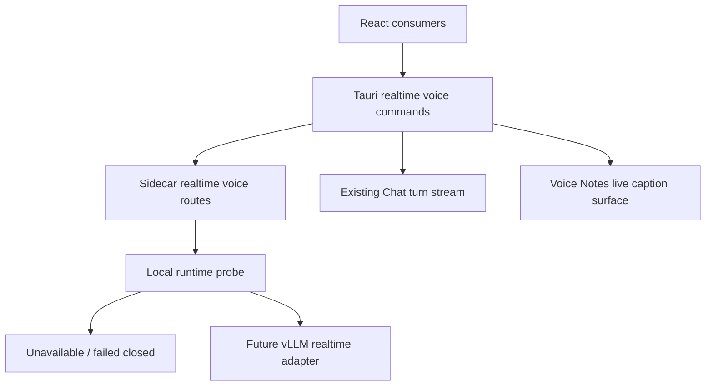

# Realtime Voice Conversation

## Summary

Build a reusable local realtime voice foundation that starts with explicit runtime status, fail-closed behavior, and a shared status contract. This PR lands the shippable substrate first: CogniOS must know whether a local realtime ASR runtime is packaged and usable before Voice Notes or Chat can claim true realtime speech.

---

## Problem Frame

Voice Notes currently get coarse timestamps from local audio segment offsets, not from ASR alignment. That near-realtime path is useful but still waits for completed segments and file-level ASR. The confirmed direction is a local-first realtime ASR layer that can later stream audio frames to Qwen3-ASR through vLLM, feed Voice Notes live captions, and dispatch finalized utterances into Chat's existing LLM text stream.

The immediate implementation must avoid a false realtime claim. The current sidecar package explicitly excludes heavy Qwen/vLLM-style runtimes, so this slice must make packaging feasibility observable and fail closed when the local runtime is unavailable.

---

## Requirements

**Shared realtime voice layer**

- R1. CogniOS exposes a shared realtime voice capability status that is not owned by Voice Notes or Chat.
- R2. The shared contract leaves room for provisional captions and finalized utterances, but this PR only exposes runtime status.
- R3. Runtime status includes unavailable, installing, starting, ready, degraded, failed, and stopped.
- R4. Missing packaged local realtime ASR fails closed into an explicit unavailable state.

**Voice Notes**

- R5. Voice Notes keep using saved source audio as the authority for final transcripts.
- R6. Voice Notes may display live captions only when the shared realtime runtime reports ready.
- R7. Final Voice Note timestamps and speaker labels remain part of the existing finalization path.

**Chat**

- R8. Chat can receive finalized voice utterances as ordinary user turns without changing the existing Chat response stream.
- R9. Chat must not submit provisional captions to the LLM.
- R10. Chat v1 remains text-response only.

**Packaging**

- R11. The macOS packaging path must expose whether realtime ASR runtime packaging is supported, missing, or disabled.
- R12. A packaged build must not depend on a manually launched developer vLLM server for a ready status.
- R13. The implementation must leave a testable runtime adapter boundary for local vLLM integration without adding an unvalidated dependency to the app bundle.

---

## Key Technical Decisions

- **Runtime status before audio streaming:** Land a small, testable capability contract first because false-ready realtime voice would be worse than a clear unavailable state.
- **Sidecar owns realtime ASR capability detection:** The Python sidecar already owns model/runtime readiness and packaging concerns, so it should report local realtime ASR status to Rust and React.
- **Rust keeps event bridging and Chat dispatch:** Existing Tauri events already bridge sidecar streams to React, and `start_chat_turn` already persists user messages and streams LLM text.
- **No bundled vLLM dependency in this slice:** Current PyInstaller packaging excludes `qwen_asr`, `torch`, and related heavy modules. This plan records packaging validation as required work before any ready status can ship.
- **Voice Notes finalization stays authoritative:** Existing source-audio finalization protects timestamps, speaker labels, search indexing, and retry behavior while live captions mature.

---

## High-Level Technical Design

The first slice creates the shared status contract and fail-closed runtime probe. Later slices can add audio event streaming, finalized utterance dispatch, and live-caption UI while preserving the same runtime status boundary.

---

## Implementation Units

### U1. Sidecar realtime voice runtime status

- **Goal:** Add sidecar models and routes that report local realtime ASR capability without claiming readiness when no packaged runtime exists.
- **Files:** `sidecar/search_sidecar/app.py`, `sidecar/search_sidecar/routes/realtime_voice.py`, `sidecar/search_sidecar/realtime_voice/__init__.py`, `sidecar/search_sidecar/realtime_voice/runtime.py`, `sidecar/tests/test_realtime_voice_routes.py`
- **Patterns:** Follow route shape from `sidecar/search_sidecar/routes/voice_notes.py` and status envelope simplicity from existing model routes.
- **Test Scenarios:**
  - Status returns `unavailable` when no packaged runtime marker or configured runtime is present.
  - Status does not report `ready` for a developer-only external URL unless explicit test configuration enables it and the loopback endpoint is reachable.
  - Response includes a machine-readable packaging reason.
- **Covers:** R1, R3, R4, R11, R12, R13

### U2. Rust IPC contracts and command bridge

- **Goal:** Expose realtime voice status to React through Tauri commands and shared TypeScript contracts.
- **Files:** `src-tauri/src/services/search/client.rs`, `src-tauri/src/services/search/mod.rs`, `src-tauri/src/commands/realtime_voice.rs`, `src-tauri/src/commands/mod.rs`, `src-tauri/src/lib.rs`, `src/lib/contracts/realtimeVoice.ts`, `src/lib/tauri/ipc.ts`
- **Patterns:** Follow `get_chat_models`, `get_models_status`, and sidecar envelope handling patterns.
- **Test Scenarios:**
  - Rust DTO round-trips the sidecar status fields.
  - Tauri command returns a typed unavailable status when sidecar reports unavailable.
  - TypeScript contract exposes status through the shared realtime voice namespace without adding event types before an event source exists.
- **Covers:** R1, R2, R3, R4

### U3. Chat status gate

- **Goal:** Add a Chat-visible status gate for the future voice path without submitting audio or finalized utterances yet.
- **Files:** `src/features/chat/api/chatClient.ts`, `src/features/chat/components/ChatLayout.tsx`, `src/features/chat/components/ChatLayout.test.tsx`, `src/features/chat/realtimeVoice.ts`
- **Patterns:** Reuse the Chat client's Tauri bridge. Keep `startTurn` unchanged until finalized utterance events exist.
- **Test Scenarios:**
  - Realtime voice is disabled with the runtime's unavailable reason when no local runtime is packaged.
  - Initialising sidecar status retries instead of leaving the UI permanently in "checking" state.
- **Covers:** R8, R10

### U4. Voice Notes live-caption wording gate

- **Goal:** Remove true-live caption claims from Voice Notes until shared realtime runtime readiness can be consumed by the recording surface.
- **Files:** `src/features/voice-notes/components/VoiceNoteRecordingPreview.tsx`
- **Patterns:** Preserve existing recording phases and transcript preview behavior.
- **Test Scenarios:**
  - Existing transcript preview rendering remains covered by current tests.
  - User-facing recording placeholder no longer claims the segment-level transcript path is true live captions.
- **Covers:** R5, R7

## Follow-Up Units

### F1. Chat voice utterance dispatch hook

- **Goal:** Add a Chat client path that can submit a finalized voice utterance through the existing Chat turn machinery without sending partial captions.
- **Files:** `src/lib/contracts/realtimeVoice.ts`, `src/features/chat/api/chatClient.ts`, `src/features/chat/components/ChatLayout.tsx`, `src/features/chat/components/ChatLayout.test.tsx`
- **Patterns:** Reuse `startTurn` and `CHAT_TURN_EVENT`; do not create a parallel LLM stream.
- **Test Scenarios:**
  - A finalized utterance calls `startTurn` once.
  - Provisional captions update local listening UI state but do not call `startTurn`.
  - Text streaming response behavior remains unchanged after a voice-submitted turn.
- **Covers:** R8, R9, R10

### F2. Voice Notes live-caption gating

- **Goal:** Gate Voice Notes live-caption claims behind shared realtime runtime readiness while preserving existing saved-audio finalization.
- **Files:** `src/features/voice-notes/components/VoiceNoteRecordingPreview.tsx`, `src/features/voice-notes/components/VoiceNoteRecordingPreview.test.tsx`, `src/features/voice-notes/recording.ts`
- **Patterns:** Preserve existing recording phases and transcript preview behavior; treat realtime status as an additive capability.
- **Test Scenarios:**
  - When realtime voice is unavailable, Voice Notes do not display a true-live caption claim.
  - Existing recording and final transcript status remain visible.
  - A ready realtime status can surface a live-caption placeholder without changing finalization semantics.
- **Covers:** R5, R6, R7

### U5. Packaging validation hook

- **Goal:** Make the packaging limitation explicit in build/runtime surfaces so packaged builds cannot accidentally report realtime ASR as ready.
- **Files:** `sidecar/packaging/build_macos_arm64.sh`, `sidecar/packaging/smoke_test_macos_sidecar.py`, `sidecar/search_sidecar/realtime_voice/runtime.py`, `sidecar/tests/test_realtime_voice_routes.py`
- **Patterns:** Follow current PyInstaller exclusions and smoke-test style; do not bundle vLLM until validated.
- **Test Scenarios:**
  - Packaging smoke test can query realtime voice status.
  - Packaged sidecar reports unavailable with a packaging reason when vLLM runtime is absent.
  - Build script documents or emits the realtime runtime packaging state without requiring a manual server.
- **Covers:** R11, R12, R13

---

## System-Wide Impact

- Realtime voice becomes a shared product capability rather than Voice Notes-only plumbing.
- The sidecar gains a new runtime capability surface that future vLLM integration can implement behind a stable contract.
- Chat gets a visible disabled entry point and status gate for future voice utterance submission while keeping the existing LLM response stream unchanged.
- Voice Notes retain the current final transcript authority and stop presenting the segment-level path as true live captions.

---

## Risks & Dependencies

- **vLLM packaging risk:** vLLM, Qwen3-ASR realtime, torch, CUDA/Metal support, and PyInstaller compatibility are not validated in the current app bundle. U5 must fail closed until this is proven.
- **Hardware support risk:** Local realtime ASR may be platform- or accelerator-dependent. Runtime status must include enough reason text for unsupported machines.
- **Chat accidental-send risk:** Utterance boundaries can send too early. F1 must keep the boundary isolated so it can be tuned before full realtime streaming lands.
- **Product trust risk:** Any cloud fallback must stay out of the primary path unless explicitly added later with consent.

---

## Acceptance Examples

- AE1. **Covers R1-R4.** Given no local realtime ASR runtime is packaged, when React asks for realtime voice status, CogniOS returns unavailable with a packaging reason.
- AE2. **Covers R8/R10.** Given realtime voice status is unavailable, when a user opens Chat, the Voice entry point is disabled with the local runtime reason and does not alter the existing text turn stream.
- AE3. **Covers R5/R7.** Given Voice Notes realtime status is unavailable, when a user records a Voice Note, CogniOS keeps the existing saved-audio and final transcript path without claiming true live captions.
- AE4. **Covers R11-R13.** Given a packaged macOS sidecar, when the smoke test runs, realtime voice status is queryable and does not depend on a manually launched vLLM server.

---

## Documentation / Operational Notes

- The user-facing ready state must wait for a validated packaged runtime. A developer-only environment variable or manually launched server may be useful for future spikes, but it cannot satisfy packaged-product readiness.
- The eventual vLLM adapter should implement the contract introduced here rather than changing Voice Notes or Chat directly.

---

## Sources / Research

- Origin requirements: `docs/brainstorms/2026-06-07-realtime-voice-conversation-requirements.md`
- Existing Voice Notes native segmenting: `src-tauri/src/services/voice_notes/native_audio.rs`
- Existing realtime transcript append path: `src-tauri/src/services/voice_notes/mod.rs`
- Existing Chat turn stream bridge: `src-tauri/src/commands/chat.rs`
- Existing Chat SSE route: `sidecar/search_sidecar/routes/chat.py`
- Existing sidecar packaging exclusions: `sidecar/packaging/build_macos_arm64.sh`
- Qwen3-ASR model card: https://huggingface.co/Qwen/Qwen3-ASR-0.6B
- vLLM supported models: https://docs.vllm.ai/en/latest/models/supported_models/
