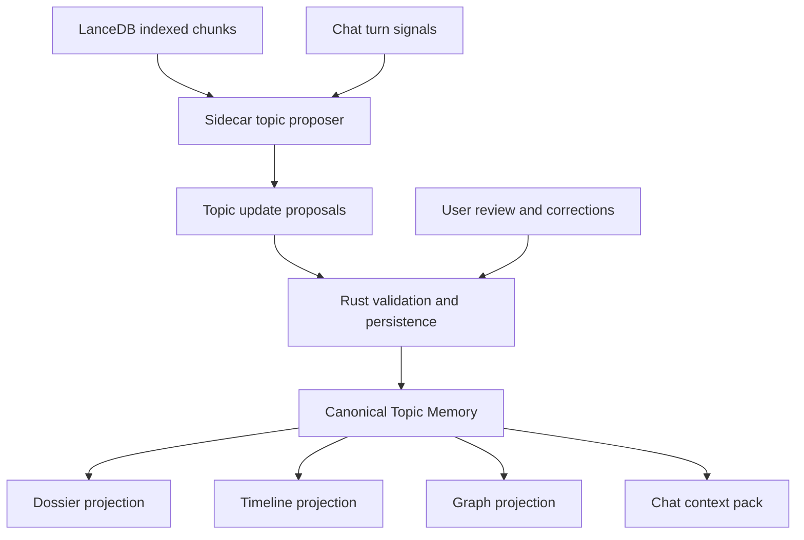
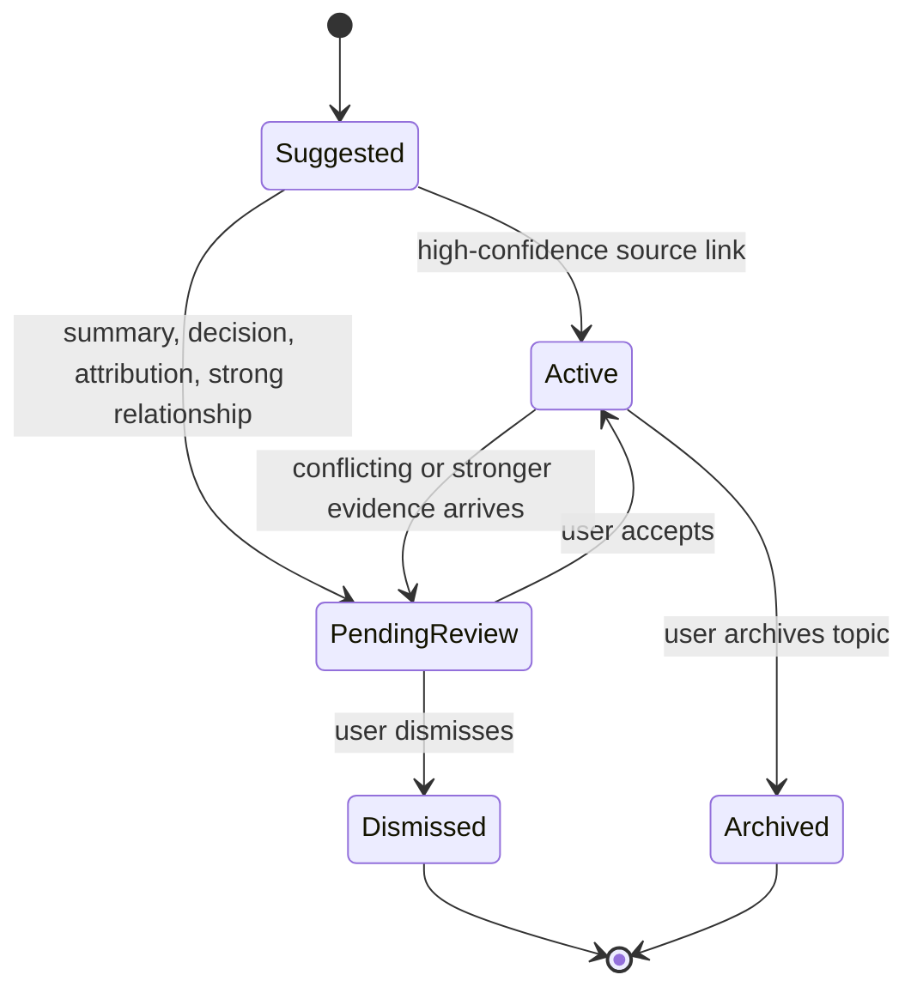

# feat: Build topic memory layer

## Summary

Build a canonical Topic Memory layer above LanceDB search. The layer automatically discovers and maintains topics across voice notes, mounted folders, and Obsidian vaults, then exposes the same memory through dossier, timeline, graph, and Chat context views with section/chunk-level citations.

---

## Problem Frame

CogniOS can index many content kinds into LanceDB, but indexed chunks still leave the user doing the memory work. Today the workaround for a topic that spans meetings, a manually organized folder, and mounted Obsidian notes is folder naming plus multi-turn Chat with manually attached resources. The next layer should turn repeated evidence into a durable topic object the product can read, cite, review, and update.

This plan keeps existing Session Memory scoped to a single Chat session. Topic Memory is global workspace memory, not a replacement for chat transcript compaction.

---

## Requirements

**Canonical Topic Memory**
- R1. CogniOS stores Topic Memory as a canonical durable object with dossier, timeline, graph, source links, claim/event citations, status, and review state.
- R2. Dossier, timeline, graph, and Chat context are projections of the same Topic Memory data rather than separate memory systems.
- R3. Topic Memory must support source evidence from indexed voice note transcripts, notes, mounted text files, PDFs, URL content, and Obsidian vault content already present in the workspace index.
- R4. Topic Memory must retain section/chunk-level citations that can point back to transcript segments, markdown headings, PDF pages, or indexed chunks.

**Discovery and Maintenance**
- R5. The system can automatically suggest or create topics from indexed content without requiring the user to predefine every topic.
- R6. Automatic updates must record why a source, claim, event, or relationship was associated with a topic.
- R7. Low-risk source/topic links and evidence candidates may be auto-applied when confidence is high.
- R8. High-impact updates such as summaries, decisions, person attribution, strong relationships, and conflict resolution must remain reviewable before becoming trusted memory.
- R9. Refreshes must be incremental enough that a changed node can update related topics without rebuilding every topic from scratch.

**Surfaces and Chat**
- R10. The user can browse Topic Memory through a dedicated surface that shows dossier, timeline, graph, sources, citations, and pending review items.
- R11. Chat can read relevant Topic Memory as context when a user asks about a known or emerging topic.
- R12. Chat can trigger topic creation or update proposals when a conversation surfaces a recurring topic, but retrieved text and memory content remain untrusted context.
- R13. Users can correct topic membership, dismiss suggestions, and review pending high-impact memory updates.

**Trust and Privacy**
- R14. Topic Memory must preserve the local-first posture and follow the existing cloud-provider disclosure rules when model-generated maintenance uses a remote provider.
- R15. Unsaved Session Memory must not be indexed into global Topic Memory unless the user promotes it through an explicit save or topic-update action.
- R16. Topic Memory citation and review payloads must avoid exposing absolute internal paths to React or provider prompts.

---

## Scope Boundaries

- No exact-span citation for every sentence in v1; section/chunk-level citations are sufficient.
- No replacement for Session Memory or chat transcript storage.
- No manual-only wiki workflow; user correction is supported, but automatic topic discovery is part of v1.
- No cross-device sync or collaboration.
- No unattended long-running agent jobs beyond bounded local refresh tasks.
- No write tools that modify arbitrary user notes as a side effect of Topic Memory maintenance.

### Deferred to Follow-Up Work

- Fine-grained contradiction auditing and stale-claim lifecycle beyond basic pending-review state.
- Rich force-directed interactive graph editing.
- User-authored ontology/rules for topic extraction.
- Exact source-span anchors for every generated sentence.
- Export formats such as `llms.txt`, GraphML, or Obsidian-ready wiki folders.

---

## Context & Research

### Relevant Local Patterns

- `sidecar/search_sidecar/storage/lancedb_store.py` owns the indexed chunk table with `node_id`, `text`, `role`, `content_version`, and timestamps.
- `sidecar/search_sidecar/routes/index.py` exposes indexed node content and keeps metadata rows hidden from user-visible content.
- `sidecar/search_sidecar/retrieval/search.py` aggregates chunk matches per node for workspace search.
- `sidecar/search_sidecar/chat/tools.py` exposes read-only workspace grep/read tools and already treats retrieved content as bounded, citable context.
- `src-tauri/src/infrastructure/db/chat_repository.rs` and `src-tauri/src/services/chat/session_memory.rs` show the Rust-owned durable-state pattern for chat sessions and derived Session Memory.
- `docs/security/chat-trust-boundaries.md` forbids unsaved Session Memory from appearing in global search or unrelated Chat retrieval.
- `src/features/chat/components/ChatLayout.tsx` already renders Chat citations and tool events, which Topic Memory can extend rather than replace.
- `src/features/settings/components/SettingsLayout.tsx` already positions indexing/provider settings as the engines powering the knowledge base.

### External Prior Art

- Karpathy's LLM Wiki pattern separates immutable raw sources, LLM-maintained wiki pages, and a schema/protocol layer; it emphasizes ingest, query, lint, index, and log operations.
- `Astro-Han/karpathy-llm-wiki` packages that pattern as raw sources compiled into durable wiki pages with citations and health checks.
- `sdyckjq-lab/llm-wiki-skill` adds confidence labels, automatic context injection, graph views, query result persistence, batch ingest, and knowledge-base health checks.

### Planning Implications

The local product already has the raw/source and search layers. The missing work is not another search API; it is a durable, reviewable, cited synthesis layer that can be projected into multiple surfaces.

---

## Key Technical Decisions

- **Rust owns canonical Topic Memory:** Topic Memory is user-facing durable app state, so SQLite in the Tauri layer should own topic records, review status, and user corrections.
- **Sidecar proposes, Rust commits:** The Python sidecar reads LanceDB chunks and proposes topic updates; Rust validates, persists, and exposes them through commands.
- **Projections share one source of truth:** Dossier, timeline, graph, and Chat context read from the same topic memory records to prevent drift.
- **Citation lives below the projection:** Claims, events, relationships, and source links carry citation anchors so every view can cite the same evidence.
- **Hybrid auto-write policy:** Low-risk source links and evidence candidates can become active automatically, while higher-impact synthesis remains pending until reviewed.
- **Session Memory stays isolated:** Existing Session Memory can inform the active Chat turn but does not enter global Topic Memory unless promoted through an explicit user-visible flow.

---

## High-Level Technical Design

---

## Implementation Units

### U1. Topic Memory Domain And Persistence

- **Goal:** Add Rust-owned Topic Memory domain types, migrations, repositories, and IPC command contracts.
- **Requirements:** R1, R2, R4, R7, R8, R13, R16
- **Dependencies:** None
- **Files:** `src-tauri/migrations/0012_topic_memory.sql`, `src-tauri/src/domain/topic_memory/mod.rs`, `src-tauri/src/infrastructure/db/topic_memory_repository.rs`, `src-tauri/src/commands/topic_memory.rs`, `src-tauri/src/commands/mod.rs`, `src-tauri/src/lib.rs`, `src/lib/contracts/topicMemory.ts`, `src/lib/tauri/ipc.ts`
- **Approach:** Model topics, source links, claims, events, relationships, citations, and update proposals separately so review state does not pollute active memory. Keep citation anchors portable by storing node IDs, chunk IDs or section labels, role, optional page/timestamp/heading metadata, and display-safe path fields.
- **Patterns to follow:** `chat_repository.rs` for repository shape, `chat.rs` for command DTOs, `lib/contracts/chat.ts` for TypeScript mirror contracts.
- **Test scenarios:** Migration creates the topic tables and indexes; repository creates a topic with cited source links; pending proposals do not appear as active claims; deleting or archiving a topic hides it from list commands; invalid citation payloads are rejected without panicking.

### U2. Sidecar Topic Proposal Engine

- **Goal:** Add a sidecar service that scans indexed chunks and returns bounded topic update proposals.
- **Requirements:** R3, R4, R5, R6, R7, R8, R9, R14
- **Dependencies:** U1 command DTOs may evolve from this unit, but the sidecar can be tested independently first.
- **Files:** `sidecar/search_sidecar/topic_memory/__init__.py`, `sidecar/search_sidecar/topic_memory/proposer.py`, `sidecar/search_sidecar/routes/topic_memory.py`, `sidecar/search_sidecar/routes/__init__.py`, `sidecar/search_sidecar/app.py`, `sidecar/tests/test_topic_memory.py`
- **Approach:** Start with deterministic local proposal generation over LanceDB rows: cluster by repeated salient terms, node names, headings, and transcript/source metadata; emit source links, candidate claims, events, and relationships with confidence and rationale. Leave provider-backed synthesis as a follow-up enhancement unless existing chat-provider plumbing can be reused safely without expanding scope.
- **Patterns to follow:** `routes/index.py` for sidecar route shape, `chat/tools.py` for bounded payloads and citation-friendly outputs, `retrieval/search.py` for active-node filtering.
- **Test scenarios:** Repeated meeting/folder/Obsidian chunks produce one topic proposal; citations preserve chunk IDs and roles; low-confidence ambiguous chunks become pending proposals; proposal output is bounded for large indexes; empty indexes return an empty ready result.

### U3. Rust Refresh Orchestration

- **Goal:** Wire Rust commands that request sidecar proposals, apply high-confidence safe updates, and store reviewable proposals.
- **Requirements:** R5, R6, R7, R8, R9, R14, R16
- **Dependencies:** U1, U2
- **Files:** `src-tauri/src/services/topic_memory/mod.rs`, `src-tauri/src/services/mod.rs`, `src-tauri/src/services/search/client.rs`, `src-tauri/src/commands/topic_memory.rs`, `src-tauri/tests/topic_memory.rs`
- **Approach:** Add commands for listing topics, reading a topic detail, refreshing topics from indexed content, accepting/dismissing proposals, and applying user corrections. Keep refresh bounded and explicit in v1, with hooks available for later background scheduling.
- **Patterns to follow:** `services/chat/session_memory.rs` for derived artifact lifecycle, `services/search/client.rs` for sidecar envelopes, `node_status_repository.rs` for status and event-friendly persistence.
- **Test scenarios:** Refresh stores active source links and pending synthesis proposals; sidecar unavailable returns a typed envelope; accepting a proposal promotes it into active memory; dismissing a proposal prevents it from being reapplied unchanged; absolute internal paths are not exposed in command output.

### U4. Topic Memory UI Surface

- **Goal:** Add a user-facing Topic Memory surface with dossier, timeline, graph, sources, citations, and review controls.
- **Requirements:** R2, R4, R10, R13, R16
- **Dependencies:** U1, U3
- **Files:** `src/features/topic-memory/api/topicMemoryClient.ts`, `src/features/topic-memory/components/TopicMemoryLayout.tsx`, `src/features/topic-memory/components/TopicDossier.tsx`, `src/features/topic-memory/components/TopicTimeline.tsx`, `src/features/topic-memory/components/TopicGraph.tsx`, `src/features/topic-memory/components/TopicReviewQueue.tsx`, `src/features/topic-memory/components/TopicSources.tsx`, `src/features/topic-memory/components/*.test.tsx`, `src/app/App.tsx`, `src/styles/app.css`
- **Approach:** Add a dense work-focused surface rather than a marketing-style page. Use tabs for projections, citations as inspectable source rows, and review actions for pending proposals.
- **Patterns to follow:** `ChatLayout.tsx` for source/citation rendering and async state, `SettingsLayout.tsx` for operational panels, `SearchResultRow.tsx` for compact source rows.
- **Test scenarios:** Topic list and detail render active memory; switching tabs does not change underlying topic data; pending proposals can be accepted or dismissed; citation rows expose node IDs and display labels without absolute paths; empty state explains that indexed content is needed without implying cloud sync.

### U5. Chat Topic Context Integration

- **Goal:** Let Chat discover relevant Topic Memory and trigger topic update proposals during related conversations.
- **Requirements:** R11, R12, R14, R15
- **Dependencies:** U1, U3
- **Files:** `src-tauri/src/commands/chat.rs`, `src-tauri/src/infrastructure/db/chat_repository.rs`, `sidecar/search_sidecar/chat/tools.py`, `sidecar/search_sidecar/chat/orchestrator.py`, `src/lib/contracts/chat.ts`, `src/features/chat/components/ChatLayout.tsx`, `src/features/chat/components/ChatLayout.test.tsx`
- **Approach:** Expose read-only Topic Memory context to Chat as bounded context/tool data. Add a Chat-side proposal path that can suggest a topic update after a turn, while keeping automatic writes constrained by the hybrid policy.
- **Patterns to follow:** Existing `grep_workspace` tool event flow, `session_memory` prompt-context rules, and chat trust boundaries.
- **Test scenarios:** Chat can include a relevant topic context pack; a conversation about a recurring topic can create a reviewable proposal; unsaved Session Memory is not indexed into Topic Memory; topic context is treated as untrusted source material; provider errors do not corrupt topic state.

### U6. Topic Corrections And Review UX

- **Goal:** Make automatic topics correctable enough that fully automatic creation is trustworthy.
- **Requirements:** R6, R8, R13
- **Dependencies:** U4, U5
- **Files:** `src/features/topic-memory/components/TopicReviewQueue.tsx`, `src/features/topic-memory/components/TopicSources.tsx`, `src/features/topic-memory/components/TopicMemoryLayout.tsx`, `src-tauri/src/commands/topic_memory.rs`, `src-tauri/tests/topic_memory.rs`
- **Approach:** Support accept, dismiss, merge source into topic, remove source from topic, archive topic, and mark proposal rationale as reviewed. Keep correction actions small and reversible where possible.
- **Patterns to follow:** Explorer rename/delete confirmation patterns and Chat source-cluster status semantics.
- **Test scenarios:** User dismissal persists across refreshes; removing a source removes dependent pending proposals or marks them stale; archived topics stop receiving auto-updates; review actions are keyboard reachable.

### U7. Verification And Regression Coverage

- **Goal:** Cover the cross-layer behavior with focused Rust, Python, and React tests.
- **Requirements:** R1-R16
- **Dependencies:** U1-U6
- **Files:** `src-tauri/tests/topic_memory.rs`, `sidecar/tests/test_topic_memory.py`, `src/features/topic-memory/components/*.test.tsx`, `src/features/chat/components/ChatLayout.test.tsx`, `src/lib/contracts/topicMemory.ts`
- **Approach:** Test the canonical memory lifecycle before UI polish. Use deterministic fixture chunks instead of model-generated text so regressions are stable.
- **Patterns to follow:** `src-tauri/tests/chat_sessions.rs`, `sidecar/tests/test_chat_routes.py`, and existing React Testing Library component tests.
- **Test scenarios:** End-to-end fixture content from a voice note, folder file, and Obsidian note becomes one topic; all projections cite the same underlying evidence; review state gates high-impact updates; Chat can read a topic without writing unsafe memory; refresh and UI commands degrade cleanly when the sidecar is unavailable.

---

## System-Wide Impact

- Topic Memory introduces a new durable workspace memory surface, so migrations and command contracts must be reviewed like other user-facing data models.
- The sidecar gains a synthesis/proposal role above retrieval, but it does not become the owner of durable user memory.
- Chat gains global Topic Memory context while retaining Session Memory isolation.
- UI navigation needs a new memory surface or an extension of the existing Memory nav slot without crowding Explorer/Search.

---

## Risks & Dependencies

- **Over-grouping risk:** Fully automatic topics can damage trust if unrelated meetings and notes merge. Mitigation: keep rationale and review state visible.
- **Citation drift risk:** If citations point only to nodes, projections will look grounded but not inspectable. Mitigation: store chunk/section metadata at the claim/event/relationship layer.
- **Provider privacy risk:** LLM-backed synthesis may send indexed content to remote providers. Mitigation: reuse existing provider disclosures and keep deterministic local proposals as the v1 baseline.
- **Scope risk:** Dossier, timeline, graph, and Chat integration are broad. Mitigation: treat them as projections of one canonical model and keep graph editing deferred.

---

## Acceptance Examples

- AE1. Given one voice note transcript, one mounted Obsidian note, and one folder document all discuss the same project topic, when Topic Memory refresh runs, CogniOS creates or updates one topic with cited source links from all three sources.
- AE2. Given a topic has one claim and one event with citations, when the user switches between dossier, timeline, and graph, each projection shows the same evidence anchors rather than separate uncited summaries.
- AE3. Given a candidate decision attributes ownership to a person, when refresh proposes it, the decision remains pending review until the user accepts it.
- AE4. Given a user dismisses a bad source/topic association, when refresh runs again with the same evidence, CogniOS does not immediately recreate the dismissed proposal.
- AE5. Given an active Chat conversation asks about a recurring topic, when relevant Topic Memory exists, Chat can use a bounded context pack and cite the topic's underlying sources.
- AE6. Given no sidecar is available, when the user opens Topic Memory, persisted topics remain readable and refresh actions show an unavailable state without corrupting stored memory.

---

## Sources & Research

- `docs/prd/initial.md` establishes CogniOS as a local-first memory operating system with Topics, Memory Timeline, and Chat synthesis.
- `docs/brainstorms/2026-04-26-search-requirements.md` defines the LanceDB-backed search layer this work builds above.
- `docs/brainstorms/2026-05-10-session-note-compaction-requirements.md` and `docs/security/chat-trust-boundaries.md` define Session Memory isolation.
- `docs/brainstorms/2026-05-11-voice-note-requirements.md` defines voice notes as indexed meeting artifacts.
- `docs/brainstorms/2026-05-17-agentic-chat-tool-loop-requirements.md` defines Chat's read-only tool and trust posture.
- Karpathy LLM Wiki gist: `https://gist.github.com/karpathy/442a6bf555914893e9891c11519de94f`
- `https://github.com/Astro-Han/karpathy-llm-wiki`
- `https://github.com/sdyckjq-lab/llm-wiki-skill`
